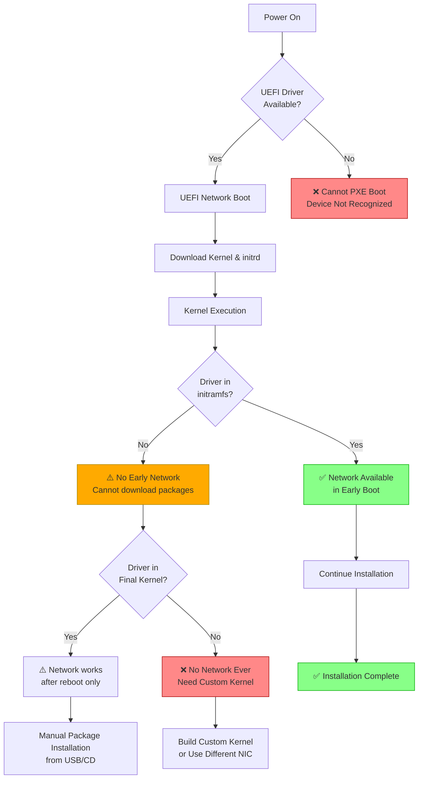

# Network Device Lifecycle During PXE Boot

## Overview
This document traces the complete lifecycle of network devices through the PXE boot process, showing where network interfaces are initialized, configured, reset, and reconfigured at each stage.

## Network Device State Diagram

```mermaid
stateDiagram-v2
    [*] --> PowerOff
    PowerOff --> UEFIFirmware: Power On
    
    state UEFIFirmware {
        [*] --> FirmwareInit
        FirmwareInit --> NetworkCardInit: Load UEFI Network Driver
        NetworkCardInit --> LinkLayerConfig: Initialize NIC Hardware
        LinkLayerConfig --> IPv6AutoConfig: Configure Link-Local
        IPv6AutoConfig --> RouterDiscovery: Send RS
        RouterDiscovery --> DHCPv6: Receive RA with Managed Flag
        DHCPv6 --> BootFileDownload: Get IPv6 Address & Boot URL
        BootFileDownload --> GRUBLoaded: Download & Execute GRUB
    }
    
    state GRUBLoaded {
        [*] --> GRUBNetworkStack
        GRUBNetworkStack --> ConfigFileDownload: Reuse UEFI Network State
        ConfigFileDownload --> KernelDownload: Fetch grub.cfg
        KernelDownload --> InitrdDownload: Fetch vmlinuz
        InitrdDownload --> BootKernel: Fetch initrd
    }
    
    BootKernel --> NetworkReset: Execute Kernel
    
    state NetworkReset {
        [*] --> UEFIDriverUnload
        note right of UEFIDriverUnload
            CRITICAL: Network state is LOST
            Firmware drivers unloaded
            All configuration gone
        end note
        UEFIDriverUnload --> LinuxDriverInit
    }
    
    state LinuxKernel {
        [*] --> LinuxDriverInit
        LinuxDriverInit --> HardwareDetection: Load Kernel Modules
        HardwareDetection --> udevDiscovery: Detect Network Cards
        udevDiscovery --> InterfaceNaming: Apply Naming Scheme
        InterfaceNaming --> ParseKernelCmdline: Create Network Interfaces
        ParseKernelCmdline --> InitramfsNetworking: Read ip= parameter
        
        state InitramfsNetworking {
            [*] --> LinkUp
            LinkUp --> IPv6Init: Bring Interface Up
            IPv6Init --> RouterSolicitation2: Initialize IPv6 Stack
            RouterSolicitation2 --> DHCPv6_2: Send RS Again
            DHCPv6_2 --> NetworkReady: Second DHCPv6 Negotiation
        }
        
        NetworkReady --> InstallerFetch: Network Configured
        InstallerFetch --> Installation: Download Packages
        Installation --> InstalledOS: Complete Installation
    }
    
    LinuxDriverInit --> LinuxKernel
    InstalledOS --> [*]
```



## Detailed Network Device Lifecycle

### Stage 1: UEFI Firmware Network Stack

**When:** Power-on to kernel execution  
**Network Driver:** UEFI firmware network driver (SNP - Simple Network Protocol)  
**Configuration Source:** UEFI firmware settings, DHCPv6

#### 1.1 Hardware Initialization
```
Location: UEFI Firmware ROM
Driver: Network Card UEFI Driver (e.g., Intel UNDI, Broadcom UEFI)
State: Cold boot - hardware powered off
```

**Configurations:**
- **NIC Firmware Settings**:
  - Boot ROM enabled/disabled
  - PXE/HTTP Boot priority
  - Wake-on-LAN settings
  - Network boot timeout
  - VLAN tagging (if supported)

- **UEFI Network Stack**:
  - IPv4/IPv6 enable/disable
  - DNS configuration method
  - HTTP/HTTPS boot support
  - iSCSI initiator settings

#### 1.2 Link Layer Configuration
```
MAC Address: Read from NIC EEPROM
Link Speed: Auto-negotiation (1Gbps, 10Gbps, etc.)
Duplex: Full duplex
MTU: 1500 (default, or jumbo frames if configured)
```

**Configurations:**
- **MAC Address**: Usually fixed, but can be overridden in UEFI
- **Link Speed**: Auto-negotiation vs forced speed
- **Flow Control**: Enable/disable Ethernet flow control
- **Energy Efficient Ethernet**: Power saving modes

#### 1.3 IPv6 Autoconfiguration
```
Process:
1. Generate link-local address: fe80::<interface-id>
2. Duplicate Address Detection (DAD)
3. Send Router Solicitation (RS)
4. Receive Router Advertisement (RA)
```

**Configurations:**
- **Link-Local Address Generation**:
  - EUI-64 based on MAC
  - Privacy extensions (temporary addresses)
  - Stable privacy addresses (RFC 7217)

- **Router Advertisement Processing**:
  - Accept RA: Yes/No
  - Managed flag: Use DHCPv6 for addresses
  - Other config flag: Use DHCPv6 for other info
  - MTU from RA
  - Hop limit
  - Router lifetime

#### 1.4 DHCPv6 Negotiation
```
Process:
1. Client → Server: SOLICIT (multicast to ff02::1:2)
2. Server → Client: ADVERTISE
3. Client → Server: REQUEST
4. Server → Client: REPLY
```

**Configurations Available:**

**DHCPv6 Client (UEFI) Settings:**
- DHCP Client Identifier (DUID)
- Vendor Class Identifier
- Rapid Commit enable/disable
- Information Request vs Address Request
- Reconfigure Accept
- Request timeout/retry

**DHCPv6 Server Options Sent:**
- IPv6 Address (IA_NA)
- DNS Recursive Servers (option 23)
- Domain Search List (option 24)
- SNTP Servers (option 31)
- Boot File URL (option 59)
- Boot File Parameters (option 60)
- Client Architecture Type detection
- Vendor-specific options

#### 1.5 Boot File Download (TFTP or HTTP)
```
Network State: Fully configured IPv6 address
Protocols Available: TFTPv6, HTTP, HTTPSv6, NFS
```

**Configurations:**
- **TFTP Options**:
  - Block size (512 default, up to 65464)
  - Timeout
  - Transfer size option
  - Window size

- **HTTP Boot Options**:
  - URI scheme (http:// vs https://)
  - TLS version (1.2, 1.3)
  - Certificate validation
  - Proxy settings
  - Custom HTTP headers

#### 1.6 GRUB Network Usage
```
Network State: Inherited from UEFI
Driver: GRUB uses UEFI network protocols
Capability: Can download additional files
```

**Configurations:**
- **GRUB Network Modules**:
  - `net` - Core network support
  - `efinet` - UEFI network interface
  - `tftp` - TFTP protocol
  - `http` - HTTP protocol
  - `net_bootp` - BOOTP protocol

- **GRUB Network Commands**:
  ```grub
  net_bootp                    # Reinitiate DHCP
  net_get_dhcp_option          # Query DHCP options
  net_ipv6_autoconf            # IPv6 autoconfiguration
  net_add_addr                 # Add IPv6 address
  net_add_route                # Add routing entry
  ```

**Files GRUB Downloads:**
- grub.cfg (configuration)
- vmlinuz (kernel)
- initrd.img (initial ramdisk)
- Fonts, themes, modules (if configured)

---

### Stage 2: NETWORK RESET - Critical Transition Point

**When:** Kernel execution begins  
**What Happens:** UEFI firmware drivers are COMPLETELY UNLOADED

```
⚠️  CRITICAL STATE CHANGE ⚠️

UEFI Network Stack:    [TERMINATED]
Firmware Drivers:      [UNLOADED]
Network Configuration: [LOST]
IPv6 Address:         [GONE]
DHCP Lease:           [EXPIRED/FORGOTTEN]
TCP Connections:      [CLOSED]
ARP/ND Cache:         [CLEARED]

Hardware State:       [PRESERVED - NIC still powered]
MAC Address:         [PRESERVED - In NIC hardware]
Link State:          [MAY REMAIN - Physical link usually stays up]
```

**Why Network Resets:**
1. **Different driver models**: UEFI drivers vs Linux kernel drivers
2. **Memory spaces**: Firmware memory unmapped when kernel takes over
3. **No state handoff protocol**: UEFI has no standard way to pass network state to kernel
4. **Security**: Clean slate prevents firmware-level compromises from persisting

---

### Stage 3: Linux Kernel Network Stack

**When:** Kernel boot to end of installation  
**Network Driver:** Native Linux kernel driver  
**Configuration Source:** Kernel parameters, initramfs scripts, netplan

#### 3.1 Kernel Boot & Driver Loading
```
Location: Linux kernel memory
Initial State: No network configuration
Process: Build network stack from scratch
```

**Configurations:**

**Kernel Command Line Parameters:**
```bash
# Network interface configuration
ip=<client-ip>:<server-ip>:<gw-ip>:<netmask>:<hostname>:<device>:<autoconf>

# Examples:
ip=dhcp                          # DHCPv4 on any interface
ip=dhcp6                         # DHCPv6 on any interface
ip=:::::eth0:dhcp6              # DHCPv6 on specific interface
ip=[2001:db8::100]:::[64]::eth0:none  # Static IPv6

# Interface naming
net.ifnames=0                    # Disable predictable names (use eth0, eth1)
net.ifnames=1                    # Enable predictable names (enp0s3, ens33)
biosdevname=0                    # Disable BIOS device naming

# Network debugging
netconsole=@/,@192.168.1.1/     # Network console for debugging
```

**Module Parameters:**
```bash
# Loaded via modprobe or kernel cmdline
modprobe.blacklist=<module>      # Don't load specific driver
<driver>.param=value             # Driver-specific parameters

# Examples:
e1000e.InterruptThrottleRate=3000
igb.RSS=8                        # Receive Side Scaling queues
```

#### 3.2 Hardware Detection (udev)
```
Process:
1. PCI/PCIe enumeration
2. Device identification by vendor/device ID
3. udev rule matching
4. Kernel module loading
5. Device node creation
```

**Configurations:**

**udev Rules** (`/lib/udev/rules.d/` in initramfs):

```bash
# 70-persistent-net.rules - Persistent interface naming
# Maps MAC addresses to interface names
SUBSYSTEM=="net", ACTION=="add", DRIVERS=="?*", \
  ATTR{address}=="52:54:00:12:34:56", NAME="eth0"

# 80-net-setup-link.rules - Predictable interface naming
# Generates names like enp0s3, ens33, etc.
# Based on: bus, slot, port, physical location

# 99-custom-network.rules - Custom rules
# Set interface properties, run scripts on network events
SUBSYSTEM=="net", ACTION=="add", KERNEL=="eth*", \
  RUN+="/usr/local/bin/network-init.sh"
```

**Interface Naming Schemes:**
- `eth0, eth1` - Traditional kernel names
- `enp2s0` - en = ethernet, p2 = PCI bus 2, s0 = slot 0
- `ens33` - en = ethernet, s33 = slot 33
- `enx<MAC>` - Based on MAC address
- `eno1` - On-board device 1

#### 3.3 Interface Creation & Configuration
```
Process:
1. Driver creates network interface
2. Interface appears in kernel
3. Interface is DOWN by default
4. ip link set dev <if> up
```

**Configurations:**

**Interface Parameters:**
```bash
# MTU (Maximum Transmission Unit)
ip link set dev eth0 mtu 9000           # Jumbo frames

# MAC Address (can be changed in software)
ip link set dev eth0 address 52:54:00:12:34:56

# TX Queue Length
ip link set dev eth0 txqueuelen 10000

# Multicast
ip link set dev eth0 multicast on

# ARP
ip link set dev eth0 arp on

# Promiscuous Mode
ip link set dev eth0 promisc on
```

**Ethtool Settings:**
```bash
# Speed and Duplex
ethtool -s eth0 speed 1000 duplex full autoneg off

# Offload Features
ethtool -K eth0 tso on              # TCP Segmentation Offload
ethtool -K eth0 gso on              # Generic Segmentation Offload
ethtool -K eth0 gro on              # Generic Receive Offload
ethtool -K eth0 lro on              # Large Receive Offload
ethtool -K eth0 rx-checksumming on
ethtool -K eth0 tx-checksumming on

# Ring Buffer Sizes
ethtool -G eth0 rx 4096 tx 4096

# Interrupt Coalescing
ethtool -C eth0 rx-usecs 100
```

#### 3.4 IPv6 Stack Initialization
```
Process:
1. Enable IPv6 on interface
2. Generate link-local address
3. Perform DAD (Duplicate Address Detection)
4. Interface ready for communication
```

**Configurations:**

**IPv6 sysctl Parameters:**
```bash
# Enable/Disable IPv6
net.ipv6.conf.eth0.disable_ipv6 = 0

# IPv6 Forwarding
net.ipv6.conf.eth0.forwarding = 0

# Accept Router Advertisements
net.ipv6.conf.eth0.accept_ra = 2        # 0=off, 1=on if not forwarding, 2=always

# Accept RA Router Preference
net.ipv6.conf.eth0.accept_ra_rtr_pref = 1

# Accept RA Prefix Info
net.ipv6.conf.eth0.accept_ra_pinfo = 1

# Autoconfiguration
net.ipv6.conf.eth0.autoconf = 1

# DAD Transmits
net.ipv6.conf.eth0.dad_transmits = 1    # Number of NS for DAD

# Use Temporary Addresses (Privacy Extensions)
net.ipv6.conf.eth0.use_tempaddr = 0     # 0=off, 1=on, 2=prefer temporary

# Maximum Addresses
net.ipv6.conf.eth0.max_addresses = 16

# Hop Limit
net.ipv6.conf.eth0.hop_limit = 64
```

#### 3.5 Router Discovery (Again)
```
Process:
1. Send Router Solicitation to ff02::2
2. Wait for Router Advertisement
3. Process RA options (MTU, hop limit, managed flags)
4. Configure default route if advertised
```

**Configurations:**

**Router Advertisement Processing:**
```bash
# Accept RA Defrtr (default router)
net.ipv6.conf.eth0.accept_ra_defrtr = 1

# RA MTU
net.ipv6.conf.eth0.accept_ra_mtu = 1

# RA Pinfo (prefix information)
net.ipv6.conf.eth0.accept_ra_pinfo = 1

# RA Route Information Options
net.ipv6.conf.eth0.accept_ra_rt_info_max_plen = 0

# Router Solicitation Interval
net.ipv6.conf.eth0.router_solicitation_interval = 4

# Router Solicitation Delay
net.ipv6.conf.eth0.router_solicitation_delay = 1

# Max Router Solicitations
net.ipv6.conf.eth0.router_solicitations = 3
```

#### 3.6 DHCPv6 Client (Second Time)
```
Process:
1. initramfs-tools runs ipconfig or dhclient
2. New DHCPv6 SOLICIT message
3. Server responds (may be same address as before)
4. Address configured on interface
```

**Configurations:**

**dhclient Configuration** (`/etc/dhcp/dhclient6.conf` in initramfs):
```bash
# Request specific options
request dhcp6.name-servers,
        dhcp6.domain-search,
        dhcp6.sntp-servers;

# DUID (DHCP Unique Identifier) type
# Type 1: DUID-LLT (Link-layer address + time)
# Type 2: DUID-EN (Enterprise number)
# Type 3: DUID-LL (Link-layer address)

# Send custom options
send dhcp6.client-id <identifier>;

# Timeout and retry
timeout 60;
retry 5;

# Rapid commit
send dhcp6.rapid-commit;
```

**systemd-networkd Configuration** (Alternative):
```ini
# /etc/systemd/network/10-eth0.network
[Match]
Name=eth0

[Network]
DHCP=ipv6
IPv6AcceptRA=true

[DHCPv6]
RapidCommit=yes
UseAddress=yes
UseDNS=yes
UseDomains=yes
WithoutRA=solicit
```

**ip-config (initramfs built-in):**
```bash
# Configured via kernel command line ip= parameter
# Simpler than dhclient, part of klibc-utils

# Supports:
# - DHCPv4/DHCPv6
# - Static configuration
# - BOOTP
# - RARP
```

#### 3.7 Network Configuration Files in initramfs

**netplan Configuration** (`/etc/netplan/01-netcfg.yaml`):
```yaml
network:
  version: 2
  renderer: networkd
  ethernets:
    all-en:
      match:
        name: "en*"
      dhcp6: true
      accept-ra: true
      ipv6-privacy: false
      dhcp6-overrides:
        use-dns: true
        use-domains: true
        use-ntp: true
    eth0:
      dhcp6: true
      addresses:
        - 2001:db8:1::100/64
      routes:
        - to: ::/0
          via: 2001:db8:1::1
      nameservers:
        addresses:
          - 2001:4860:4860::8888
```

**systemd-networkd** (`/etc/systemd/network/*.network`):
```ini
[Match]
Name=eth0

[Network]
DHCP=ipv6
IPv6AcceptRA=true
LinkLocalAddressing=ipv6
IPv6PrivacyExtensions=false

[Address]
Address=2001:db8:1::100/64

[Route]
Gateway=2001:db8:1::1

[DHCPv6]
UseAddress=yes
UseDNS=yes
UseNTP=yes
RapidCommit=yes
```

**Legacy /etc/network/interfaces:**
```bash
auto eth0
iface eth0 inet6 dhcp
    accept_ra 2
    autoconf 1
    privext 0
    
# Or static:
iface eth0 inet6 static
    address 2001:db8:1::100
    netmask 64
    gateway 2001:db8:1::1
    dns-nameservers 2001:4860:4860::8888
```

#### 3.8 initramfs Network Scripts

**Script Locations:**
```
/scripts/init-premount/  - Run before mounting root
/scripts/init-bottom/    - Run after mounting root
/scripts/functions       - Network helper functions
/scripts/nfs             - NFS-specific networking
```

**Key Functions:**
```bash
# configure_networking() - Main network setup
# Sets up network based on ip= parameter
# Located in: /scripts/functions

# run_dhclient() - Run DHCP client
# run_ipconfig() - Run ip-config utility

# Environment variables set:
DEVICE=eth0                      # Network interface
BOOTIF=01-52-54-00-12-34-56     # Boot interface from PXE
IPV6ADDR=2001:db8:1::100        # IPv6 address
IPV6NETMASK=64                  # Prefix length
IPV6GATEWAY=2001:db8:1::1       # Default gateway
HOSTNAME=ubuntu-server          # Hostname
DNSDOMAIN=example.com           # DNS domain
```

#### 3.9 Network Ready - Installer Phase
```
State: Network fully configured
Capabilities: Can download packages, access repos
Configuration: Should match installation target network
```

**Configurations:**

**APT Configuration** (for package downloads):
```bash
# Proxy settings
Acquire::http::Proxy "http://proxy.example.com:3128";
Acquire::https::Proxy "https://proxy.example.com:3128";

# IPv4/IPv6 preference
Acquire::ForceIPv6 "true";

# Timeouts
Acquire::http::Timeout "120";
Acquire::Retries "3";
```

**Mirror Selection:**
```yaml
# In autoinstall user-data
apt:
  primary:
    - arches: [default]
      uri: http://[2001:db8:1::10]/ubuntu
  sources:
    custom:
      source: deb http://[2001:db8:1::11]/custom ./
```

---

## Configuration Summary Table

| Stage | Network State | Driver | Configuration Files | Customizable Parameters |
|-------|--------------|--------|-------------------|------------------------|
| **UEFI Firmware** | Clean boot | UEFI SNP | UEFI Settings | MAC, Boot order, IPv6 enable, PXE timeout |
| **Router Discovery** | Link-local only | UEFI SNP | RA from router | MTU, Hop limit, Managed flags |
| **DHCPv6 (Firmware)** | Getting address | UEFI SNP | DHCPv6 server config | Address, DNS, boot URL, lease time |
| **GRUB** | Reuses UEFI | UEFI protocols | grub.cfg | Timeout, kernel params, menu entries |
| **↓ RESET ↓** | **ALL LOST** | **UNLOADED** | **N/A** | **N/A** |
| **Kernel Init** | No network | None | Kernel cmdline | ip=, net.ifnames=, modprobe params |
| **Driver Load** | Interface created | Linux kernel | udev rules | Interface naming, driver params |
| **Link Up** | Interface up, no IP | Linux kernel | ip/ethtool | MTU, offloads, queues, speed |
| **IPv6 Init** | Link-local | Linux kernel | sysctl | DAD, privacy, accept_ra, autoconf |
| **Router Discovery 2** | Link-local + routes | Linux kernel | sysctl | RA processing, default route |
| **DHCPv6 (Kernel)** | Full config | Linux kernel | dhclient.conf / netplan | Address, DNS, domains, rapid commit |
| **Installer** | Production ready | Linux kernel | autoinstall config | Final network config, static IPs |

## Key Takeaways

### Where Network Gets Reset
1. **Between UEFI and Linux Kernel** - Complete reset, no state preserved
2. This is why you see DHCPv6 run twice in packet captures

### Where Network State Persists
1. **Within UEFI** - From firmware init through GRUB execution
2. **Within Linux** - From kernel boot through installation completion

### Critical Configuration Points
1. **UEFI Settings** - Enable network boot, set boot order
2. **DHCPv6 Server** - Provide boot URL and network config
3. **Kernel Command Line** - Tell kernel how to configure network
4. **initramfs** - Contains tools and configs for early network
5. **netplan/systemd-networkd** - Final network configuration

### Why Two DHCPv6 Exchanges?
- **First (UEFI)**: Get boot files and minimal network for downloading
- **Second (Kernel)**: Get production network config for installation/operation
- No way to transfer network state from firmware to kernel
- Security benefit: Clean slate for OS networking

---

## Custom Drivers and Unrecognized Devices

### The Driver Problem at Each Stage

Network drivers are required at THREE different stages of PXE boot, and each stage has different requirements and failure modes.



### Stage-by-Stage Driver Requirements

#### Stage 1: UEFI Firmware Driver

**What's Required:**
- UEFI-compatible network driver in NIC's option ROM
- Or: UEFI driver loaded from firmware/disk
- Driver must implement UEFI Simple Network Protocol (SNP)

**Common Issues:**

1. **Very New Hardware**
   ```
   Problem: NIC released after motherboard firmware
   Symptom: Network boot option doesn't appear in BIOS
   Impact: Cannot PXE boot at all
   ```

   **Solutions:**
   - Update motherboard firmware (BIOS/UEFI)
   - Flash updated NIC firmware with newer UEFI driver
   - Use external UEFI driver (load from USB before PXE)
   - Use a different, supported NIC

   **Example - Intel X710 on older motherboard:**
   ```bash
   # Update NIC firmware with UEFI driver
   nvmupdate64e -u -l -o update.xml
   
   # Or add UEFI driver to firmware:
   # 1. Download Intel(R) Ethernet Connections Boot Utility
   # 2. Extract .efi driver
   # 3. Load via UEFI shell or add to firmware
   ```

2. **Vendor-Specific Hardware**
   ```
   Problem: Custom NIC (Mellanox, Chelsio, etc.) without UEFI support
   Symptom: Card works in OS but not for PXE
   Impact: Must use different NIC for PXE boot
   ```

   **Solutions:**
   - Check vendor website for UEFI driver update
   - Use onboard NIC for PXE, custom NIC for production
   - iPXE can sometimes provide drivers for cards without UEFI support

3. **Older Hardware Without IPv6 UEFI Support**
   ```
   Problem: UEFI driver only supports IPv4 PXE
   Symptom: IPv6 PXE fails, IPv4 works
   Impact: Cannot use IPv6-only PXE setup
   ```

   **Solutions:**
   - Use dual-stack (IPv4 + IPv6) PXE
   - Update NIC firmware for IPv6 support
   - Use iPXE which has better IPv6 support

**How to Check UEFI Driver Availability:**
```
1. Enter UEFI Setup (usually F2/Del during boot)
2. Check Boot > Network Boot or Network Stack
3. Look for IPv4/IPv6 PXE Boot options
4. If missing, driver not available in firmware
```

#### Stage 2: Linux Kernel Driver (in initramfs)

**What's Required:**
- Kernel module (.ko file) for the NIC
- Module must be included in initramfs
- Module must be loaded before network configuration

**Common Issues:**

1. **Driver Not in initramfs**
   ```
   Problem: Driver exists in kernel but not copied to initramfs
   Symptom: Network works after full boot, not during installation
   Impact: Cannot download packages during installation
   ```

   **Detection:**
   ```bash
   # Check if driver is in initramfs
   lsinitramfs /boot/initrd.img | grep -i <driver-name>
   # Example: lsinitramfs /boot/initrd.img | grep -i e1000e
   
   # List all network drivers in initramfs
   lsinitramfs /boot/initrd.img | grep 'kernel/drivers/net'
   ```

   **Solutions:**
   - Rebuild initramfs with driver included
   - Modify PXE initrd to include driver
   - Use kernel parameter to load driver: `modprobe.blacklist=<conflicting-driver>`

   **Manual Fix:**
   ```bash
   # On the PXE server, unpack initrd
   mkdir initrd-custom
   cd initrd-custom
   unmkinitramfs /srv/tftp/ubuntu-24.04/initrd.img .
   
   # Add custom driver
   cp /lib/modules/6.8.0-45-generic/kernel/drivers/net/ethernet/intel/e1000e/e1000e.ko \
      main/lib/modules/6.8.0-45-generic/kernel/drivers/net/ethernet/intel/e1000e/
   
   # Update module dependencies
   depmod -b main/ 6.8.0-45-generic
   
   # Rebuild initramfs
   cd main
   find . | cpio -o -H newc | gzip > /srv/tftp/ubuntu-24.04/initrd-custom.img
   ```

2. **Wrong Driver Version/Module Conflicts**
   ```
   Problem: Multiple drivers claim the device
   Symptom: Wrong driver loads, network doesn't work
   Impact: Interface appears but can't communicate
   ```

   **Example - e1000e vs e1000:**
   ```bash
   # Check which driver is loaded
   lspci -k | grep -A 3 Ethernet
   # Shows: Kernel driver in use: e1000
   # But should be: e1000e for newer Intel cards
   
   # Force correct driver via kernel parameter
   # In grub.cfg:
   modprobe.blacklist=e1000 modprobe.force=e1000e
   ```

3. **Out-of-Tree Driver Required**
   ```
   Problem: NIC requires vendor driver not in mainline kernel
   Symptom: Device shows as "Unknown" or doesn't appear
   Impact: No network support without custom kernel
   ```

   **Identification:**
   ```bash
   # Check PCI device
   lspci -nn | grep Ethernet
   # Output: 01:00.0 Ethernet controller [0200]: Device [8086:15f2] (rev 01)
   
   # Look up vendor/device ID
   # [8086:15f2] = Intel Corporation, specific model
   
   # Search if driver exists in kernel
   modinfo <driver-name>
   # If not found, need out-of-tree driver
   ```

   **Solution - Build Custom Kernel:**
   ```bash
   # 1. Download vendor driver source
   wget https://downloadmirror.intel.com/xxx/ixgbe-x.x.x.tar.gz
   tar xzf ixgbe-x.x.x.tar.gz
   cd ixgbe-x.x.x/src
   
   # 2. Build module against kernel headers
   make KSRC=/lib/modules/6.8.0-45-generic/build
   
   # 3. Install module
   sudo make install
   
   # 4. Rebuild initramfs with new module
   sudo update-initramfs -u -k 6.8.0-45-generic
   
   # 5. Copy updated initrd to PXE server
   sudo cp /boot/initrd.img-6.8.0-45-generic /srv/tftp/ubuntu-24.04/initrd.img
   ```

#### Stage 3: Linux Kernel Driver (final installed system)

**What's Required:**
- Driver available in final installed kernel
- Driver loads automatically on boot
- Or: Driver installed via DKMS after installation

**Common Issues:**

1. **Driver in Backports/Updates**
   ```
   Problem: Hardware too new for installer kernel
   Symptom: Network works in installer (has newer kernel) but not after reboot
   Impact: System boots but no network
   ```

   **Solution - HWE Kernel:**
   ```yaml
   # In autoinstall user-data
   packages:
     - linux-generic-hwe-24.04  # Hardware Enablement kernel
     - linux-image-generic-hwe-24.04
     - linux-headers-generic-hwe-24.04
   ```

2. **Proprietary/Vendor Driver Required**
   ```
   Problem: Need to install vendor driver after OS installation
   Symptom: Works during install, fails after reboot
   Impact: Must manually install driver
   ```

   **Solution - DKMS (Dynamic Kernel Module Support):**
   ```yaml
   # In autoinstall late-commands
   late-commands:
     - curtin in-target -- apt-get install -y dkms build-essential
     - curtin in-target -- wget https://vendor.com/driver.tar.gz -O /tmp/driver.tar.gz
     - curtin in-target -- tar xzf /tmp/driver.tar.gz -C /tmp
     - curtin in-target -- /tmp/driver/install.sh
   ```

   **Or use preseed to copy driver:**
   ```bash
   # On PXE server, create custom package repository
   mkdir -p /var/www/html/custom-drivers
   
   # Place .deb packages
   cp custom-nic-driver_1.0_amd64.deb /var/www/html/custom-drivers/
   
   # Create package index
   cd /var/www/html/custom-drivers
   dpkg-scanpackages . /dev/null | gzip -9c > Packages.gz
   
   # In autoinstall:
   apt:
     sources:
       custom-drivers:
         source: "deb [trusted=yes] http://[2001:db8:1::10]/custom-drivers ./"
   packages:
     - custom-nic-driver
   ```

### Device Not Recognized - Troubleshooting Flow

```mermaid
flowchart TD
    Start[Device Not Working] --> WhichStage{At which stage?}
    
    WhichStage -->|UEFI/PXE| UEFIDebug[UEFI Stage Debug]
    WhichStage -->|Kernel Boot| KernelDebug[Kernel Stage Debug]
    WhichStage -->|After Install| PostDebug[Post-Install Debug]
    
    UEFIDebug --> CheckUEFIDriver[Check UEFI Driver<br/>lspci in UEFI shell]
    CheckUEFIDriver --> UEFIFix1[Update Firmware]
    CheckUEFIDriver --> UEFIFix2[Load External Driver]
    CheckUEFIDriver --> UEFIFix3[Use Different NIC]
    
    KernelDebug --> CheckModule[Check Module<br/>lsmod, modprobe]
    CheckModule --> ModuleMissing{Module Exists?}
    
    ModuleMissing -->|No| GetDriver[Obtain Driver Source]
    ModuleMissing -->|Yes| LoadIssue[Check Load Errors<br/>dmesg | grep -i firmware]
    
    GetDriver --> BuildModule[Build Against<br/>Kernel Headers]
    BuildModule --> AddInitramfs[Add to initramfs]
    AddInitramfs --> TestBoot[Test PXE Boot]
    
    LoadIssue --> FirmwareMissing{Missing Firmware?}
    FirmwareMissing -->|Yes| GetFirmware[Install Firmware Package]
    FirmwareMissing -->|No| DriverConflict[Check Driver Conflicts]
    
    PostDebug --> CheckInstalled[Check if Driver Installed<br/>dpkg -l | grep driver]
    CheckInstalled --> InstallDriver[Install via DKMS<br/>or Package]
    
    style Start fill:#ffa,stroke:#aa0
    style TestBoot fill:#8f8,stroke:#0a0
    style GetFirmware fill:#8ff,stroke:#0aa
    style InstallDriver fill:#8ff,stroke:#0aa
```

### When You Need a Custom Kernel

**Scenarios Requiring Custom Kernel:**

1. **Brand New Hardware**
   - Hardware released after Ubuntu 24.04
   - Driver not in upstream kernel yet
   - Vendor provides out-of-tree driver only

   **Solution:**
   ```bash
   # Option 1: Use Ubuntu mainline kernel PPA
   # (if driver merged in newer kernel version)
   
   # Option 2: Build custom kernel with driver
   git clone git://kernel.ubuntu.com/ubuntu/ubuntu-noble.git
   cd ubuntu-noble
   
   # Add driver to drivers/net/ethernet/<vendor>/
   cp -r /path/to/vendor-driver drivers/net/ethernet/vendor/
   
   # Update Kconfig and Makefile
   echo "source \"drivers/net/ethernet/vendor/Kconfig\"" >> drivers/net/ethernet/Kconfig
   
   # Configure kernel
   fakeroot debian/rules clean
   fakeroot debian/rules editconfigs
   # Enable new driver: CONFIG_VENDOR_NIC=m
   
   # Build
   fakeroot debian/rules binary
   
   # Install on PXE server
   dpkg -i ../linux-image-*.deb
   cp /boot/vmlinuz-custom /srv/tftp/ubuntu-24.04/
   cp /boot/initrd.img-custom /srv/tftp/ubuntu-24.04/
   ```

2. **Specialized Hardware**
   - High-speed NICs (100GbE, InfiniBand)
   - Smart NICs with DPDK
   - Network processors

   **Solution:**
   ```bash
   # Often requires vendor kernel + userspace
   # Example: Mellanox OFED
   wget https://www.mellanox.com/downloads/ofed/MLNX_OFED-5.8-1.0.1.1/MLNX_OFED_LINUX-5.8-1.0.1.1-ubuntu24.04-x86_64.tgz
   tar xzf MLNX_OFED_LINUX-5.8-1.0.1.1-ubuntu24.04-x86_64.tgz
   cd MLNX_OFED_LINUX-5.8-1.0.1.1-ubuntu24.04-x86_64
   sudo ./mlnxofedinstall --add-kernel-support
   ```

3. **Backported Features**
   - Need newer driver for performance
   - Bug fixes not in Ubuntu kernel
   - Specific feature required

   **Solution:**
   ```bash
   # Use DKMS to maintain driver across kernel updates
   # Place driver source in /usr/src/driver-version/
   sudo dkms add -m driver -v version
   sudo dkms build -m driver -v version
   sudo dkms install -m driver -v version
   ```

### Firmware Dependencies

Many network cards require firmware files separate from the driver:

**Common Firmware Issues:**
```bash
# Check for firmware errors
dmesg | grep -i firmware
# Example output:
# [    2.123456] iwlwifi 0000:02:00.0: firmware: failed to load iwlwifi-9000-pu-b0-jf-b0-46.ucode

# Firmware usually in:
/lib/firmware/

# For PXE boot, firmware must be in initramfs:
lsinitramfs /boot/initrd.img | grep firmware
```

**Installing Missing Firmware:**
```bash
# Ubuntu provides firmware in:
apt install linux-firmware
apt install firmware-misc-nonfree  # For non-free firmware

# For PXE, ensure initramfs includes firmware:
echo "firmware-package" >> /etc/initramfs-tools/conf.d/firmware
update-initramfs -u

# Or manually add to initramfs:
mkdir -p /tmp/initrd/lib/firmware/
cp /lib/firmware/iwlwifi* /tmp/initrd/lib/firmware/
```

### Testing Driver Availability

**Before PXE Boot:**
```bash
# On a working system with same hardware:
# 1. Check driver
lspci -k | grep -A 3 Ethernet
# Note the "Kernel driver in use"

# 2. Check if driver is module or built-in
modinfo <driver-name>
# If error, it's built-in: check /boot/config
grep CONFIG_<DRIVER> /boot/config-$(uname -r)

# 3. Check firmware dependencies
modinfo <driver-name> | grep firmware

# 4. Verify in initramfs
lsinitramfs /boot/initrd.img | grep <driver-name>
```

**During PXE Boot (if you have console access):**
```bash
# Drop to initramfs shell (add 'break=init' to kernel cmdline)
# Check hardware
cat /proc/bus/pci/devices
lspci  # if available in initramfs

# Check loaded modules
lsmod | grep net

# Try manual driver load
modprobe <driver-name>
dmesg | tail -20

# Check if firmware loaded
dmesg | grep -i firmware
```

### Best Practices for Driver Management

1. **Test Hardware Compatibility First**
   ```bash
   # Before deployment, verify:
   # - Check Ubuntu hardware compatibility list
   # - Test PXE boot with Ubuntu live ISO
   # - Verify driver in kernel: modinfo <driver>
   ```

2. **Maintain Driver Repository**
   ```bash
   # Keep custom drivers in version control
   /pxe-server/
   ├── drivers/
   │   ├── intel-ixgbe/
   │   │   └── ixgbe-5.19.6.tar.gz
   │   ├── mellanox-ofed/
   │   │   └── MLNX_OFED_LINUX-5.8.tgz
   │   └── broadcom-bnxt/
   │       └── bnxt_en-1.10.2.tar.gz
   ├── kernels/
   │   ├── vmlinuz-6.8.0-custom
   │   └── initrd.img-6.8.0-custom
   └── firmware/
       └── additional-firmware.tar.gz
   ```

3. **Use Hardware Enablement (HWE) Kernels**
   ```yaml
   # Autoinstall with HWE kernel for newer hardware
   kernel:
     package: linux-generic-hwe-24.04
   ```

4. **Document Driver Requirements**
   ```markdown
   # Server Hardware: Dell PowerEdge R750
   ## Network Cards
   - Onboard: Intel X710 (i40e driver)
     - Requires: linux-firmware (>= 20240610)
     - UEFI: Supported in firmware 2.5+
     - Kernel: Built-in since 5.15
   
   - Add-in: Mellanox ConnectX-6
     - Requires: MLNX_OFED drivers
     - UEFI: Requires firmware update
     - Kernel: Need custom kernel or DKMS
   ```

### Recovery When Network Driver Fails

If PXE boot fails due to driver issues:

1. **Use USB Installation**
   - Install with USB drive
   - Install driver packages
   - Configure network
   - Then use system normally

2. **Use Alternative NIC**
   - Install PCIe NIC with known driver
   - Use for PXE boot
   - Install system
   - Add custom NIC driver after boot

3. **Serial Console Installation**
   - Boot without network
   - Use serial console for installation
   - Install packages from local media
   - Add network driver post-install

4. **Hybrid Approach**
   - PXE boot with working NIC
   - Install OS
   - Configure production NIC after installation
   - Reboot to production configuration
