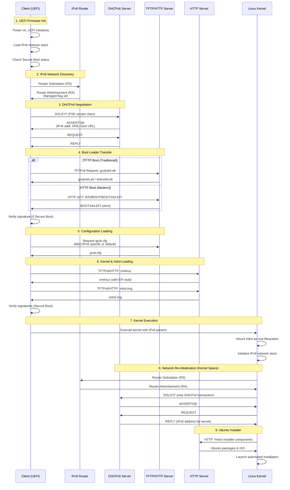

# PXE Boot Process for Ubuntu 24.04 Server (IPv6)

## Overview
PXE (Preboot Execution Environment) allows servers to boot from a network interface before booting from local storage. This guide covers PXE boot implementation using IPv6 for modern network environments.

## Prerequisites
- DHCPv6 Server (ISC DHCP or dnsmasq)
- TFTP Server with IPv6 support
- HTTP/NFS Server with IPv6 support
- Ubuntu 24.04 ISO image
- IPv6-enabled network infrastructure

## Modern UEFI PXE Boot Sequence with IPv6



### 1. **UEFI Firmware Initialization**
- Server powers on and UEFI firmware initializes
- UEFI network stack (IPv6 capable) loads
- Network card firmware initializes with UEFI network boot support
- UEFI firmware may check for Secure Boot requirements

### 2. **IPv6 Network Discovery**
- Client sends Router Solicitation (RS) message
- Router responds with Router Advertisement (RA) containing:
  - IPv6 prefix information
  - Managed flag (indicating DHCPv6 should be used)
  - Router address for default gateway
- Client configures link-local IPv6 address

### 3. **DHCPv6 Negotiation**
```
Client → DHCPv6 Server: SOLICIT (includes PXE vendor class)
DHCPv6 Server → Client: ADVERTISE
  - IPv6 address
  - DNS servers
  - Boot file URL (option 59)
  - TFTP server address (option 60)
Client → DHCPv6 Server: REQUEST
DHCPv6 Server → Client: REPLY
```

### 4. **Boot Loader Transfer (UEFI)**
**Option A: TFTP (Traditional)**
- Client contacts TFTP server using IPv6 address
- Downloads UEFI boot loader (grubx64.efi or shimx64.efi for Secure Boot)
- Boot loader signature verified if Secure Boot is enabled

**Option B: HTTP Boot (Modern)**
- Client initiates HTTP/HTTPS connection over IPv6
- Downloads boot loader via HTTP (faster and more reliable than TFTP)
- Supports larger files and resume capability
- HTTPS provides encrypted transfer for Secure Boot scenarios

### 5. **Configuration File Loading**
UEFI boot loader requests configuration file over IPv6:
```
1. grub/grub.cfg-01-<MAC-ADDRESS>
2. grub/grub.cfg-<IPv6-ADDRESS-FULL>
3. grub/grub.cfg-<IPv6-ADDRESS-PREFIX>
4. grub/grub.cfg
```

**Example IPv6 config paths:**
```
grub/grub.cfg-2001:0db8:0001:0000:0000:0000:0000:0100
grub/grub.cfg-2001:0db8:0001:0000
grub/grub.cfg
```

### 6. **Kernel and Initrd Loading**
- GRUB reads UEFI-compatible configuration
- Downloads Linux kernel (vmlinuz) with EFI stub support
- Downloads initial RAM disk (initrd) with IPv6 and UEFI modules
- Transfer via TFTPv6 or HTTP(S) depending on configuration
- Files can be signed for Secure Boot verification
- Modern systems may use unified kernel images (UKI) combining kernel, initrd, and cmdline

### 7. **Kernel Execution**
- Kernel boots with IPv6 parameters
- Initrd provides temporary root filesystem with IPv6 support
- Kernel loads its own network drivers and IPv6 stack

**Configuration Files & Device Initialization:**

The kernel and initrd environment reads several configuration sources to determine which devices come up:

1. **Kernel Command Line** (from GRUB)
   - Passed via `linux` or `linuxefi` command in grub.cfg
   - Examples: `ip=dhcp6`, `net.ifnames=0`, `biosdevname=0`
   - Parsed by kernel at boot time to configure early network

2. **Initrd Configuration Files:**
   ```
   /etc/netplan/*.yaml              # Ubuntu 24.04 uses netplan
   /etc/network/interfaces          # Legacy Debian-style (if present)
   /etc/systemd/network/*.network   # systemd-networkd configs
   /run/net-*.conf                  # Created by initramfs network scripts
   ```

3. **Network Configuration in Initrd:**
   - `/scripts/init-premount/` - Early network setup scripts
   - `/scripts/nfs` - NFS-specific network initialization
   - `/conf/initramfs.conf` - Initramfs configuration including network boot settings
   - `/etc/initramfs-tools/initramfs.conf` - Build-time configuration

4. **Device Detection:**
   - **udev rules** in initrd: `/lib/udev/rules.d/*.rules`
   - Network interface naming: `80-net-setup-link.rules`
   - Persistent network names: `70-persistent-net.rules`
   - Device driver loading: `/lib/modules/$(uname -r)/modules.dep`

5. **Kernel Modules for Network:**
   - `/lib/modules/$(uname -r)/kernel/drivers/net/`
   - Loaded via `modprobe` based on detected hardware
   - Module parameters from `/etc/modprobe.d/*.conf` (if in initrd)

6. **initramfs-tools Configuration:**
   ```bash
   # /etc/initramfs-tools/initramfs.conf
   BOOT=nfs                    # Boot method (nfs, local, etc.)
   DEVICE=                     # Specific network device
   NFSROOT=auto                # NFS root configuration
   ```

7. **Network Boot Script Variables:**
   ```bash
   # Variables set by kernel cmdline and used by initramfs scripts:
   ip=${IPV6_ADDR}:${GATEWAY}:${NETMASK}:${HOSTNAME}:${DEVICE}:${AUTOCONF}
   # Example: ip=dhcp or ip=dhcp6
   # These are parsed by /scripts/functions in initramfs
   ```

**Typical Boot Order:**
```
1. Kernel parses command line parameters (ip=dhcp6)
2. Initrd unpacks to tmpfs
3. /init script executes (initramfs entry point)
4. Early boot scripts in /scripts/init-premount/ run
5. udev starts and detects hardware
6. Network modules loaded based on detected NICs
7. ip-config or dhclient runs (based on ip= parameter)
8. Network interface comes up with IPv6
9. Mount root filesystem (or continue to installer)
```

**Key Files That Control Interface Behavior:**

```bash
# In the initrd environment:
/etc/netplan/01-netcfg.yaml     # Primary network config (Ubuntu)
/run/initramfs/netplan/          # Runtime netplan configs
/run/net-*.conf                  # Generated network state files

# Example netplan in initrd:
network:
  version: 2
  ethernets:
    all-en:
      match:
        name: en*
      dhcp6: true
      accept-ra: true
```

**Environment Variables Set:**

During initrd execution, these variables control network behavior:
- `DEVICE` - Network interface to use
- `BOOTIF` - Boot interface from PXE (MAC address)
- `IPV6ADDR`, `IPV6NETMASK`, `IPV6GATEWAY` - Static IPv6 config
- `HOSTNAME` - System hostname
- `DNSDOMAIN` - DNS domain name
- `ROOTSERVER` - Server providing root filesystem

### 8. **Network Re-initialization (Critical Step)**
- **Kernel network stack is independent from UEFI firmware**
- Kernel sends new Router Solicitation to discover IPv6 router
- Kernel initiates **second DHCPv6 negotiation** to obtain:
  - New IPv6 address for the kernel environment
  - DNS servers for package downloads
  - Gateway information
- This is necessary because kernel doesn't inherit UEFI firmware's network state
- Network interface configuration can be different from firmware (different MAC, driver, etc.)

### 9. **Ubuntu Installer Launch**
- Installer fetches components via HTTP over IPv6
- Downloads packages from IPv6-enabled repository
- Performs automated or interactive installation

## Server Configuration Example

### DHCPv6 Server (ISC DHCP)
```bash
# /etc/dhcp/dhcpd6.conf
default-lease-time 600;
max-lease-time 7200;
log-facility local7;

# Enable RFC 4833 timezone options
allow leasequery;

subnet6 2001:db8:1::/64 {
    # Range for dynamic assignment
    range6 2001:db8:1::100 2001:db8:1::200;
    
    # DNS servers
    option dhcp6.name-servers 2001:4860:4860::8888, 2001:4860:4860::8844;
    
    # Domain search list
    option dhcp6.domain-search "example.com";
    
    # PXE Boot options for UEFI
    option dhcp6.bootfile-url "tftp://[2001:db8:1::10]/grubx64.efi";
    
    # Vendor specific options
    option dhcp6.vendor-class 0 10 "PXEClient";
}

# Host-specific configuration
host ubuntu-client {
    host-identifier option dhcp6.client-id 00:01:00:01:2a:3b:4c:5d:6e:7f;
    fixed-address6 2001:db8:1::150;
}
```

### Router Advertisement (radvd)
```bash
# /etc/radvd.conf
interface eth0
{
    AdvSendAdvert on;
    MinRtrAdvInterval 3;
    MaxRtrAdvInterval 10;
    
    # Managed flag - clients should use DHCPv6
    AdvManagedFlag on;
    AdvOtherConfigFlag on;
    
    prefix 2001:db8:1::/64
    {
        AdvOnLink on;
        AdvAutonomous off;  # Don't use SLAAC
        AdvRouterAddr on;
    };
    
    # RDNSS (Recursive DNS Server)
    RDNSS 2001:4860:4860::8888 2001:4860:4860::8844
    {
        AdvRDNSSLifetime 300;
    };
};
```

### TFTP Server Configuration (tftp-hpa) - Legacy Support
```bash
# /etc/default/tftpd-hpa
TFTP_USERNAME="tftp"
TFTP_DIRECTORY="/srv/tftp"
TFTP_ADDRESS="[::]:69"  # Listen on all IPv6 addresses
TFTP_OPTIONS="--secure --ipv6 -v --blocksize 1468"  # Optimized for IPv6 MTU
```

### HTTP Boot Server (nginx) - Modern Approach
```nginx
# /etc/nginx/sites-available/pxe-boot
server {
    listen [::]:80 ipv6only=on;
    listen [::]:443 ssl http2 ipv6only=on;
    server_name pxe.example.com;
    
    # SSL for Secure Boot
    ssl_certificate /etc/ssl/certs/pxe-server.crt;
    ssl_certificate_key /etc/ssl/private/pxe-server.key;
    ssl_protocols TLSv1.3 TLSv1.2;
    
    root /srv/http-boot;
    
    # Enable range requests for resume capability
    add_header Accept-Ranges bytes;
    
    location /efi/ {
        autoindex on;
        allow 2001:db8:1::/64;
        deny all;
    }
    
    location /ubuntu/ {
        autoindex on;
        allow 2001:db8:1::/64;
        deny all;
    }
}
```

### Modern UEFI Boot Directory Structure
```
/srv/tftp/  or  /srv/http-boot/
├── EFI/
│   └── BOOT/
│       ├── BOOTX64.EFI      # Default UEFI boot loader
│       ├── grubx64.efi      # GRUB for UEFI
│       ├── shimx64.efi      # Shim for Secure Boot
│       ├── mmx64.efi        # MOK Manager for Secure Boot
│       └── grubx64.efi.signed  # Signed GRUB for Secure Boot
├── ubuntu-24.04/
│   ├── vmlinuz              # Kernel with EFI stub
│   ├── initrd.img           # Initial RAM disk with UEFI support
│   └── vmlinuz.efi.signed   # Signed kernel (Secure Boot)
├── grub/
│   ├── grub.cfg             # GRUB configuration
│   ├── x86_64-efi/          # GRUB UEFI modules
│   │   ├── linux.mod
│   │   ├── net.mod
│   │   └── efinet.mod
│   └── fonts/
│       └── unicode.pf2
└── ipxe/                    # Optional: iPXE for advanced features
    └── snponly.efi          # iPXE UEFI binary
```

### Modern UEFI GRUB Configuration
```bash
# /srv/tftp/grub/grub.cfg or /srv/http-boot/grub/grub.cfg
set timeout=10
set default=0

# UEFI-specific settings
set gfxmode=auto
load_video
insmod gfxterm
insmod efi_gop
insmod efi_uga
terminal_output gfxterm

# Network modules for IPv6
insmod net
insmod efinet
insmod tftp
insmod http

# Set UEFI boot parameters
set root=(tftp,2001:db8:1::10)

menuentry "Install Ubuntu Server 24.04 LTS (UEFI)" {
    echo 'Loading kernel with UEFI support...'
    linuxefi /ubuntu-24.04/vmlinuz \
        ip=dhcp6 \
        url=http://[2001:db8:1::10]/ubuntu-24.04-server.iso \
        autoinstall \
        ds=nocloud-net;s=http://[2001:db8:1::10]/autoinstall/ \
        ipv6.disable=0 \
        net.ifnames=0
    echo 'Loading initrd...'
    initrdefi /ubuntu-24.04/initrd.img
}

menuentry "Install Ubuntu Server 24.04 LTS (Secure Boot)" {
    echo 'Loading signed kernel...'
    linuxefi /ubuntu-24.04/vmlinuz.efi.signed \
        ip=dhcp6 \
        url=https://[2001:db8:1::10]/ubuntu-24.04-server.iso \
        autoinstall \
        ds=nocloud-net;s=https://[2001:db8:1::10]/autoinstall/
    initrdefi /ubuntu-24.04/initrd.img
}

menuentry "Boot from local disk (UEFI)" {
    exit
}

menuentry "UEFI Firmware Settings" {
    fwsetup
}
```

> **Note:** For a detailed comparison of GRUB2 vs other UEFI boot loaders (systemd-boot, iPXE, rEFInd, UEFI Shell), see [uefi-bootloaders.md](./uefi-bootloaders.md). This guide uses GRUB2 as the standard boot loader for PXE deployments.

## Autoinstall Configuration (Ubuntu 24.04)
```yaml
# /var/www/html/autoinstall/user-data
#cloud-config
autoinstall:
  version: 1
  locale: en_US.UTF-8
  keyboard:
    layout: us
  network:
    ethernets:
      enp0s3:
        dhcp4: true
  storage:
    layout:
      name: lvm
  identity:
    hostname: ubuntu-server
    username: ubuntu
    password: $6$encrypted_password_here
  ssh:
    install-server: true
    authorized-keys:
      - ssh-rsa AAAAB3... user@example.com
  packages:
    - vim
    - htop
    - net-tools
  late-commands:
    - curtin in-target -- systemctl enable ssh
```

## Network Flow Diagram
```
┌──────────┐     DHCPv6      ┌──────────┐
│  Client  │◄───────────────►│   DHCPv6  │
│  Server  │               │  Server  │
└────┬─────┘               └──────────┘
     │
     │ TFTP Request
     ▼
┌──────────┐
│   TFTP   │
│  Server  │
└────┬─────┘
     │
     │ HTTP/NFS
     ▼
┌──────────┐
│   HTTP   │
│  Server  │
└──────────┘
```

## Troubleshooting

### Common Issues
1. **No DHCPv6 Response**
   - Check DHCPv6 server logs: `journalctl -u isc-dhcp-server`
   - Verify network connectivity
   - Ensure DHCPv6 server is listening on correct interface

2. **TFTP Timeout**
   - Check TFTP server: `systemctl status tftpd-hpa`
   - Verify firewall rules: `sudo ufw status`
   - Test TFTP: `tftp -6 2001:db8:1::10 -c get grubx64.efi`

3. **Kernel Panic**
   - Verify kernel and initrd compatibility
   - Check boot parameters
   - Ensure sufficient RAM (minimum 2GB for Ubuntu 24.04)

### Useful Commands
```bash
# Monitor DHCPv6 requests
sudo tcpdump -i eth0 port 546 or port 547 -n

# Check TFTP logs
sudo journalctl -u tftpd-hpa -f

# Test HTTP server
curl http://[2001:db8:1::10]/ubuntu-24.04-server.iso --head

# Monitor PXE boot process
sudo tcpdump -i eth0 port 69 -n
```

## Modern Security Considerations

### UEFI Secure Boot
- **Enable Secure Boot** in UEFI firmware settings
- Use signed boot loaders (shimx64.efi) with valid certificates
- Sign custom kernels with your organization's key or use MOK (Machine Owner Key)
- Implement MOK Manager (mmx64.efi) for managing custom keys
- Regularly update Secure Boot DBX (revocation list)

### Network Security
- **HTTP Boot over HTTPS**: Encrypt boot loader and file transfers
- Enable IPv6 firewall rules (nftables/firewalld)
- Use DHCPv6 Guard on switches to prevent rogue DHCPv6 servers
- Implement RA Guard to prevent rogue router advertisements
- Use IPsec for end-to-end encryption of PXE traffic
- Enable Secure Neighbor Discovery (SEND) if supported
- Monitor for IPv6-specific attacks (neighbor exhaustion, RA flooding)
- Implement proper IPv6 network segmentation with VLANs

### Boot Process Security
- **TPM 2.0 Integration**: Use TPM for measured boot
- Enable UEFI firmware password/supervisor password
- Ensure UEFI-only boot mode (disable Compatibility Support Module if present)
- Use network boot authentication (802.1X)
- Implement MAC address filtering in DHCPv6
- Regular firmware updates for UEFI and network cards
- Enable UEFI boot order locks to prevent unauthorized boot device changes

### File Integrity
- Sign all boot files (kernels, initrd, boot loaders)
- Use checksums (SHA-256) for installation media
- Implement file integrity monitoring for boot directories
- Use read-only filesystems for boot file repositories
- Regular vulnerability scanning of boot images

## Secure Boot Setup Guide

### 1. Prepare Signed Boot Components
```bash
# Install signing tools
sudo apt install sbsigntool efitools

# Generate or obtain signing certificate
openssl req -new -x509 -newkey rsa:2048 \
    -keyout MOK.key -out MOK.crt \
    -days 3650 -nodes -sha256 \
    -subj "/CN=My Organization PXE Boot/"

# Convert to DER format
openssl x509 -in MOK.crt -out MOK.cer -outform DER

# Sign GRUB
sbsign --key MOK.key --cert MOK.crt \
    --output /srv/http-boot/EFI/BOOT/grubx64.efi.signed \
    /srv/http-boot/EFI/BOOT/grubx64.efi

# Sign kernel
sbsign --key MOK.key --cert MOK.crt \
    --output /srv/http-boot/ubuntu-24.04/vmlinuz.efi.signed \
    /srv/http-boot/ubuntu-24.04/vmlinuz
```

### 2. Deploy Shim for Secure Boot
```bash
# Copy shim and MOK manager
cp /usr/lib/shim/shimx64.efi.signed /srv/http-boot/EFI/BOOT/BOOTX64.EFI
cp /usr/lib/shim/mmx64.efi /srv/http-boot/EFI/BOOT/mmx64.efi
cp /usr/lib/shim/grubx64.efi.signed /srv/http-boot/EFI/BOOT/grubx64.efi

# Copy MOK certificate for enrollment
cp MOK.cer /srv/http-boot/EFI/BOOT/
```

### 3. Configure DHCPv6 for Secure Boot
```bash
# /etc/dhcp/dhcpd6.conf - Detect Secure Boot clients
option dhcp6.bootfile-url code 59 = string;

subnet6 2001:db8:1::/64 {
    range6 2001:db8:1::100 2001:db8:1::200;
    
    # Detect UEFI Secure Boot architecture
    if option dhcp6.client-arch-type = 00:07 {
        # UEFI x64 - Use shim for Secure Boot
        option dhcp6.bootfile-url "http://[2001:db8:1::10]/EFI/BOOT/BOOTX64.EFI";
    } elsif option dhcp6.client-arch-type = 00:09 {
        # UEFI x64 HTTP
        option dhcp6.bootfile-url "http://[2001:db8:1::10]/EFI/BOOT/BOOTX64.EFI";
    }
}
```

## Performance Optimization

### TFTP Tuning
```bash
# Increase block size for faster transfers
TFTP_OPTIONS="--secure --ipv6 -v --blocksize 1468 --timeout 5"

# For very large initrd files, consider using HTTP Boot instead
```

### HTTP Boot Performance
```nginx
# nginx optimization for boot files
server {
    # Enable sendfile for better performance
    sendfile on;
    tcp_nopush on;
    tcp_nodelay on;
    
    # Increase buffer sizes
    client_body_buffer_size 128k;
    client_max_body_size 100M;
    
    # Enable compression
    gzip on;
    gzip_types application/x-gzip application/x-compressed;
    
    # Cache boot files
    location /EFI/ {
        expires 1h;
        add_header Cache-Control "public, immutable";
    }
}
```

### Network Optimization
```bash
# Increase MTU for IPv6 if network supports it
ip link set dev eth0 mtu 9000

# Optimize network card for PXE
ethtool -G eth0 rx 4096 tx 4096
ethtool -K eth0 tso on gso on
```

## Modern UEFI Boot Parameters
```bash
# UEFI and IPv6-specific kernel parameters
ipv6.disable=0              # Ensure IPv6 is enabled
ipv6.autoconf=1             # Enable IPv6 autoconfiguration
accept_ra=2                 # Accept Router Advertisements
dhcpv6.rapid_commit=1       # Enable rapid commit for faster DHCPv6
efi=runtime                 # Enable EFI runtime services
noefi=0                     # Don't disable EFI
acpi=force                  # Force ACPI support
uefi_secure_boot            # Indicate Secure Boot status
tpm_tis.force=1             # Force TPM TIS driver (if using TPM)
```