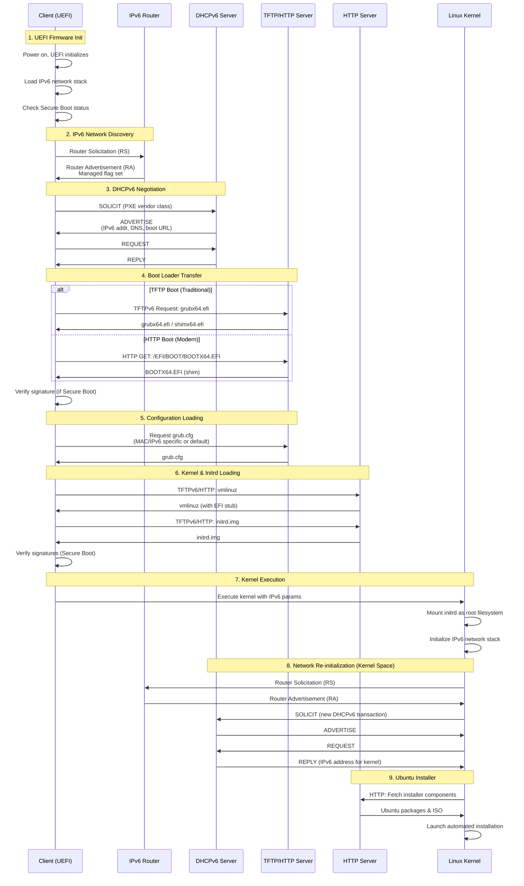

# PXE Boot Process for Ubuntu 24.04 Server (IPv6)

## Overview
PXE (Preboot Execution Environment) allows servers to boot from a network interface before booting from local storage. This guide covers PXE boot implementation using IPv6 for modern network environments.

## Prerequisites
- DHCPv6 Server (ISC DHCP or dnsmasq)
- TFTP Server with IPv6 support
- HTTP/NFS Server with IPv6 support
- Ubuntu 24.04 ISO image
- IPv6-enabled network infrastructure

## Modern UEFI PXE Boot Sequence with IPv6



### 1. **UEFI Firmware Initialization**
- Server powers on and UEFI firmware initializes
- UEFI network stack (IPv6 capable) loads
- Network card firmware initializes with UEFI network boot support
- UEFI firmware may check for Secure Boot requirements

### 2. **IPv6 Network Discovery (NDP)**
- Client configures link-local IPv6 address (fe80::/10 + EUI-64 from MAC)
- Client sends Router Solicitation (RS) message to ff02::2 (All-Routers multicast)
- Router responds with Router Advertisement (RA) containing:
  - IPv6 prefix information (for SLAAC if enabled)
  - Managed flag (M=1, indicating DHCPv6 should be used for addresses)
  - Other config flag (O=1, indicating DHCPv6 for other configuration)
  - Router address for default gateway
  - MTU, hop limit, router lifetime
- Client may perform Duplicate Address Detection (DAD) using Neighbor Solicitation

> **Note:** For detailed NDP mechanisms, message formats, and interaction with DHCP relay, see [NDP Deep Dive](#ndp-neighbor-discovery-protocol-deep-dive) section below.

### 3. **DHCPv6 Negotiation**

**Direct (Same Subnet):**
```
Client → DHCPv6 Server: SOLICIT (includes PXE vendor class)
DHCPv6 Server → Client: ADVERTISE
  - IPv6 address
  - DNS servers
  - Boot file URL (option 59)
  - TFTP server address (option 60)
Client → DHCPv6 Server: REQUEST
DHCPv6 Server → Client: REPLY
```

**Via Relay Agent (Remote Subnet):**
```
Client → Relay: SOLICIT (multicast to ff02::1:2)
Relay → Server: RELAY-FORWARD (unicast, encapsulates SOLICIT)
Server → Relay: RELAY-REPLY (unicast, encapsulates ADVERTISE)
Relay → Client: ADVERTISE (extracted from RELAY-REPLY)
Client → Relay: REQUEST
Relay → Server: RELAY-FORWARD (encapsulates REQUEST)
Server → Relay: RELAY-REPLY (encapsulates REPLY)
Relay → Client: REPLY
```

> **Note:** For detailed DHCP relay mechanisms, forwarding logic, and relay agent information options, see [DHCP Relay Deep Dive](#dhcp-relay-deep-dive) section below.

### 4. **Boot Loader Transfer (UEFI)**
**Option A: TFTP (Traditional)**
- Client contacts TFTP server using IPv6 address
- Downloads UEFI boot loader (grubx64.efi or shimx64.efi for Secure Boot)
- Boot loader signature verified if Secure Boot is enabled

**Option B: HTTP Boot (Modern)**
- Client initiates HTTP/HTTPS connection over IPv6
- Downloads boot loader via HTTP (faster and more reliable than TFTP)
- Supports larger files and resume capability
- HTTPS provides encrypted transfer for Secure Boot scenarios

### 5. **Configuration File Loading**
UEFI boot loader requests configuration file over IPv6:
```
1. grub/grub.cfg-01-<MAC-ADDRESS>
2. grub/grub.cfg-<IPv6-ADDRESS-FULL>
3. grub/grub.cfg-<IPv6-ADDRESS-PREFIX>
4. grub/grub.cfg
```

**Example IPv6 config paths:**
```
grub/grub.cfg-2001:0db8:0001:0000:0000:0000:0000:0100
grub/grub.cfg-2001:0db8:0001:0000
grub/grub.cfg
```

### 6. **Kernel and Initrd Loading**
- GRUB reads UEFI-compatible configuration
- Downloads Linux kernel (vmlinuz) with EFI stub support
- Downloads initial RAM disk (initrd) with IPv6 and UEFI modules
- Transfer via TFTPv6 or HTTP(S) depending on configuration
- Files can be signed for Secure Boot verification
- Modern systems may use unified kernel images (UKI) combining kernel, initrd, and cmdline

### 7. **Kernel Execution**
- Kernel boots with IPv6 parameters
- Initrd provides temporary root filesystem with IPv6 support
- Kernel loads its own network drivers and IPv6 stack

**Configuration Files & Device Initialization:**

The kernel and initrd environment reads several configuration sources to determine which devices come up:

1. **Kernel Command Line** (from GRUB)
   - Passed via `linux` or `linuxefi` command in grub.cfg
   - Examples: `ip=dhcp6`, `net.ifnames=0`, `biosdevname=0`
   - Parsed by kernel at boot time to configure early network

2. **Initrd Configuration Files:**
   ```
   /etc/netplan/*.yaml              # Ubuntu 24.04 uses netplan
   /etc/network/interfaces          # Legacy Debian-style (if present)
   /etc/systemd/network/*.network   # systemd-networkd configs
   /run/net-*.conf                  # Created by initramfs network scripts
   ```

3. **Network Configuration in Initrd:**
   - `/scripts/init-premount/` - Early network setup scripts
   - `/scripts/nfs` - NFS-specific network initialization
   - `/conf/initramfs.conf` - Initramfs configuration including network boot settings
   - `/etc/initramfs-tools/initramfs.conf` - Build-time configuration

4. **Device Detection:**
   - **udev rules** in initrd: `/lib/udev/rules.d/*.rules`
   - Network interface naming: `80-net-setup-link.rules`
   - Persistent network names: `70-persistent-net.rules`
   - Device driver loading: `/lib/modules/$(uname -r)/modules.dep`

5. **Kernel Modules for Network:**
   - `/lib/modules/$(uname -r)/kernel/drivers/net/`
   - Loaded via `modprobe` based on detected hardware
   - Module parameters from `/etc/modprobe.d/*.conf` (if in initrd)

6. **initramfs-tools Configuration:**
   ```bash
   # /etc/initramfs-tools/initramfs.conf
   BOOT=nfs                    # Boot method (nfs, local, etc.)
   DEVICE=                     # Specific network device
   NFSROOT=auto                # NFS root configuration
   ```

7. **Network Boot Script Variables:**
   ```bash
   # Variables set by kernel cmdline and used by initramfs scripts:
   ip=${IPV6_ADDR}:${GATEWAY}:${NETMASK}:${HOSTNAME}:${DEVICE}:${AUTOCONF}
   # Example: ip=dhcp or ip=dhcp6
   # These are parsed by /scripts/functions in initramfs
   ```

**Typical Boot Order:**
```
1. Kernel parses command line parameters (ip=dhcp6)
2. Initrd unpacks to tmpfs
3. /init script executes (initramfs entry point)
4. Early boot scripts in /scripts/init-premount/ run
5. udev starts and detects hardware
6. Network modules loaded based on detected NICs
7. ip-config or dhclient runs (based on ip= parameter)
8. Network interface comes up with IPv6
9. Mount root filesystem (or continue to installer)
```

**Key Files That Control Interface Behavior:**

```bash
# In the initrd environment:
/etc/netplan/01-netcfg.yaml     # Primary network config (Ubuntu)
/run/initramfs/netplan/          # Runtime netplan configs
/run/net-*.conf                  # Generated network state files

# Example netplan in initrd:
network:
  version: 2
  ethernets:
    all-en:
      match:
        name: en*
      dhcp6: true
      accept-ra: true
```

**Environment Variables Set:**

During initrd execution, these variables control network behavior:
- `DEVICE` - Network interface to use
- `BOOTIF` - Boot interface from PXE (MAC address)
- `IPV6ADDR`, `IPV6NETMASK`, `IPV6GATEWAY` - Static IPv6 config
- `HOSTNAME` - System hostname
- `DNSDOMAIN` - DNS domain name
- `ROOTSERVER` - Server providing root filesystem

### 8. **Network Re-initialization (Critical Step)**
- **Kernel network stack is independent from UEFI firmware**
- Kernel sends new Router Solicitation to discover IPv6 router
- Kernel initiates **second DHCPv6 negotiation** to obtain:
  - New IPv6 address for the kernel environment
  - DNS servers for package downloads
  - Gateway information
- This is necessary because kernel doesn't inherit UEFI firmware's network state
- Network interface configuration can be different from firmware (different MAC, driver, etc.)

### 9. **Ubuntu Installer Launch**
- Installer fetches components via HTTP over IPv6
- Downloads packages from IPv6-enabled repository
- Performs automated or interactive installation

## Server Configuration Example

### DHCPv6 Server (ISC DHCP)
```bash
# /etc/dhcp/dhcpd6.conf
default-lease-time 600;
max-lease-time 7200;
log-facility local7;

# Enable RFC 4833 timezone options
allow leasequery;

subnet6 2001:db8:1::/64 {
    # Range for dynamic assignment
    range6 2001:db8:1::100 2001:db8:1::200;
    
    # DNS servers
    option dhcp6.name-servers 2001:4860:4860::8888, 2001:4860:4860::8844;
    
    # Domain search list
    option dhcp6.domain-search "example.com";
    
    # PXE Boot options for UEFI
    option dhcp6.bootfile-url "tftp://[2001:db8:1::10]/grubx64.efi";
    
    # Vendor specific options
    option dhcp6.vendor-class 0 10 "PXEClient";
}

# Host-specific configuration
host ubuntu-client {
    host-identifier option dhcp6.client-id 00:01:00:01:2a:3b:4c:5d:6e:7f;
    fixed-address6 2001:db8:1::150;
}
```

### Router Advertisement (radvd)
```bash
# /etc/radvd.conf
interface eth0
{
    AdvSendAdvert on;
    MinRtrAdvInterval 3;
    MaxRtrAdvInterval 10;
    
    # Managed flag - clients should use DHCPv6
    AdvManagedFlag on;
    AdvOtherConfigFlag on;
    
    prefix 2001:db8:1::/64
    {
        AdvOnLink on;
        AdvAutonomous off;  # Don't use SLAAC
        AdvRouterAddr on;
    };
    
    # RDNSS (Recursive DNS Server)
    RDNSS 2001:4860:4860::8888 2001:4860:4860::8844
    {
        AdvRDNSSLifetime 300;
    };
};
```

### TFTP Server Configuration (tftp-hpa) - Legacy Support
```bash
# /etc/default/tftpd-hpa
TFTP_USERNAME="tftp"
TFTP_DIRECTORY="/srv/tftp"
TFTP_ADDRESS="[::]:69"  # Listen on all IPv6 addresses
TFTP_OPTIONS="--secure --ipv6 -v --blocksize 1468"  # Optimized for IPv6 MTU
```

### HTTP Boot Server (nginx) - Modern Approach
```nginx
# /etc/nginx/sites-available/pxe-boot
server {
    listen [::]:80 ipv6only=on;
    listen [::]:443 ssl http2 ipv6only=on;
    server_name pxe.example.com;
    
    # SSL for Secure Boot
    ssl_certificate /etc/ssl/certs/pxe-server.crt;
    ssl_certificate_key /etc/ssl/private/pxe-server.key;
    ssl_protocols TLSv1.3 TLSv1.2;
    
    root /srv/http-boot;
    
    # Enable range requests for resume capability
    add_header Accept-Ranges bytes;
    
    location /efi/ {
        autoindex on;
        allow 2001:db8:1::/64;
        deny all;
    }
    
    location /ubuntu/ {
        autoindex on;
        allow 2001:db8:1::/64;
        deny all;
    }
}
```

### Modern UEFI Boot Directory Structure
```
/srv/tftp/  or  /srv/http-boot/
├── EFI/
│   └── BOOT/
│       ├── BOOTX64.EFI      # Default UEFI boot loader
│       ├── grubx64.efi      # GRUB for UEFI
│       ├── shimx64.efi      # Shim for Secure Boot
│       ├── mmx64.efi        # MOK Manager for Secure Boot
│       └── grubx64.efi.signed  # Signed GRUB for Secure Boot
├── ubuntu-24.04/
│   ├── vmlinuz              # Kernel with EFI stub
│   ├── initrd.img           # Initial RAM disk with UEFI support
│   └── vmlinuz.efi.signed   # Signed kernel (Secure Boot)
├── grub/
│   ├── grub.cfg             # GRUB configuration
│   ├── x86_64-efi/          # GRUB UEFI modules
│   │   ├── linux.mod
│   │   ├── net.mod
│   │   └── efinet.mod
│   └── fonts/
│       └── unicode.pf2
└── ipxe/                    # Optional: iPXE for advanced features
    └── snponly.efi          # iPXE UEFI binary
```

### Modern UEFI GRUB Configuration
```bash
# /srv/tftp/grub/grub.cfg or /srv/http-boot/grub/grub.cfg
set timeout=10
set default=0

# UEFI-specific settings
set gfxmode=auto
load_video
insmod gfxterm
insmod efi_gop
insmod efi_uga
terminal_output gfxterm

# Network modules for IPv6
insmod net
insmod efinet
insmod tftp
insmod http

# Set UEFI boot parameters
set root=(tftp,2001:db8:1::10)

menuentry "Install Ubuntu Server 24.04 LTS (UEFI)" {
    echo 'Loading kernel with UEFI support...'
    linuxefi /ubuntu-24.04/vmlinuz \
        ip=dhcp6 \
        url=http://[2001:db8:1::10]/ubuntu-24.04-server.iso \
        autoinstall \
        ds=nocloud-net;s=http://[2001:db8:1::10]/autoinstall/ \
        ipv6.disable=0 \
        net.ifnames=0
    echo 'Loading initrd...'
    initrdefi /ubuntu-24.04/initrd.img
}

menuentry "Install Ubuntu Server 24.04 LTS (Secure Boot)" {
    echo 'Loading signed kernel...'
    linuxefi /ubuntu-24.04/vmlinuz.efi.signed \
        ip=dhcp6 \
        url=https://[2001:db8:1::10]/ubuntu-24.04-server.iso \
        autoinstall \
        ds=nocloud-net;s=https://[2001:db8:1::10]/autoinstall/
    initrdefi /ubuntu-24.04/initrd.img
}

menuentry "Boot from local disk (UEFI)" {
    exit
}

menuentry "UEFI Firmware Settings" {
    fwsetup
}
```

> **Note:** For a detailed comparison of GRUB2 vs other UEFI boot loaders (systemd-boot, iPXE, rEFInd, UEFI Shell), see [uefi-bootloaders.md](./uefi-bootloaders.md). This guide uses GRUB2 as the standard boot loader for PXE deployments.

## Autoinstall Configuration (Ubuntu 24.04)
```yaml
# /var/www/html/autoinstall/user-data
#cloud-config
autoinstall:
  version: 1
  locale: en_US.UTF-8
  keyboard:
    layout: us
  network:
    ethernets:
      enp0s3:
        dhcp4: true
  storage:
    layout:
      name: lvm
  identity:
    hostname: ubuntu-server
    username: ubuntu
    password: $6$encrypted_password_here
  ssh:
    install-server: true
    authorized-keys:
      - ssh-rsa AAAAB3... user@example.com
  packages:
    - vim
    - htop
    - net-tools
  late-commands:
    - curtin in-target -- systemctl enable ssh
```

## Network Flow Diagram
```
┌──────────┐     DHCPv6      ┌──────────┐
│  Client  │◄───────────────►│   DHCPv6  │
│  Server  │               │  Server  │
└────┬─────┘               └──────────┘
     │
     │ TFTP Request
     ▼
┌──────────┐
│   TFTP   │
│  Server  │
└────┬─────┘
     │
     │ HTTP/NFS
     ▼
┌──────────┐
│   HTTP   │
│  Server  │
└──────────┘
```

## Troubleshooting

### Common Issues
1. **No DHCPv6 Response**
   - Check DHCPv6 server logs: `journalctl -u isc-dhcp-server`
   - Verify network connectivity
   - Ensure DHCPv6 server is listening on correct interface

2. **TFTP Timeout**
   - Check TFTP server: `systemctl status tftpd-hpa`
   - Verify firewall rules: `sudo ufw status`
   - Test TFTP: `tftp -6 2001:db8:1::10 -c get grubx64.efi`

3. **Kernel Panic**
   - Verify kernel and initrd compatibility
   - Check boot parameters
   - Ensure sufficient RAM (minimum 2GB for Ubuntu 24.04)

### Useful Commands
```bash
# Monitor DHCPv6 requests
sudo tcpdump -i eth0 port 546 or port 547 -n

# Check TFTP logs
sudo journalctl -u tftpd-hpa -f

# Test HTTP server
curl http://[2001:db8:1::10]/ubuntu-24.04-server.iso --head

# Monitor PXE boot process
sudo tcpdump -i eth0 port 69 -n
```

## Modern Security Considerations

### UEFI Secure Boot
- **Enable Secure Boot** in UEFI firmware settings
- Use signed boot loaders (shimx64.efi) with valid certificates
- Sign custom kernels with your organization's key or use MOK (Machine Owner Key)
- Implement MOK Manager (mmx64.efi) for managing custom keys
- Regularly update Secure Boot DBX (revocation list)

### Network Security
- **HTTP Boot over HTTPS**: Encrypt boot loader and file transfers
- Enable IPv6 firewall rules (nftables/firewalld)
- Use DHCPv6 Guard on switches to prevent rogue DHCPv6 servers
- Implement RA Guard to prevent rogue router advertisements
- Use IPsec for end-to-end encryption of PXE traffic
- Enable Secure Neighbor Discovery (SEND) if supported
- Monitor for IPv6-specific attacks (neighbor exhaustion, RA flooding)
- Implement proper IPv6 network segmentation with VLANs

### Boot Process Security
- **TPM 2.0 Integration**: Use TPM for measured boot
- Enable UEFI firmware password/supervisor password
- Ensure UEFI-only boot mode (disable Compatibility Support Module if present)
- Use network boot authentication (802.1X)
- Implement MAC address filtering in DHCPv6
- Regular firmware updates for UEFI and network cards
- Enable UEFI boot order locks to prevent unauthorized boot device changes

### File Integrity
- Sign all boot files (kernels, initrd, boot loaders)
- Use checksums (SHA-256) for installation media
- Implement file integrity monitoring for boot directories
- Use read-only filesystems for boot file repositories
- Regular vulnerability scanning of boot images

---

## DHCP Relay Deep Dive

When a PXE client and DHCPv6 server are on different subnets (common in data center environments), a **relay agent** is required. This section details the relay mechanisms, message formats, and forwarding logic.

### Why Relay Is Needed

**Problem:**
- DHCPv6 clients use link-local multicast (ff02::1:2) to discover DHCP servers
- Link-local multicast doesn't cross router boundaries
- Centralized DHCP servers can't directly receive client broadcasts

**Solution:**
- Relay agent on the client's subnet intercepts DHCP messages
- Converts multicast → unicast to reach remote server
- Adds subnet context so server knows which address pool to use

### DHCPv6 Relay Architecture

```
┌─────────────────────────────────────────────────────────────┐
│ PXE CLIENT (UEFI Firmware)                    Subnet A      │
│ Link-local: fe80::1234                        2001:db8:1::/64│
└─────────────────────────────────────────────────────────────┘
         │ SOLICIT to ff02::1:2 (All DHCP agents)
         ↓
┌─────────────────────────────────────────────────────────────┐
│ RELAY AGENT (Router/DPU)                                    │
│ Interface A: 2001:db8:1::1 (client-facing)                 │
│ Interface B: 2001:db8:100::50 (server-facing)              │
│                                                             │
│ • Listens on ff02::1:2 (All_DHCP_Relay_Agents_and_Servers) │
│ • Intercepts client messages                                │
│ • Encapsulates in RELAY-FORWARD                             │
│ • Adds link-address (subnet identifier)                     │
│ • Adds peer-address (client's link-local)                   │
│ • Forwards via unicast to configured server                 │
└─────────────────────────────────────────────────────────────┘
         │ RELAY-FORWARD to 2001:db8:100::10 (unicast)
         ↓
┌─────────────────────────────────────────────────────────────┐
│ DHCPv6 SERVER                                 Subnet B       │
│ 2001:db8:100::10                              2001:db8:100::/64│
│                                                             │
│ • Receives RELAY-FORWARD                                    │
│ • Extracts link-address → determines subnet                 │
│ • Selects address from appropriate pool                     │
│ • Encapsulates response in RELAY-REPLY                      │
│ • Sends back to relay agent                                 │
└─────────────────────────────────────────────────────────────┘
         │ RELAY-REPLY to 2001:db8:100::50 (unicast)
         ↓
┌─────────────────────────────────────────────────────────────┐
│ RELAY AGENT                                                 │
│ • Receives RELAY-REPLY                                      │
│ • Extracts encapsulated ADVERTISE                           │
│ • Forwards to client (multicast or unicast)                 │
└─────────────────────────────────────────────────────────────┘
         │ ADVERTISE
         ↓
┌─────────────────────────────────────────────────────────────┐
│ PXE CLIENT                                                  │
│ • Receives ADVERTISE                                        │
│ • Continues with REQUEST/REPLY exchange                     │
└─────────────────────────────────────────────────────────────┘
```

### DHCPv6 Message Types (Relay-Specific)

```
Message Type | Code | Direction        | Purpose
-------------|------|------------------|----------------------------------
SOLICIT      |  1   | Client → Relay   | Discover available servers
ADVERTISE    |  2   | Relay → Client   | Server offers configuration
REQUEST      |  3   | Client → Relay   | Request specific configuration
REPLY        |  7   | Relay → Client   | Server provides configuration
RELAY-FORW   | 12   | Relay → Server   | Encapsulates client message
RELAY-REPL   | 13   | Server → Relay   | Encapsulates server response
```

### RELAY-FORWARD Message Format (RFC 8415)

```
 0                   1                   2                   3
 0 1 2 3 4 5 6 7 8 9 0 1 2 3 4 5 6 7 8 9 0 1 2 3 4 5 6 7 8 9 0 1
+-+-+-+-+-+-+-+-+-+-+-+-+-+-+-+-+-+-+-+-+-+-+-+-+-+-+-+-+-+-+-+-+
|    msg-type   |   hop-count   |                               |
+-+-+-+-+-+-+-+-+-+-+-+-+-+-+-+-+                               |
|                                                               |
|                         link-address                          |
|                                                               |
|                                                               |
+-+-+-+-+-+-+-+-+-+-+-+-+-+-+-+-+-+-+-+-+-+-+-+-+-+-+-+-+-+-+-+-+
|                                                               |
|                         peer-address                          |
|                                                               |
|                                                               |
+-+-+-+-+-+-+-+-+-+-+-+-+-+-+-+-+-+-+-+-+-+-+-+-+-+-+-+-+-+-+-+-+
|                                                               |
.                            options                            .
.                 (variable length)                             .
|                                                               |
+-+-+-+-+-+-+-+-+-+-+-+-+-+-+-+-+-+-+-+-+-+-+-+-+-+-+-+-+-+-+-+-+

Field Details:
├─ msg-type: 12 (RELAY-FORW)
├─ hop-count: Number of relay agents traversed (0-32)
├─ link-address: IPv6 address of subnet where client resides
│                Used by server to select address pool
│                Set to relay's interface address facing client
├─ peer-address: IPv6 address of client (or previous relay)
│                Usually client's link-local address
│                Used to send reply back to correct client
└─ options: Contains encapsulated client message + relay info
```

### RELAY-REPLY Message Format (RFC 8415)

```
 0                   1                   2                   3
 0 1 2 3 4 5 6 7 8 9 0 1 2 3 4 5 6 7 8 9 0 1 2 3 4 5 6 7 8 9 0 1
+-+-+-+-+-+-+-+-+-+-+-+-+-+-+-+-+-+-+-+-+-+-+-+-+-+-+-+-+-+-+-+-+
|    msg-type   |   hop-count   |                               |
+-+-+-+-+-+-+-+-+-+-+-+-+-+-+-+-+                               |
|                                                               |
|                         link-address                          |
|                                                               |
|                                                               |
+-+-+-+-+-+-+-+-+-+-+-+-+-+-+-+-+-+-+-+-+-+-+-+-+-+-+-+-+-+-+-+-+
|                                                               |
|                         peer-address                          |
|                                                               |
|                                                               |
+-+-+-+-+-+-+-+-+-+-+-+-+-+-+-+-+-+-+-+-+-+-+-+-+-+-+-+-+-+-+-+-+
|                                                               |
.                            options                            .
.                 (must include OPTION_RELAY_MSG)               .
|                                                               |
+-+-+-+-+-+-+-+-+-+-+-+-+-+-+-+-+-+-+-+-+-+-+-+-+-+-+-+-+-+-+-+-+

Field Details:
├─ msg-type: 13 (RELAY-REPL)
├─ hop-count: Copied from RELAY-FORW
├─ link-address: Copied from RELAY-FORW
├─ peer-address: Copied from RELAY-FORW
└─ options: Contains OPTION_RELAY_MSG with server response
```

### Critical Relay Options

#### OPTION_RELAY_MSG (Option 9) - Required

```
 0                   1                   2                   3
 0 1 2 3 4 5 6 7 8 9 0 1 2 3 4 5 6 7 8 9 0 1 2 3 4 5 6 7 8 9 0 1
+-+-+-+-+-+-+-+-+-+-+-+-+-+-+-+-+-+-+-+-+-+-+-+-+-+-+-+-+-+-+-+-+
|        OPTION_RELAY_MSG       |         option-len            |
+-+-+-+-+-+-+-+-+-+-+-+-+-+-+-+-+-+-+-+-+-+-+-+-+-+-+-+-+-+-+-+-+
|                                                               |
.                   DHCP-relay-message                          .
.                 (entire client message)                       .
|                                                               |
+-+-+-+-+-+-+-+-+-+-+-+-+-+-+-+-+-+-+-+-+-+-+-+-+-+-+-+-+-+-+-+-+

option-code: 9
option-len: Length of encapsulated message
DHCP-relay-message: Complete DHCPv6 message from client
```

**Purpose:** Encapsulates the entire client message (SOLICIT, REQUEST, etc.) inside the relay message.

#### OPTION_INTERFACE_ID (Option 18) - Optional

```
 0                   1                   2                   3
 0 1 2 3 4 5 6 7 8 9 0 1 2 3 4 5 6 7 8 9 0 1 2 3 4 5 6 7 8 9 0 1
+-+-+-+-+-+-+-+-+-+-+-+-+-+-+-+-+-+-+-+-+-+-+-+-+-+-+-+-+-+-+-+-+
|      OPTION_INTERFACE_ID      |         option-len            |
+-+-+-+-+-+-+-+-+-+-+-+-+-+-+-+-+-+-+-+-+-+-+-+-+-+-+-+-+-+-+-+-+
|                                                               |
.                        interface-id                           .
.                   (opaque, relay-defined)                     .
|                                                               |
+-+-+-+-+-+-+-+-+-+-+-+-+-+-+-+-+-+-+-+-+-+-+-+-+-+-+-+-+-+-+-+-+

option-code: 18
option-len: Length of interface-id
interface-id: Opaque identifier (e.g., "eth0", "vlan100", SNMP ifIndex)
```

**Purpose:** Identifies the specific relay agent interface where client message arrived. Server echoes this back, relay uses it to forward to correct interface.

**Use Cases:**
- Multi-homed relay agents (multiple client-facing interfaces)
- VLANs/VRFs requiring different address pools
- Circuit identification for billing/tracking

#### OPTION_REMOTE_ID (Option 37) - Optional

```
 0                   1                   2                   3
 0 1 2 3 4 5 6 7 8 9 0 1 2 3 4 5 6 7 8 9 0 1 2 3 4 5 6 7 8 9 0 1
+-+-+-+-+-+-+-+-+-+-+-+-+-+-+-+-+-+-+-+-+-+-+-+-+-+-+-+-+-+-+-+-+
|       OPTION_REMOTE_ID        |         option-len            |
+-+-+-+-+-+-+-+-+-+-+-+-+-+-+-+-+-+-+-+-+-+-+-+-+-+-+-+-+-+-+-+-+
|                       enterprise-number                       |
+-+-+-+-+-+-+-+-+-+-+-+-+-+-+-+-+-+-+-+-+-+-+-+-+-+-+-+-+-+-+-+-+
|                                                               |
.                         remote-id                             .
.             (vendor-specific client identifier)               .
|                                                               |
+-+-+-+-+-+-+-+-+-+-+-+-+-+-+-+-+-+-+-+-+-+-+-+-+-+-+-+-+-+-+-+-+

option-code: 37
option-len: 4 + length of remote-id
enterprise-number: IANA-assigned vendor ID
remote-id: Opaque identifier (e.g., MAC, serial, port ID)
```

**Purpose:** Relay adds additional client identification (beyond DUID). Useful for tracking, policy application, or correlating with access systems.

**Examples:**
- Client MAC address
- Switch port identifier (for per-port policies)
- DSL circuit ID
- Serial number for device tracking

#### OPTION_SUBSCRIBER_ID (Option 38) - Optional

```
 0                   1                   2                   3
 0 1 2 3 4 5 6 7 8 9 0 1 2 3 4 5 6 7 8 9 0 1 2 3 4 5 6 7 8 9 0 1
+-+-+-+-+-+-+-+-+-+-+-+-+-+-+-+-+-+-+-+-+-+-+-+-+-+-+-+-+-+-+-+-+
|     OPTION_SUBSCRIBER_ID      |         option-len            |
+-+-+-+-+-+-+-+-+-+-+-+-+-+-+-+-+-+-+-+-+-+-+-+-+-+-+-+-+-+-+-+-+
|                                                               |
.                       subscriber-id                           .
.                   (UTF-8 encoded string)                      .
|                                                               |
+-+-+-+-+-+-+-+-+-+-+-+-+-+-+-+-+-+-+-+-+-+-+-+-+-+-+-+-+-+-+-+-+

option-code: 38
option-len: Length of subscriber-id
subscriber-id: UTF-8 string (e.g., username, account number)
```

**Purpose:** Associates DHCP transaction with subscriber/customer identity for billing, policy enforcement, or service provisioning.

### Relay Agent Forwarding Logic

#### Client → Server (RELAY-FORWARD)

```c
// Pseudocode for relay agent processing client message

void process_client_message(packet_t *pkt, interface_t *iface) {
    dhcpv6_msg_t *client_msg = parse_dhcpv6(pkt);
    
    // 1. Validate message type
    if (client_msg->type != SOLICIT && 
        client_msg->type != REQUEST &&
        client_msg->type != RENEW &&
        client_msg->type != REBIND &&
        client_msg->type != RELEASE &&
        client_msg->type != DECLINE &&
        client_msg->type != INFORMATION_REQUEST) {
        return; // Not a client message, ignore
    }
    
    // 2. Check hop count (prevent loops)
    uint8_t hop_count = 0;
    if (client_msg->type == RELAY_FORW) {
        hop_count = client_msg->hop_count;
        if (hop_count >= 32) {
            log_error("Max hop count reached, dropping");
            return;
        }
        hop_count++;
    }
    
    // 3. Build RELAY-FORWARD message
    relay_forward_t relay_msg;
    relay_msg.msg_type = RELAY_FORW;
    relay_msg.hop_count = hop_count;
    
    // 4. Set link-address (identifies client subnet)
    // Use address of interface where client message arrived
    relay_msg.link_address = iface->ipv6_addr; // e.g., 2001:db8:1::1
    
    // 5. Set peer-address (identifies client)
    // Use client's link-local or previous relay address
    relay_msg.peer_address = pkt->src_ipv6; // e.g., fe80::1234
    
    // 6. Add OPTION_RELAY_MSG (encapsulate original message)
    add_option(&relay_msg, OPTION_RELAY_MSG, 
               client_msg, client_msg->length);
    
    // 7. Add OPTION_INTERFACE_ID (if configured)
    if (config.add_interface_id) {
        add_option(&relay_msg, OPTION_INTERFACE_ID,
                   iface->name, strlen(iface->name));
    }
    
    // 8. Add OPTION_REMOTE_ID (if configured)
    if (config.add_remote_id) {
        uint8_t remote_id[64];
        int len = build_remote_id(pkt, remote_id, sizeof(remote_id));
        add_option(&relay_msg, OPTION_REMOTE_ID, remote_id, len);
    }
    
    // 9. Add OPTION_SUBSCRIBER_ID (if available)
    if (subscriber_db_lookup(pkt->src_mac, &subscriber_id)) {
        add_option(&relay_msg, OPTION_SUBSCRIBER_ID,
                   subscriber_id, strlen(subscriber_id));
    }
    
    // 10. Forward to configured DHCP server(s)
    for (int i = 0; i < config.num_servers; i++) {
        send_unicast(config.servers[i], &relay_msg);
        log_relay("Forwarded to server %s, hop=%d, link-addr=%s",
                  config.servers[i], hop_count, 
                  ipv6_to_str(&relay_msg.link_address));
    }
}

// Helper: Build remote-id from client information
int build_remote_id(packet_t *pkt, uint8_t *buf, int buflen) {
    uint32_t enterprise = 0x00000009; // Example: Cisco
    int offset = 0;
    
    // Add enterprise number (4 bytes)
    memcpy(buf + offset, &enterprise, 4);
    offset += 4;
    
    // Add client MAC address (6 bytes)
    memcpy(buf + offset, pkt->src_mac, 6);
    offset += 6;
    
    return offset; // Total length
}
```

#### Server → Client (RELAY-REPLY Processing)

```c
// Pseudocode for relay agent processing server response

void process_relay_reply(packet_t *pkt) {
    relay_reply_t *relay_msg = parse_relay_reply(pkt);
    
    // 1. Validate message type
    if (relay_msg->msg_type != RELAY_REPL) {
        return; // Not a relay reply, ignore
    }
    
    // 2. Extract encapsulated server message
    dhcpv6_option_t *relay_msg_opt = 
        find_option(relay_msg, OPTION_RELAY_MSG);
    if (!relay_msg_opt) {
        log_error("RELAY-REPLY missing OPTION_RELAY_MSG");
        return;
    }
    
    dhcpv6_msg_t *server_msg = 
        parse_dhcpv6(relay_msg_opt->data, relay_msg_opt->length);
    
    // 3. Determine output interface
    interface_t *out_iface = NULL;
    
    // 3a. Check for OPTION_INTERFACE_ID (highest priority)
    dhcpv6_option_t *iface_id_opt = 
        find_option(relay_msg, OPTION_INTERFACE_ID);
    if (iface_id_opt) {
        out_iface = lookup_interface_by_id(iface_id_opt->data);
    }
    
    // 3b. Fallback: Use link-address to determine interface
    if (!out_iface) {
        out_iface = lookup_interface_by_addr(&relay_msg->link_address);
    }
    
    if (!out_iface) {
        log_error("Cannot determine output interface");
        return;
    }
    
    // 4. Determine destination address
    ipv6_addr_t dst_addr;
    
    // 4a. Check if peer-address is multicast (shouldn't be)
    if (is_multicast(&relay_msg->peer_address)) {
        // Use All_DHCP_Relay_Agents_and_Servers multicast
        dst_addr = parse_ipv6("ff02::1:2");
    } 
    // 4b. Unicast to peer-address (typical case)
    else {
        dst_addr = relay_msg->peer_address; // e.g., fe80::1234
    }
    
    // 5. Forward extracted server message to client
    send_ipv6(out_iface, &dst_addr, server_msg);
    
    log_relay("Forwarded reply to client %s via %s",
              ipv6_to_str(&dst_addr), out_iface->name);
}
```

### Relay Chain (Multiple Hops)

When multiple relay agents are chained (e.g., access switch → aggregation router → core):

```
Client ──→ Relay1 ──→ Relay2 ──→ Server
       ↑           ↑           ↑
       │           │           │
  fe80::c         │         2001:db8:100::10
  (link-local)    │
                  │
        Each relay encapsulates
        previous relay's message
```

**Nested RELAY-FORWARD structure:**

```
Outer RELAY-FORWARD (from Relay2):
├─ hop-count: 1
├─ link-address: 2001:db8:1::1 (Relay1's interface)
├─ peer-address: 2001:db8:2::1 (Relay1's address)
└─ OPTION_RELAY_MSG:
    └─ Inner RELAY-FORWARD (from Relay1):
        ├─ hop-count: 0
        ├─ link-address: 2001:db8:1::1 (client subnet)
        ├─ peer-address: fe80::c (client)
        └─ OPTION_RELAY_MSG:
            └─ Original SOLICIT from client
```

**Server processes innermost message** (original client SOLICIT), using the **first relay's link-address** to determine subnet.

**Server response nesting:**

```
RELAY-REPLY to Relay2:
├─ hop-count: 1
├─ link-address: 2001:db8:1::1
├─ peer-address: 2001:db8:2::1
└─ OPTION_RELAY_MSG:
    └─ RELAY-REPLY to Relay1:
        ├─ hop-count: 0
        ├─ link-address: 2001:db8:1::1
        ├─ peer-address: fe80::c
        └─ OPTION_RELAY_MSG:
            └─ ADVERTISE to client
```

Each relay **unwraps one layer** and forwards to the peer-address from that layer.

### Relay Configuration Examples

#### ISC DHCP Relay (dhcrelay)

```bash
# Basic relay configuration
dhcrelay -6 \
    -l pf0hpf \                           # Listen on client-facing interface
    -u 2001:db8:100::10%p0                # Upstream server via interface p0

# Multiple upstream servers
dhcrelay -6 \
    -l pf0hpf \
    -u 2001:db8:100::10%p0 \
    -u 2001:db8:100::11%p0                # Redundant server

# Add interface-id option
dhcrelay -6 \
    -l pf0hpf \
    -u 2001:db8:100::10%p0 \
    -I                                    # Include OPTION_INTERFACE_ID

# Add remote-id and subscriber-id (requires custom build)
dhcrelay -6 \
    -l pf0hpf \
    -u 2001:db8:100::10%p0 \
    -I \
    --remote-id-enterprise 9 \            # Cisco enterprise number
    --remote-id-format mac                # Use MAC as remote-id
```

#### dnsmasq Relay Mode

```bash
# /etc/dnsmasq.conf
# Relay DHCPv6 to upstream server
dhcp-relay=2001:db8:1::,2001:db8:100::10  # Local subnet, upstream server

# Multiple relays
dhcp-relay=2001:db8:1::,2001:db8:100::10,2001:db8:100::11
```

#### systemd-networkd with DHCPv6 Prefix Delegation

```ini
# /etc/systemd/network/relay.network
[Match]
Name=pf0hpf

[Network]
DHCPv6PrefixDelegation=yes
IPv6AcceptRA=no

[DHCPv6PrefixDelegation]
UplinkInterface=p0
SubnetId=auto

[DHCPv6]
UseAddress=no
UseDelegatedPrefix=yes
```

#### Kea DHCPv6 Relay Configuration

```json
{
  "Dhcp6": {
    "interfaces-config": {
      "interfaces": [ "pf0hpf" ],
      "service-sockets-require-all": true
    },
    "relay-supplied-options": [
      {
        "name": "interface-id",
        "code": 18,
        "data": "pf0hpf"
      },
      {
        "name": "remote-id",
        "code": 37,
        "data": "0000000900aabbccddee",
        "always-send": true
      }
    ],
    "multi-threading": {
      "enable-multi-threading": true,
      "thread-pool-size": 4,
      "packet-queue-size": 64
    },
    "subnet6": [],
    "relay": {
      "server-addr": "2001:db8:100::10",
      "port": 547
    }
  }
}
```

### Server-Side Processing of Relay Information

#### Using link-address for Subnet Selection

```python
# DHCPv6 server pseudocode
def process_relay_forward(relay_msg):
    # Extract link-address from relay
    link_addr = relay_msg.link_address
    
    # Match to configured subnet
    for subnet in config.subnets:
        if link_addr in subnet.prefix:
            # This is the client's subnet
            pool = subnet.address_pool
            break
    
    # Select address from pool
    client_duid = extract_duid(relay_msg.relay_message)
    assigned_addr = allocate_address(pool, client_duid)
    
    # Build reply with selected address
    reply = build_advertise(assigned_addr, subnet.options)
    
    # Encapsulate in RELAY-REPLY
    relay_reply = encapsulate_relay_reply(relay_msg, reply)
    return relay_reply
```

#### Using OPTION_INTERFACE_ID for Policy

```python
# Server applies different policies per interface
def process_relay_forward_with_interface_id(relay_msg):
    # Extract interface-id option
    interface_id = relay_msg.get_option(OPTION_INTERFACE_ID)
    
    # Lookup policy for this interface
    if interface_id == "vlan100":
        policy = policies["guest_network"]
    elif interface_id == "vlan200":
        policy = policies["corporate_network"]
    else:
        policy = policies["default"]
    
    # Apply policy (different address pools, options, lifetime)
    assigned_addr = allocate_address(policy.pool, client_duid)
    options = policy.dhcp_options
    lifetime = policy.lease_lifetime
    
    reply = build_advertise(assigned_addr, options, lifetime)
    return encapsulate_relay_reply(relay_msg, reply)
```

#### Using OPTION_REMOTE_ID for Device Tracking

```python
# Server logs/tracks devices by remote-id
def process_relay_forward_with_remote_id(relay_msg):
    remote_id = relay_msg.get_option(OPTION_REMOTE_ID)
    
    if remote_id:
        enterprise, device_id = parse_remote_id(remote_id)
        
        # Log for tracking/auditing
        log_lease_event({
            "timestamp": now(),
            "enterprise": enterprise,
            "device_id": device_id,
            "link_address": relay_msg.link_address,
            "assigned_address": assigned_addr
        })
        
        # Check device authorization
        if not is_authorized_device(enterprise, device_id):
            return build_decline()
    
    # Continue with normal processing
    return build_advertise(assigned_addr, options)
```

### Performance and Scalability

**Relay Agent Performance:**
- Minimal overhead (~50-100 microseconds per message)
- CPU usage: <1% for typical PXE boot traffic (10-100 req/sec)
- Can handle thousands of clients per relay agent
- Stateless operation (no connection tracking)

**Relay Agent Limitations:**
- Hop count limit: 32 (prevents relay loops)
- No queueing: drops packets under extreme load
- Single-threaded in most implementations
- No built-in HA (use VRRP for redundancy)

**Hardware Offload:**
Some DPUs can offload relay agent processing:
```
Software relay: ~100 microseconds
Hardware relay: ~1-2 microseconds (100x faster)
```

Useful for high-density environments (thousands of PXE boots simultaneously).

### Troubleshooting Relay Issues

#### Capture Relay Traffic

```bash
# On relay agent (DPU), capture DHCPv6
tcpdump -i pf0hpf -n -v 'udp port 546 or udp port 547'

# Look for:
# - SOLICIT from client (ff02::1:2)
# - RELAY-FORWARD to server
# - RELAY-REPLY from server
# - ADVERTISE to client
```

#### Verify Relay Configuration

```bash
# Check relay is running
systemctl status dhcrelay6

# Check relay is listening on correct interface
netstat -lunp | grep dhcrelay
# Should show UDP port 547 on client interface

# Check IPv6 forwarding is enabled
sysctl net.ipv6.conf.all.forwarding
# Should be 1

# Check firewall allows DHCPv6
ip6tables -L -n | grep 546
ip6tables -L -n | grep 547
```

#### Common Relay Problems

**Problem 1: Relay not forwarding**
```
Symptom: Client times out, no ADVERTISE received
Cause: Relay not listening on ff02::1:2
Fix: Ensure relay joined All_DHCP_Relay_Agents_and_Servers multicast group
Verify: tcpdump shows SOLICIT arriving but no RELAY-FORWARD sent
```

**Problem 2: Server not responding**
```
Symptom: RELAY-FORWARD sent but no RELAY-REPLY
Cause: Server firewall, routing issue, or link-address not matched
Fix: Check server logs, verify link-address matches configured subnet
Verify: tcpdump on server shows no incoming RELAY-FORWARD
```

**Problem 3: Wrong subnet assigned**
```
Symptom: Client gets address from wrong pool
Cause: link-address incorrectly set by relay
Fix: Ensure relay uses correct interface address for link-address
Verify: Inspect RELAY-FORWARD, check link-address field
```

**Problem 4: Reply not reaching client**
```
Symptom: Server sends RELAY-REPLY but client never receives
Cause: Relay cannot forward to peer-address (link-local routing)
Fix: Ensure relay has route to peer-address (usually link-local scope)
Verify: tcpdump shows RELAY-REPLY arriving but nothing forwarded
```

### Security Considerations for Relay

**Rogue Relay Agents:**
- Attacker deploys fake relay, intercepts DHCP messages
- Can redirect clients to malicious DHCP server
- **Mitigation:** Use DHCPv6 Guard on switches (blocks relay from untrusted ports)

**Relay Amplification:**
- Attacker spoofs source, causes relay to flood server
- **Mitigation:** Rate-limit RELAY-FORWARD messages, validate source

**Information Disclosure:**
- OPTION_REMOTE_ID, OPTION_SUBSCRIBER_ID leak sensitive info
- **Mitigation:** Only add these options on trusted networks, encrypt with IPsec

**Relay Loop:**
- Misconfigured relays forward to each other infinitely
- **Mitigation:** Hop count limit (32), loop detection

---

## NDP (Neighbor Discovery Protocol) Deep Dive

Neighbor Discovery Protocol (NDP) is fundamental to IPv6 networking and critical for PXE boot. It replaces ARP from IPv4 and provides additional functionality for address autoconfiguration, router discovery, and neighbor reachability.

### NDP's Role in PXE Boot

```
PXE Boot Sequence (IPv6):
1. Link-local address configuration (SLAAC or manual)
2. NDP Router Discovery (RS/RA) ← NDP
3. Duplicate Address Detection (DAD) ← NDP
4. DHCPv6 negotiation (uses discovered routers)
5. Boot file retrieval
```

**Why NDP Matters for PXE:**
- **Router discovery**: Client learns default gateway before DHCP
- **Address validation**: DAD ensures no IP conflicts
- **Relay agent discovery**: DHCPv6 relay needs link-local reachability
- **Prefix information**: Determines which subnet for DHCP server selection
- **MTU discovery**: Optimizes TFTP block sizes

### NDP Message Types (ICMPv6)

All NDP messages use ICMPv6 with specific type codes:

```
Message                    | ICMPv6 Type | Direction          | Purpose
---------------------------|-------------|--------------------|--------------------------
Router Solicitation (RS)   | 133         | Client → Router    | Request router info
Router Advertisement (RA)  | 134         | Router → Clients   | Announce router presence
Neighbor Solicitation (NS) | 135         | Node ↔ Node       | Address resolution, DAD
Neighbor Advertisement (NA)| 136         | Node ↔ Node       | Response to NS
Redirect                   | 137         | Router → Client    | Better next hop
```

### Router Solicitation (RS) Message Format

```
 0                   1                   2                   3
 0 1 2 3 4 5 6 7 8 9 0 1 2 3 4 5 6 7 8 9 0 1 2 3 4 5 6 7 8 9 0 1
+-+-+-+-+-+-+-+-+-+-+-+-+-+-+-+-+-+-+-+-+-+-+-+-+-+-+-+-+-+-+-+-+
|     Type      |     Code      |          Checksum             |
+-+-+-+-+-+-+-+-+-+-+-+-+-+-+-+-+-+-+-+-+-+-+-+-+-+-+-+-+-+-+-+-+
|                            Reserved                           |
+-+-+-+-+-+-+-+-+-+-+-+-+-+-+-+-+-+-+-+-+-+-+-+-+-+-+-+-+-+-+-+-+
|   Options ...
+-+-+-+-+-+-+-+-+-+-+-+-

IPv6 Header:
├─ Source: Unspecified (::) or link-local address
├─ Destination: ff02::2 (All-Routers multicast)
├─ Hop Limit: 255 (must be 255, prevents forwarding)
└─ Next Header: 58 (ICMPv6)

ICMPv6 Fields:
├─ Type: 133 (Router Solicitation)
├─ Code: 0
├─ Checksum: ICMPv6 checksum
└─ Reserved: 0 (must be ignored)

Options (optional):
└─ Source Link-Layer Address (Type 1)
    • MAC address of client
    • Allows router to cache for unicast RA
```

**When RS is Sent:**
- During interface initialization
- When host needs router information immediately
- After link comes up (cable plugged in, WiFi connected)
- Periodically if no RA received (retransmit with exponential backoff)

**RS Example Packet:**

```
IPv6: fe80::1234:5678:9abc:def0 → ff02::2
ICMPv6 Type: 133 (Router Solicitation)
Options:
  [Type 1] Source Link-Layer Address: 00:0c:29:12:34:56
```

### Router Advertisement (RA) Message Format

```
 0                   1                   2                   3
 0 1 2 3 4 5 6 7 8 9 0 1 2 3 4 5 6 7 8 9 0 1 2 3 4 5 6 7 8 9 0 1
+-+-+-+-+-+-+-+-+-+-+-+-+-+-+-+-+-+-+-+-+-+-+-+-+-+-+-+-+-+-+-+-+
|     Type      |     Code      |          Checksum             |
+-+-+-+-+-+-+-+-+-+-+-+-+-+-+-+-+-+-+-+-+-+-+-+-+-+-+-+-+-+-+-+-+
| Cur Hop Limit |M|O|H|Prf|Resvd|       Router Lifetime         |
+-+-+-+-+-+-+-+-+-+-+-+-+-+-+-+-+-+-+-+-+-+-+-+-+-+-+-+-+-+-+-+-+
|                         Reachable Time                        |
+-+-+-+-+-+-+-+-+-+-+-+-+-+-+-+-+-+-+-+-+-+-+-+-+-+-+-+-+-+-+-+-+
|                          Retrans Timer                        |
+-+-+-+-+-+-+-+-+-+-+-+-+-+-+-+-+-+-+-+-+-+-+-+-+-+-+-+-+-+-+-+-+
|   Options ...
+-+-+-+-+-+-+-+-+-+-+-+-

IPv6 Header:
├─ Source: Router's link-local address (fe80::...)
├─ Destination: ff02::1 (All-Nodes multicast) or unicast to RS sender
├─ Hop Limit: 255 (must be 255)
└─ Next Header: 58 (ICMPv6)

ICMPv6 Fields:
├─ Type: 134 (Router Advertisement)
├─ Code: 0
├─ Checksum: ICMPv6 checksum
├─ Cur Hop Limit: Default hop limit for outgoing packets (typically 64)
├─ Flags (8 bits):
│   ├─ M (Managed): 1 = Use DHCPv6 for addresses
│   ├─ O (Other): 1 = Use DHCPv6 for other config (DNS, etc.)
│   ├─ H (Home Agent): For Mobile IPv6
│   ├─ Prf (Router Preference): 00=medium, 01=high, 11=low
│   └─ Reserved: Must be 0
├─ Router Lifetime: Seconds this router is valid as default (0-9000s)
├─ Reachable Time: Time neighbor is considered reachable (milliseconds)
└─ Retrans Timer: Time between NS retransmissions (milliseconds)

Common Options:
├─ [Type 1] Source Link-Layer Address
│   • Router's MAC address
│   • Allows hosts to cache for unicast NS
├─ [Type 3] Prefix Information
│   • IPv6 prefix for SLAAC
│   • Prefix length, flags (A, L), valid/preferred lifetimes
├─ [Type 5] MTU
│   • Link MTU for path MTU discovery
├─ [Type 25] Recursive DNS Server (RDNSS)
│   • DNS server addresses
└─ [Type 31] DNS Search List (DNSSL)
    • DNS search domains
```

**Critical Flags for PXE:**

```
┌─────────────────────────────────────────────────────────────┐
│ M (Managed) Flag                                            │
├─────────────────────────────────────────────────────────────┤
│ M=0: Use SLAAC for addresses (RA contains prefix)          │
│ M=1: Use DHCPv6 for addresses (stateful DHCPv6)           │
│                                                             │
│ For PXE boot: M=1 (DHCPv6 provides address + boot info)   │
└─────────────────────────────────────────────────────────────┘

┌─────────────────────────────────────────────────────────────┐
│ O (Other Config) Flag                                       │
├─────────────────────────────────────────────────────────────┤
│ O=0: Don't use DHCPv6 for other configuration              │
│ O=1: Use DHCPv6 for DNS, NTP, etc. (stateless DHCPv6)     │
│                                                             │
│ For PXE boot: O=1 (DHCPv6 provides boot file URL, TFTP)   │
└─────────────────────────────────────────────────────────────┘

Typical PXE Configuration: M=1, O=1 (Stateful DHCPv6)
```

**RA Example Packet (PXE Environment):**

```
IPv6: fe80::1 (router) → ff02::1 (All-Nodes)
ICMPv6 Type: 134 (Router Advertisement)
Cur Hop Limit: 64
Flags: M=1, O=1, Prf=00 (medium)
Router Lifetime: 1800 seconds (30 minutes)
Reachable Time: 30000 ms
Retrans Timer: 1000 ms
Options:
  [Type 1] Source Link-Layer Address: 00:50:56:12:34:56
  [Type 3] Prefix Information:
    Prefix: 2001:db8:1::/64
    Flags: A=0 (no SLAAC), L=1 (on-link)
    Valid Lifetime: 2592000 seconds (30 days)
    Preferred Lifetime: 604800 seconds (7 days)
  [Type 5] MTU: 1500
  [Type 25] RDNSS:
    Lifetime: 3600
    Addresses: 2001:4860:4860::8888, 2001:4860:4860::8844
```

### Neighbor Solicitation (NS) Message Format

```
 0                   1                   2                   3
 0 1 2 3 4 5 6 7 8 9 0 1 2 3 4 5 6 7 8 9 0 1 2 3 4 5 6 7 8 9 0 1
+-+-+-+-+-+-+-+-+-+-+-+-+-+-+-+-+-+-+-+-+-+-+-+-+-+-+-+-+-+-+-+-+
|     Type      |     Code      |          Checksum             |
+-+-+-+-+-+-+-+-+-+-+-+-+-+-+-+-+-+-+-+-+-+-+-+-+-+-+-+-+-+-+-+-+
|                           Reserved                            |
+-+-+-+-+-+-+-+-+-+-+-+-+-+-+-+-+-+-+-+-+-+-+-+-+-+-+-+-+-+-+-+-+
|                                                               |
+                                                               +
|                                                               |
+                       Target Address                          +
|                                                               |
+                                                               +
|                                                               |
+-+-+-+-+-+-+-+-+-+-+-+-+-+-+-+-+-+-+-+-+-+-+-+-+-+-+-+-+-+-+-+-+
|   Options ...
+-+-+-+-+-+-+-+-+-+-+-+-

IPv6 Header (Address Resolution):
├─ Source: Sender's address (link-local or global)
├─ Destination: Solicited-node multicast of target
│   • ff02::1:ffXX:XXXX (last 24 bits of target address)
├─ Hop Limit: 255
└─ Next Header: 58 (ICMPv6)

IPv6 Header (DAD - Duplicate Address Detection):
├─ Source: Unspecified (::)
├─ Destination: Solicited-node multicast of tentative address
├─ Hop Limit: 255
└─ Next Header: 58 (ICMPv6)

ICMPv6 Fields:
├─ Type: 135 (Neighbor Solicitation)
├─ Code: 0
├─ Checksum: ICMPv6 checksum
├─ Reserved: 0
└─ Target Address: IPv6 address being resolved/validated

Options (for address resolution, not DAD):
└─ [Type 1] Source Link-Layer Address
    • Sender's MAC address
```

**Two Uses of NS:**

**1. Address Resolution (like ARP):**
```
Question: What's the MAC address for 2001:db8:1::100?

Source: 2001:db8:1::50
Destination: ff02::1:ff00:100 (solicited-node multicast)
Target: 2001:db8:1::100
Option: Source Link-Layer = 00:11:22:33:44:55

Response (NA):
Source: 2001:db8:1::100
Destination: 2001:db8:1::50 (unicast)
Target: 2001:db8:1::100
Option: Target Link-Layer = aa:bb:cc:dd:ee:ff
```

**2. Duplicate Address Detection (DAD):**
```
Question: Is anyone using 2001:db8:1::50? (before I configure it)

Source: :: (unspecified - I don't have an address yet!)
Destination: ff02::1:ff00:50 (solicited-node multicast)
Target: 2001:db8:1::50 (tentative address)
NO Source Link-Layer option (source is unspecified)

If response (NA): Address is in use, must use different address
If no response: Address is available, configure it
```

**Solicited-Node Multicast Address:**

```
Target Address: 2001:db8:1::1234:5678

Solicited-Node Multicast:
├─ Prefix: ff02::1:ff (fixed)
└─ Last 24 bits of target: 34:5678

Result: ff02::1:ff34:5678

Purpose:
• Reduces multicast traffic (only nodes with similar addresses listen)
• More efficient than all-nodes multicast (ff02::1)
• Each IPv6 address joins its solicited-node multicast group
```

### Neighbor Advertisement (NA) Message Format

```
 0                   1                   2                   3
 0 1 2 3 4 5 6 7 8 9 0 1 2 3 4 5 6 7 8 9 0 1 2 3 4 5 6 7 8 9 0 1
+-+-+-+-+-+-+-+-+-+-+-+-+-+-+-+-+-+-+-+-+-+-+-+-+-+-+-+-+-+-+-+-+
|     Type      |     Code      |          Checksum             |
+-+-+-+-+-+-+-+-+-+-+-+-+-+-+-+-+-+-+-+-+-+-+-+-+-+-+-+-+-+-+-+-+
|R|S|O|                     Reserved                            |
+-+-+-+-+-+-+-+-+-+-+-+-+-+-+-+-+-+-+-+-+-+-+-+-+-+-+-+-+-+-+-+-+
|                                                               |
+                                                               +
|                                                               |
+                       Target Address                          +
|                                                               |
+                                                               +
|                                                               |
+-+-+-+-+-+-+-+-+-+-+-+-+-+-+-+-+-+-+-+-+-+-+-+-+-+-+-+-+-+-+-+-+
|   Options ...
+-+-+-+-+-+-+-+-+-+-+-+-

IPv6 Header (Response to NS):
├─ Source: Target address (the address being advertised)
├─ Destination: Source of NS (unicast) or all-nodes (multicast)
├─ Hop Limit: 255
└─ Next Header: 58 (ICMPv6)

IPv6 Header (Unsolicited - Address Change):
├─ Source: Node's address
├─ Destination: ff02::1 (All-Nodes multicast)
├─ Hop Limit: 255
└─ Next Header: 58 (ICMPv6)

ICMPv6 Fields:
├─ Type: 136 (Neighbor Advertisement)
├─ Code: 0
├─ Checksum: ICMPv6 checksum
├─ Flags (3 bits):
│   ├─ R (Router): 1 = Sender is a router
│   ├─ S (Solicited): 1 = Response to NS
│   └─ O (Override): 1 = Override existing cache entry
├─ Reserved: 0
└─ Target Address: IPv6 address being advertised

Options:
└─ [Type 2] Target Link-Layer Address
    • Target's MAC address
```

**NA Flags Explained:**

```
┌─────────────────────────────────────────────────────────────┐
│ R (Router) Flag                                             │
├─────────────────────────────────────────────────────────────┤
│ R=1: Sender is a router (can forward packets)              │
│ R=0: Sender is a host                                       │
│                                                             │
│ Important for: Default router selection                     │
└─────────────────────────────────────────────────────────────┘

┌─────────────────────────────────────────────────────────────┐
│ S (Solicited) Flag                                          │
├─────────────────────────────────────────────────────────────┤
│ S=1: This NA is response to NS (address resolution)        │
│ S=0: Unsolicited NA (announcing address change)            │
│                                                             │
│ Affects: Neighbor cache state transitions                   │
└─────────────────────────────────────────────────────────────┘

┌─────────────────────────────────────────────────────────────┐
│ O (Override) Flag                                           │
├─────────────────────────────────────────────────────────────┤
│ O=1: Override existing cache entry with new link-layer addr│
│ O=0: Don't override if entry already exists                │
│                                                             │
│ Use O=1 when: MAC address changed (NIC replacement)        │
│ Use O=0 for: Gratuitous NA (just confirming presence)      │
└─────────────────────────────────────────────────────────────┘
```

### NDP in PXE Boot Flow (Detailed)

```
┌─────────────────────────────────────────────────────────────┐
│ STEP 1: Interface Initialization                            │
├─────────────────────────────────────────────────────────────┤
│                                                             │
│ 1. UEFI firmware initializes network interface             │
│ 2. Generates link-local address (fe80::/10)                │
│    Method: EUI-64 from MAC address                         │
│    Example: MAC 00:0c:29:12:34:56                          │
│             → fe80::20c:29ff:fe12:3456                     │
│                                                             │
│ 3. Address state: TENTATIVE (not yet usable)               │
└─────────────────────────────────────────────────────────────┘
         ↓
┌─────────────────────────────────────────────────────────────┐
│ STEP 2: Duplicate Address Detection (DAD)                  │
├─────────────────────────────────────────────────────────────┤
│                                                             │
│ Client → Solicited-node multicast:                         │
│   NS: Is anyone using fe80::20c:29ff:fe12:3456?           │
│   Source: :: (unspecified)                                 │
│   Target: fe80::20c:29ff:fe12:3456                        │
│                                                             │
│ Wait: 1 second (DupAddrDetectTransmits * RetransTimer)    │
│                                                             │
│ If NA received: DUPLICATE! Must generate new address       │
│ If no response: Address is VALID ✓                         │
│                                                             │
│ Address state: TENTATIVE → PREFERRED                       │
└─────────────────────────────────────────────────────────────┘
         ↓
┌─────────────────────────────────────────────────────────────┐
│ STEP 3: Router Discovery                                   │
├─────────────────────────────────────────────────────────────┤
│                                                             │
│ Client → All-Routers (ff02::2):                            │
│   RS: Who are the routers on this link?                   │
│   Source: fe80::20c:29ff:fe12:3456                        │
│   Option: Source Link-Layer = 00:0c:29:12:34:56           │
│                                                             │
│ Router → Client (unicast) or All-Nodes (multicast):       │
│   RA: I'm a router, here's network info                   │
│   Source: fe80::1 (router's link-local)                   │
│   Flags: M=1 (use DHCPv6), O=1 (DHCPv6 for other config) │
│   Prefix: 2001:db8:1::/64                                  │
│   MTU: 1500                                                │
│   Router Lifetime: 1800s                                   │
│   Option: Source Link-Layer = 00:50:56:ab:cd:ef           │
│                                                             │
│ Client now knows:                                          │
│ • Default gateway: fe80::1                                 │
│ • Default gateway's MAC: 00:50:56:ab:cd:ef                │
│ • Network prefix: 2001:db8:1::/64                         │
│ • Must use DHCPv6 (M=1, O=1)                              │
└─────────────────────────────────────────────────────────────┘
         ↓
┌─────────────────────────────────────────────────────────────┐
│ STEP 4: DHCPv6 (Now client can proceed)                   │
├─────────────────────────────────────────────────────────────┤
│                                                             │
│ Client → All DHCP Relay Agents and Servers (ff02::1:2):   │
│   SOLICIT: I need an IPv6 address and boot info           │
│   Source: fe80::20c:29ff:fe12:3456                        │
│                                                             │
│ [DHCPv6 process continues...]                              │
└─────────────────────────────────────────────────────────────┘
         ↓
┌─────────────────────────────────────────────────────────────┐
│ STEP 5: Neighbor Cache Population (Optimization)          │
├─────────────────────────────────────────────────────────────┤
│                                                             │
│ As client communicates, it builds neighbor cache:          │
│                                                             │
│ Neighbor Cache Entry:                                       │
│ ├─ IPv6: fe80::1                                           │
│ ├─ Link-Layer: 00:50:56:ab:cd:ef                          │
│ ├─ State: REACHABLE                                        │
│ ├─ IsRouter: true                                          │
│ └─ Reachable Time: 30 seconds                             │
│                                                             │
│ Future packets to gateway: No NS needed (cached)           │
└─────────────────────────────────────────────────────────────┘
```

### NDP and DHCP Relay Interaction

The relay agent must be reachable via NDP for proper operation:

```
┌─────────────────────────────────────────────────────────────┐
│ Scenario: PXE Client + DHCP Relay on DPU                   │
├─────────────────────────────────────────────────────────────┤
│                                                             │
│ 1. Client boots, performs DAD on link-local address        │
│    Client: fe80::c (link-local)                            │
│                                                             │
│ 2. Client sends RS → ff02::2                               │
│                                                             │
│ 3. DPU (relay agent) sends RA:                             │
│    Source: fe80::dpu:1 (relay's link-local)               │
│    Flags: M=1, O=1                                         │
│    Prefix: 2001:db8:1::/64                                 │
│                                                             │
│ 4. Client sends SOLICIT → ff02::1:2                        │
│    DHCPv6 relay intercepts (joined ff02::1:2 multicast)    │
│                                                             │
│ 5. Relay forwards to server as RELAY-FORWARD (unicast)    │
│                                                             │
│ 6. Server replies with RELAY-REPLY → relay                 │
│                                                             │
│ 7. Relay needs to forward ADVERTISE to client:            │
│    Destination: fe80::c (client's link-local)             │
│                                                             │
│ 8. Relay checks neighbor cache for fe80::c:                │
│    • If cached (from earlier NS/NA): Send immediately      │
│    • If not cached: Perform address resolution first       │
│                                                             │
│ 9. Address resolution (if needed):                         │
│    Relay → ff02::1:ff00:000c (solicited-node):            │
│      NS: What's the MAC for fe80::c?                       │
│      Option: Source Link-Layer = relay's MAC               │
│                                                             │
│    Client → Relay (unicast):                               │
│      NA: My MAC is 00:0c:29:12:34:56                      │
│      Flags: R=0, S=1, O=1                                  │
│      Option: Target Link-Layer = client's MAC              │
│                                                             │
│ 10. Relay forwards ADVERTISE to client via layer 2        │
│     (Now knows client's MAC from NA)                       │
└─────────────────────────────────────────────────────────────┘
```

**Key Point:** The relay agent MUST respond to RS/RA even if it's only a relay (not providing addresses). Otherwise, clients can't discover the network topology or determine that DHCPv6 is required.

### NDP Options in Detail

#### Option 1: Source Link-Layer Address

```
 0                   1                   2                   3
 0 1 2 3 4 5 6 7 8 9 0 1 2 3 4 5 6 7 8 9 0 1 2 3 4 5 6 7 8 9 0 1
+-+-+-+-+-+-+-+-+-+-+-+-+-+-+-+-+-+-+-+-+-+-+-+-+-+-+-+-+-+-+-+-+
|     Type      |    Length     |    Link-Layer Address ...
+-+-+-+-+-+-+-+-+-+-+-+-+-+-+-+-+-+-+-+-+-+-+-+-+-+-+-+-+-+-+-+-+

Type: 1
Length: 1 (in units of 8 octets, includes type and length)
Link-Layer Address: 48 bits (6 bytes) for Ethernet MAC

Used in: RS, NS (except DAD)
Purpose: Receiver can cache sender's MAC address
```

#### Option 2: Target Link-Layer Address

```
Same format as Option 1, but Type: 2

Used in: NA, Redirect
Purpose: Provides link-layer address of target/next-hop
```

#### Option 3: Prefix Information

```
 0                   1                   2                   3
 0 1 2 3 4 5 6 7 8 9 0 1 2 3 4 5 6 7 8 9 0 1 2 3 4 5 6 7 8 9 0 1
+-+-+-+-+-+-+-+-+-+-+-+-+-+-+-+-+-+-+-+-+-+-+-+-+-+-+-+-+-+-+-+-+
|     Type      |    Length     | Prefix Length |L|A|   Rsvd1   |
+-+-+-+-+-+-+-+-+-+-+-+-+-+-+-+-+-+-+-+-+-+-+-+-+-+-+-+-+-+-+-+-+
|                         Valid Lifetime                        |
+-+-+-+-+-+-+-+-+-+-+-+-+-+-+-+-+-+-+-+-+-+-+-+-+-+-+-+-+-+-+-+-+
|                       Preferred Lifetime                      |
+-+-+-+-+-+-+-+-+-+-+-+-+-+-+-+-+-+-+-+-+-+-+-+-+-+-+-+-+-+-+-+-+
|                           Reserved2                           |
+-+-+-+-+-+-+-+-+-+-+-+-+-+-+-+-+-+-+-+-+-+-+-+-+-+-+-+-+-+-+-+-+
|                                                               |
+                                                               +
|                                                               |
+                            Prefix                             +
|                                                               |
+                                                               +
|                                                               |
+-+-+-+-+-+-+-+-+-+-+-+-+-+-+-+-+-+-+-+-+-+-+-+-+-+-+-+-+-+-+-+-+

Type: 3
Length: 4 (32 bytes)
Prefix Length: Number of valid bits in prefix (e.g., 64 for /64)
Flags:
├─ L (On-Link): 1 = Prefix is on-link (use direct L2 delivery)
└─ A (Autonomous): 1 = Use for SLAAC (autoconfiguration)
Valid Lifetime: Seconds prefix is valid (0xFFFFFFFF = infinity)
Preferred Lifetime: Seconds prefix is preferred (≤ Valid Lifetime)
Prefix: IPv6 prefix (128 bits)

For PXE (M=1, A=0):
• A=0: Don't use SLAAC, use DHCPv6 instead
• L=1: Prefix is on-link, don't route externally
```

#### Option 5: MTU

```
 0                   1                   2                   3
 0 1 2 3 4 5 6 7 8 9 0 1 2 3 4 5 6 7 8 9 0 1 2 3 4 5 6 7 8 9 0 1
+-+-+-+-+-+-+-+-+-+-+-+-+-+-+-+-+-+-+-+-+-+-+-+-+-+-+-+-+-+-+-+-+
|     Type      |    Length     |           Reserved            |
+-+-+-+-+-+-+-+-+-+-+-+-+-+-+-+-+-+-+-+-+-+-+-+-+-+-+-+-+-+-+-+-+
|                              MTU                              |
+-+-+-+-+-+-+-+-+-+-+-+-+-+-+-+-+-+-+-+-+-+-+-+-+-+-+-+-+-+-+-+-+

Type: 5
Length: 1 (8 bytes)
Reserved: 0
MTU: Maximum Transmission Unit (bytes)

Typical values:
• 1500: Standard Ethernet
• 9000: Jumbo frames
• 1280: IPv6 minimum MTU

For PXE: Important for TFTP block size optimization
```

#### Option 25: Recursive DNS Server (RDNSS)

```
 0                   1                   2                   3
 0 1 2 3 4 5 6 7 8 9 0 1 2 3 4 5 6 7 8 9 0 1 2 3 4 5 6 7 8 9 0 1
+-+-+-+-+-+-+-+-+-+-+-+-+-+-+-+-+-+-+-+-+-+-+-+-+-+-+-+-+-+-+-+-+
|     Type      |     Length    |           Reserved            |
+-+-+-+-+-+-+-+-+-+-+-+-+-+-+-+-+-+-+-+-+-+-+-+-+-+-+-+-+-+-+-+-+
|                           Lifetime                            |
+-+-+-+-+-+-+-+-+-+-+-+-+-+-+-+-+-+-+-+-+-+-+-+-+-+-+-+-+-+-+-+-+
|                                                               |
:            Addresses of IPv6 Recursive DNS Servers            :
|                                                               |
+-+-+-+-+-+-+-+-+-+-+-+-+-+-+-+-+-+-+-+-+-+-+-+-+-+-+-+-+-+-+-+-+

Type: 25 (RFC 8106)
Length: 1 + 2*N (where N = number of DNS servers)
Reserved: 0
Lifetime: Seconds DNS servers are valid (0 = no longer valid)
Addresses: One or more IPv6 addresses (16 bytes each)

Example:
• 2001:4860:4860::8888 (Google Public DNS)
• 2001:4860:4860::8844
```

### NDP State Machine (Neighbor Cache)

Each neighbor entry in the cache has a state:

```
┌──────────────────────────────────────────────────────────────┐
│ NDP Neighbor Cache States                                    │
├──────────────────────────────────────────────────────────────┤
│                                                              │
│  [INCOMPLETE]                                                │
│      ↓                                                       │
│  NS sent, waiting for NA                                    │
│      ↓ (NA received)                                         │
│  [REACHABLE]                                                 │
│      ↓                                                       │
│  Confirmed reachable (ReachableTime expires)                │
│      ↓                                                       │
│  [STALE]                                                     │
│      ↓                                                       │
│  No recent confirmation (packet sent, needs verification)   │
│      ↓                                                       │
│  [DELAY]                                                     │
│      ↓                                                       │
│  Wait for upper-layer reachability confirmation             │
│      ↓ (no confirmation in 5 seconds)                        │
│  [PROBE]                                                     │
│      ↓                                                       │
│  Send NS to verify (3 attempts)                             │
│      ↓ (NA received)       ↓ (no response)                  │
│  [REACHABLE]           [Entry deleted]                       │
│                                                              │
└──────────────────────────────────────────────────────────────┘

State Details:
├─ INCOMPLETE: Address resolution in progress
├─ REACHABLE: Confirmed reachable within ReachableTime
├─ STALE: Not recently confirmed, but entry still cached
├─ DELAY: Waiting for reachability confirmation
└─ PROBE: Actively verifying reachability
```

### Configuring NDP for PXE Boot

#### Router Advertisement Daemon (radvd)

```bash
# /etc/radvd.conf - On relay agent (DPU)
interface pf0hpf  # Client-facing interface
{
    # Send RAs automatically
    AdvSendAdvert on;
    
    # RA frequency
    MinRtrAdvInterval 3;    # Minimum 3 seconds
    MaxRtrAdvInterval 10;   # Maximum 10 seconds
    
    # Flags for PXE (use DHCPv6)
    AdvManagedFlag on;      # M=1: Use DHCPv6 for addresses
    AdvOtherConfigFlag on;  # O=1: Use DHCPv6 for other config
    
    # Don't use SLAAC
    AdvAutonomous off;      # A=0 in Prefix Information option
    
    # Router properties
    AdvDefaultLifetime 1800;  # 30 minutes
    AdvReachableTime 30000;   # 30 seconds
    AdvRetransTimer 1000;     # 1 second
    
    # Prefix information (for on-link determination)
    prefix 2001:db8:1::/64
    {
        AdvOnLink on;         # L=1: Prefix is on-link
        AdvAutonomous off;    # A=0: Don't use SLAAC
        AdvRouterAddr on;     # Include router address
        AdvValidLifetime 86400;      # 24 hours
        AdvPreferredLifetime 14400;  # 4 hours
    };
    
    # MTU (optional but recommended for PXE)
    AdvLinkMTU 1500;
    
    # DNS servers (optional, can also come from DHCPv6)
    RDNSS 2001:4860:4860::8888 2001:4860:4860::8844
    {
        AdvRDNSSLifetime 3600;  # 1 hour
    };
    
    # DNS search domains
    DNSSL example.com
    {
        AdvDNSSLLifetime 3600;
    };
};
```

#### Disable IPv6 Autoconfiguration on Clients (Force DHCPv6)

```bash
# On relay agent, ensure RA has correct flags
# M=1, O=1, A=0 (as shown above)

# On some systems, may need to disable SLAAC explicitly
sysctl -w net.ipv6.conf.all.autoconf=0
sysctl -w net.ipv6.conf.all.accept_ra=0  # Don't process RA prefixes

# Allow DHCPv6 but not SLAAC
sysctl -w net.ipv6.conf.all.accept_ra=1
sysctl -w net.ipv6.conf.all.accept_ra_defrtr=1
sysctl -w net.ipv6.conf.all.accept_ra_pinfo=0  # Ignore prefix info
```

### NDP Security (SEND - SEcure Neighbor Discovery)

Standard NDP is vulnerable to spoofing. SEND (RFC 3971) adds cryptographic security:

```
┌──────────────────────────────────────────────────────────────┐
│ NDP Vulnerabilities                                          │
├──────────────────────────────────────────────────────────────┤
│                                                              │
│ 1. Rogue Router Advertisement (RA)                          │
│    Attacker sends fake RA, becomes default gateway          │
│    Mitigation: RA Guard (switch port security)              │
│                                                              │
│ 2. Neighbor Spoofing                                         │
│    Attacker responds to NS with fake MAC                     │
│    Mitigation: SEND, DAI (Dynamic ARP Inspection for IPv6)  │
│                                                              │
│ 3. DAD Denial of Service                                     │
│    Attacker responds to all DAD NS, prevents address use    │
│    Mitigation: SEND, secure DAD                              │
│                                                              │
│ 4. Redirect Attacks                                          │
│    Malicious redirect to attacker's gateway                 │
│    Mitigation: SEND, validate redirects                      │
│                                                              │
└──────────────────────────────────────────────────────────────┘

SEND Features:
├─ Cryptographically Generated Addresses (CGA)
│   • IPv6 address tied to public key
│   • Prevents address spoofing
├─ RSA signatures on NDP messages
│   • RS, RA, NS, NA, Redirect all signed
│   • Validates sender identity
├─ Timestamp and Nonce options
│   • Prevents replay attacks
└─ Certificate-based authorization
    • Routers must have valid certificates
```

**SEND Configuration (Optional for High-Security PXE):**

```bash
# Generate CGA parameters
send-pr --cga-sec 1 --prefix 2001:db8:1::/64

# Enable SEND on interface
ip -6 addr add 2001:db8:1::1/64 cga dev eth0

# radvd with SEND support
interface eth0
{
    AdvSendAdvert on;
    AdvManagedFlag on;
    AdvOtherConfigFlag on;
    
    # SEND options
    AdvSendAdvertisements yes;
    UnicastOnly yes;  # Only send unicast RAs (more secure)
    
    # CGA parameters
    CGAParams {
        Modifier 0x1234567890abcdef;
        SubnetPrefix 2001:db8:1::/64;
        CollisionCount 0;
    };
};
```

**Note:** SEND adoption is limited due to complexity. Most PXE environments rely on switch-level protections (RA Guard, port security).

### Troubleshooting NDP in PXE

#### Capture NDP Traffic

```bash
# Capture all ICMPv6 (includes NDP)
tcpdump -i pf0hpf -n -v 'icmp6'

# Specific NDP messages
tcpdump -i pf0hpf -n -v 'icmp6 and (ip6[40] == 133 or ip6[40] == 134)'
# Type 133 = RS, Type 134 = RA

tcpdump -i pf0hpf -n -v 'icmp6 and (ip6[40] == 135 or ip6[40] == 136)'
# Type 135 = NS, Type 136 = NA
```

#### Check Neighbor Cache

```bash
# View neighbor cache (like 'arp -a' for IPv4)
ip -6 neigh show

# Example output:
# fe80::1 dev eth0 lladdr 00:50:56:ab:cd:ef REACHABLE
# 2001:db8:1::10 dev eth0 lladdr aa:bb:cc:dd:ee:ff STALE

# Manually add/delete entries (testing)
ip -6 neigh add 2001:db8:1::20 lladdr 11:22:33:44:55:66 dev eth0
ip -6 neigh del 2001:db8:1::20 dev eth0

# Flush neighbor cache
ip -6 neigh flush dev eth0
```

#### Check Router List

```bash
# View discovered routers
ip -6 route show | grep default

# Example output:
# default via fe80::1 dev eth0 proto ra metric 1024 expires 1799sec

# Check RA reception
cat /proc/net/if_inet6
# Shows all IPv6 addresses, including autoconfigured ones
```

#### Common NDP Problems in PXE

**Problem 1: No RA received**
```
Symptom: Client stuck at "Configuring network interface..."
Cause: radvd not running or misconfigured
Debug:
  • tcpdump shows RS but no RA
  • systemctl status radvd
  • Check radvd.conf for syntax errors
```

**Problem 2: Client uses SLAAC instead of DHCPv6**
```
Symptom: Client configures address but doesn't get boot info
Cause: RA has A=1 (Autonomous flag set)
Debug:
  • tcpdump shows RA with A=1
  • Fix radvd.conf: AdvAutonomous off;
  • Restart radvd
```

**Problem 3: DAD failure (duplicate address)**
```
Symptom: "Duplicate address detected" error
Cause: Another node using same link-local or global address
Debug:
  • tcpdump shows NA in response to DAD NS
  • Check for duplicate MAC addresses
  • Verify no static IPv6 configs conflict
```

**Problem 4: Neighbor resolution fails for relay**
```
Symptom: DHCPv6 times out after RELAY-REPLY
Cause: Relay can't resolve client's link-local address
Debug:
  • tcpdump on relay shows NS for client but no NA
  • Check client firewall allows ICMPv6
  • Verify client joined solicited-node multicast
```

---

## Secure Boot Setup Guide

### 1. Prepare Signed Boot Components
```bash
# Install signing tools
sudo apt install sbsigntool efitools

# Generate or obtain signing certificate
openssl req -new -x509 -newkey rsa:2048 \
    -keyout MOK.key -out MOK.crt \
    -days 3650 -nodes -sha256 \
    -subj "/CN=My Organization PXE Boot/"

# Convert to DER format
openssl x509 -in MOK.crt -out MOK.cer -outform DER

# Sign GRUB
sbsign --key MOK.key --cert MOK.crt \
    --output /srv/http-boot/EFI/BOOT/grubx64.efi.signed \
    /srv/http-boot/EFI/BOOT/grubx64.efi

# Sign kernel
sbsign --key MOK.key --cert MOK.crt \
    --output /srv/http-boot/ubuntu-24.04/vmlinuz.efi.signed \
    /srv/http-boot/ubuntu-24.04/vmlinuz
```

### 2. Deploy Shim for Secure Boot
```bash
# Copy shim and MOK manager
cp /usr/lib/shim/shimx64.efi.signed /srv/http-boot/EFI/BOOT/BOOTX64.EFI
cp /usr/lib/shim/mmx64.efi /srv/http-boot/EFI/BOOT/mmx64.efi
cp /usr/lib/shim/grubx64.efi.signed /srv/http-boot/EFI/BOOT/grubx64.efi

# Copy MOK certificate for enrollment
cp MOK.cer /srv/http-boot/EFI/BOOT/
```

### 3. Configure DHCPv6 for Secure Boot
```bash
# /etc/dhcp/dhcpd6.conf - Detect Secure Boot clients
option dhcp6.bootfile-url code 59 = string;

subnet6 2001:db8:1::/64 {
    range6 2001:db8:1::100 2001:db8:1::200;
    
    # Detect UEFI Secure Boot architecture
    if option dhcp6.client-arch-type = 00:07 {
        # UEFI x64 - Use shim for Secure Boot
        option dhcp6.bootfile-url "http://[2001:db8:1::10]/EFI/BOOT/BOOTX64.EFI";
    } elsif option dhcp6.client-arch-type = 00:09 {
        # UEFI x64 HTTP
        option dhcp6.bootfile-url "http://[2001:db8:1::10]/EFI/BOOT/BOOTX64.EFI";
    }
}
```

## Performance Optimization

### TFTP Tuning
```bash
# Increase block size for faster transfers
TFTP_OPTIONS="--secure --ipv6 -v --blocksize 1468 --timeout 5"

# For very large initrd files, consider using HTTP Boot instead
```

### HTTP Boot Performance
```nginx
# nginx optimization for boot files
server {
    # Enable sendfile for better performance
    sendfile on;
    tcp_nopush on;
    tcp_nodelay on;
    
    # Increase buffer sizes
    client_body_buffer_size 128k;
    client_max_body_size 100M;
    
    # Enable compression
    gzip on;
    gzip_types application/x-gzip application/x-compressed;
    
    # Cache boot files
    location /EFI/ {
        expires 1h;
        add_header Cache-Control "public, immutable";
    }
}
```

### Network Optimization
```bash
# Increase MTU for IPv6 if network supports it
ip link set dev eth0 mtu 9000

# Optimize network card for PXE
ethtool -G eth0 rx 4096 tx 4096
ethtool -K eth0 tso on gso on
```

## Modern UEFI Boot Parameters
```bash
# UEFI and IPv6-specific kernel parameters
ipv6.disable=0              # Ensure IPv6 is enabled
ipv6.autoconf=1             # Enable IPv6 autoconfiguration
accept_ra=2                 # Accept Router Advertisements
dhcpv6.rapid_commit=1       # Enable rapid commit for faster DHCPv6
efi=runtime                 # Enable EFI runtime services
noefi=0                     # Don't disable EFI
acpi=force                  # Force ACPI support
uefi_secure_boot            # Indicate Secure Boot status
tpm_tis.force=1             # Force TPM TIS driver (if using TPM)
```
