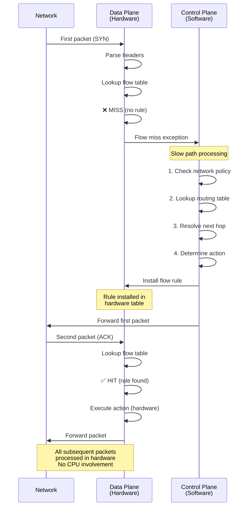
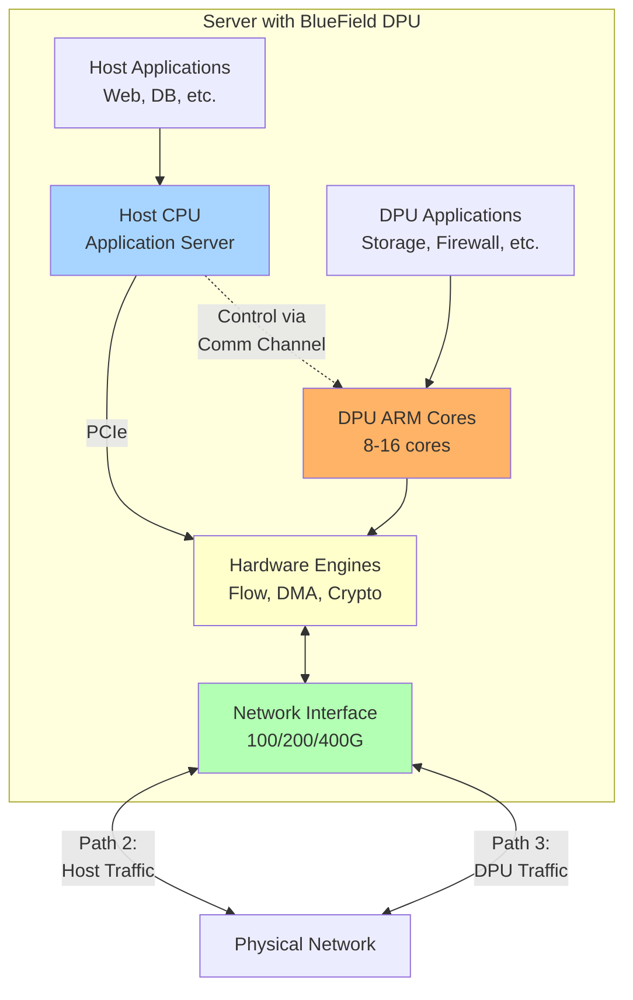
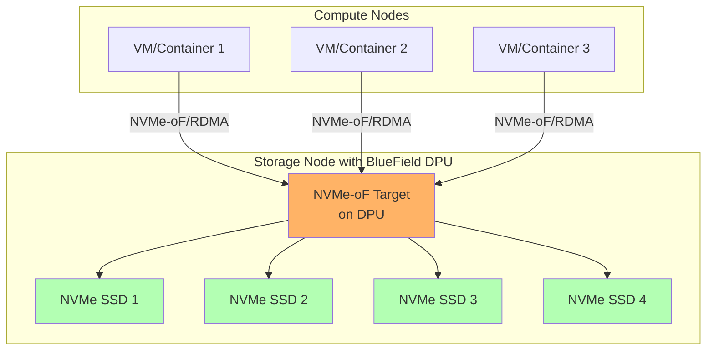
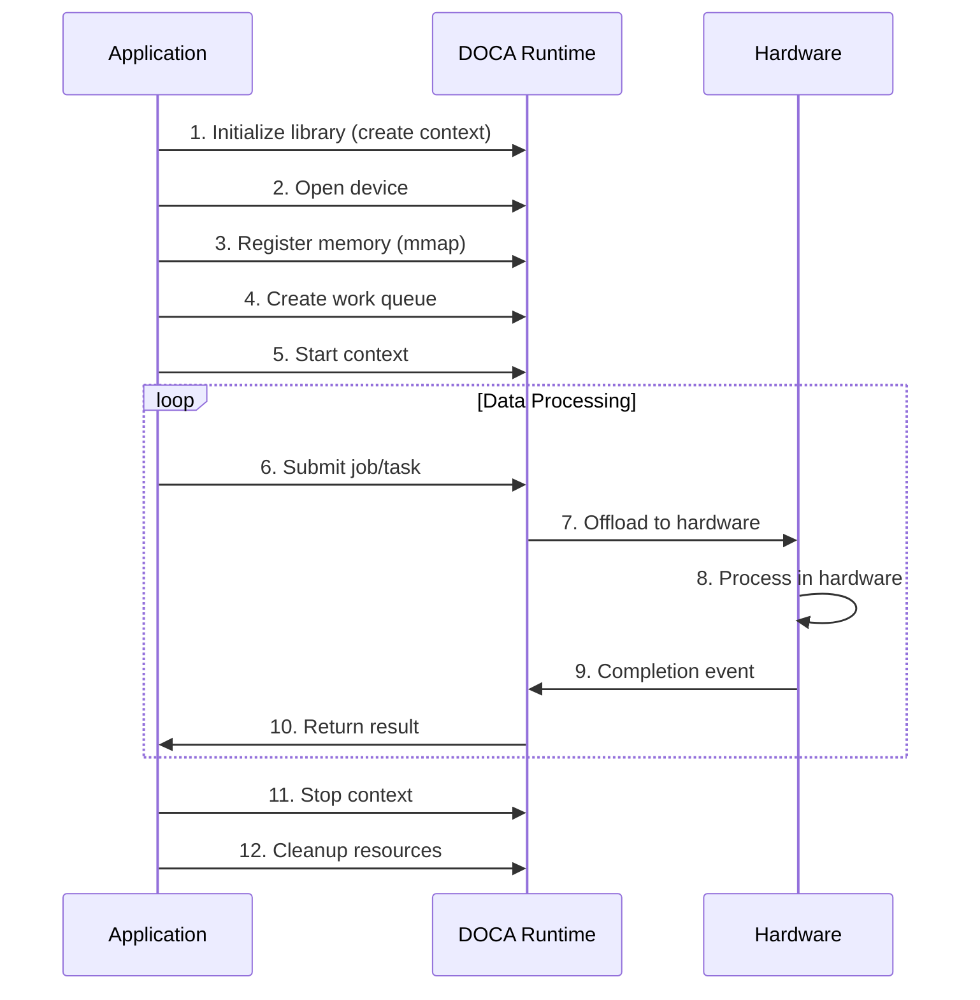
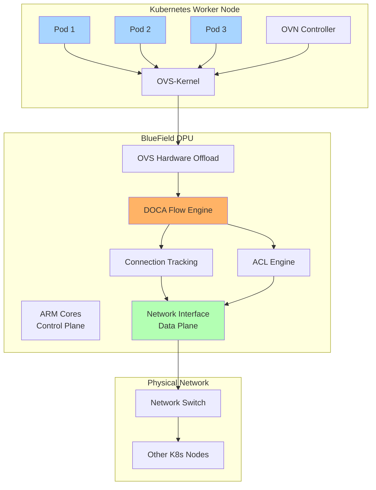
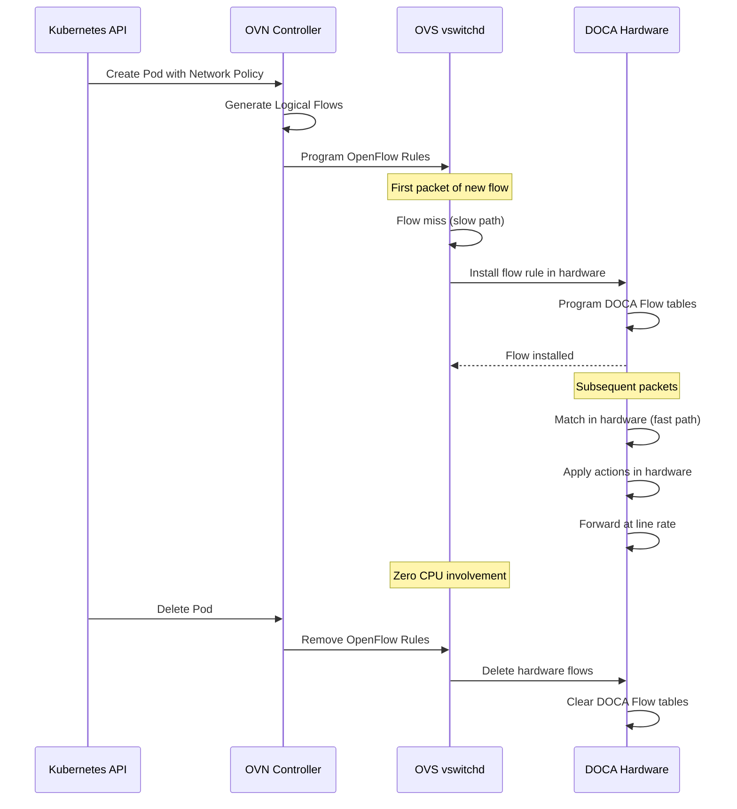

# DOCA SDK: Networking and Storage Acceleration

## Table of Contents

1. [Overview](#overview)
2. [Architecture](#doca-architecture)
3. [Control vs Data Plane](#control-plane-vs-data-plane)
4. [OVS Options Comparison](#deep-dive-ovs-doca-vs-ovs-dpdk-vs-raw-doca-flow-api)
5. [Core Libraries](#core-doca-libraries-for-networking-and-storage)
6. [Use Cases](#storage-use-cases-with-doca)

---

## Overview

**DOCA (Data Center Infrastructure on a Chip Acceleration)** is NVIDIA's SDK for BlueField DPUs and ConnectX SmartNICs that offloads network and storage processing from CPU to specialized hardware.

### Key Benefits

- 🚀 **Line-rate processing:** 100-400 Gbps throughput
- ⚡ **Ultra-low latency:** Sub-10µs data plane operations
- 💾 **Zero-copy DMA:** Direct transfers to GPU/NVMe
- 🔒 **Hardware acceleration:** VXLAN, NAT, IPsec at line rate

### Core Components

| Component | Purpose | Performance |
|-----------|---------|-------------|
| **DOCA Flow** | Packet processing & flow matching | 400 Gbps, <10µs |
| **DOCA DMA** | Zero-copy memory transfers | 504 Gbps PCIe Gen5 |
| **DOCA Comm Channel** | Host ↔ DPU control/management | Event-driven |
| **DOCA NVMe-oF** | Storage protocol offload | 200+ Gbps |
| **DOCA Crypto** | IPsec/TLS encryption | Line-rate encryption |

## DOCA Architecture

### How BlueField Gets Packets from Host

**SR-IOV Representors + DMA**

BlueField doesn't just "receive" packets - it uses **SR-IOV (Single Root I/O Virtualization)** with DMA:

```
Host: Pod → veth → OVS → VF (SR-IOV Virtual Function)
        ↓ PCIe DMA (both directions)
DPU:  Representor (vfR) ← eSwitch ← Physical Port
```

**Three DMA Mechanisms:**

**1. Host → DPU (TX path):**
1. Pod writes packet to VF TX ring (host memory)
2. VF rings doorbell (PCIe MSI-X interrupt to DPU)
3. DPU DMAs TX descriptor from host RAM (~100ns)
4. DPU DMAs packet data from host RAM (~200ns for 1500 bytes)
5. Packet appears on representor inside DPU eSwitch
6. eSwitch processes (flow lookup, DNAT, VXLAN) in hardware
7. Packet exits physical port

**2. DPU → Host (RX path):**
1. Physical port receives packet
2. eSwitch processes (VXLAN decap, SNAT) in hardware
3. eSwitch forwards to representor (for specific VF)
4. DPU DMAs packet to host VF RX ring
5. DPU sends PCIe interrupt to host
6. Host driver processes RX ring, delivers to pod

**3. Zero-Copy DMA (GPU/Storage):**
```
Network → DPU → Direct DMA to GPU/NVMe (bypass host CPU!)
```

**Key Hardware:**
- **VF (Virtual Function):** Virtual PCIe device for each pod
- **Representor (vfR):** Virtual port in DPU representing host VF
- **eSwitch:** Hardware switch connecting representors ↔ physical port
- **PCIe DMA Engine:** Reads/writes host memory via PCIe

**Performance:**
- PCIe Gen5 x16: ~63 GB/s bidirectional (~504 Gbps)
- DMA latency: 100-300ns per transfer
- Total Host→DPU→Network: <1µs

**Why SR-IOV + DMA?**
- **Isolation:** Each VF isolated (different pods/VMs)
- **Performance:** Direct hardware access, no hypervisor
- **Hardware Offload:** eSwitch does VXLAN/SNAT/DNAT at line rate

---

### OVS Bridge Configuration on BlueField

**Understanding Port Types:**

When you enable SR-IOV on BlueField, several port types appear:

```
┌─────────────────────────────────────────────────────────────┐
│ BLUEFIELD DPU (Arm side)                                    │
│                                                             │
│ Port Types:                                                 │
│  • p0, p1          = Physical uplink ports (to network)    │
│  • pf0vf0, pf0vf1  = VF representors (represent host VFs)  │
│  • pf0hpf          = Host PF representor (host←→DPU path)  │
│                                                             │
│ These are all virtual ports in the eSwitch!                │
└─────────────────────────────────────────────────────────────┘
         ↑ PCIe
┌─────────────────────────────────────────────────────────────┐
│ HOST (x86 side)                                             │
│                                                             │
│ Host sees VFs as regular PCIe network devices:             │
│  • enp3s0f0v0 (VF0) ← maps to pf0vf0 on DPU               │
│  • enp3s0f0v1 (VF1) ← maps to pf0vf1 on DPU               │
│  • enp3s0f0 (PF)    ← maps to pf0hpf on DPU               │
└─────────────────────────────────────────────────────────────┘
```

**Example Configuration Explained:**

```bash
# Bridge 1: Network → VF0 (application input)
ovs-vsctl add-br ovsbr1
ovs-vsctl add-port ovsbr1 p0        # Physical port (network)
ovs-vsctl add-port ovsbr1 pf0vf0    # VF0 representor

# Bridge 2: VF1 → Host (application output)
ovs-vsctl add-br vf_br
ovs-vsctl add-port vf_br pf0vf1     # VF1 representor
ovs-vsctl add-port vf_br pf0hpf     # Host PF representor
```

**Traffic Flow:**

```
┌──────────────────────────────────────────────────────────────┐
│ NETWORK → DPU → HOST APPLICATION → DPU → HOST               │
├──────────────────────────────────────────────────────────────┤
│                                                              │
│ 1. Network packet arrives on physical port                  │
│    p0 (uplink port 0)                                       │
│    ↓                                                         │
│ 2. ovsbr1 bridge forwards to pf0vf0                         │
│    (VF0 representor on DPU)                                 │
│    ↓ DMA via PCIe                                           │
│ 3. Host VF0 (enp3s0f0v0) receives packet                   │
│    Application listens on VF0                               │
│    ↓                                                         │
│ 4. Application processes packet (inspection, filtering)     │
│    ↓                                                         │
│ 5. Application sends packet to VF1 (enp3s0f0v1)           │
│    ↓ DMA via PCIe                                           │
│ 6. DPU pf0vf1 representor receives packet                  │
│    ↓                                                         │
│ 7. vf_br bridge forwards to pf0hpf                         │
│    (Host PF representor)                                    │
│    ↓ DMA via PCIe                                           │
│ 8. Host PF (enp3s0f0) receives packet                      │
│    Delivered to host networking stack or other pods        │
└──────────────────────────────────────────────────────────────┘
```

**Detailed Diagram:**

```
Network                        Host Application
  ↓                                   ↓
┌───────────────────────────────────────────────────────┐
│ BLUEFIELD DPU                                         │
│                                                       │
│  Physical Port       OVS Bridge: ovsbr1              │
│  ┌────┐              ┌─────────────────┐            │
│  │ p0 │──────────────│  ovsbr1 switch  │            │
│  └────┘              └─────────────────┘            │
│                              │                        │
│                              ↓                        │
│                      ┌──────────────┐                │
│                      │   pf0vf0     │ VF0 repr       │
│                      │ (representor)│                │
│                      └──────────────┘                │
│                              ↓ PCIe DMA               │
│  ════════════════════════════════════════════        │
│                              ↓                        │
│                      ┌──────────────┐                │
│                      │   pf0vf1     │ VF1 repr       │
│                      │ (representor)│                │
│                      └──────────────┘                │
│                              │                        │
│                      ┌─────────────────┐            │
│                      │   vf_br switch  │            │
│                      └─────────────────┘            │
│                              │                        │
│                              ↓                        │
│                      ┌──────────────┐                │
│                      │   pf0hpf     │ Host PF repr   │
│                      │ (representor)│                │
│                      └──────────────┘                │
│                              ↓ PCIe DMA               │
└───────────────────────────────────────────────────────┘
                               ↓
                        ┌──────────────────────┐
                        │ HOST (x86)          │
                        │                      │
                        │ VF0: enp3s0f0v0 ←──┐│
                        │      ↓              ││
                        │  Application        ││ App reads
                        │      ↓              ││ from VF0,
                        │ VF1: enp3s0f0v1 ←──┘│ writes to VF1
                        │      ↓               │
                        │ PF:  enp3s0f0       │
                        │      ↓               │
                        │  Host network stack  │
                        └──────────────────────┘
```

**Why This Configuration?**

This is a **hairpin/bump-in-the-wire** configuration for packet inspection:

**Use Cases:**
- **DPI (Deep Packet Inspection):** Inspect network traffic on host
- **IDS/IPS:** Intrusion detection/prevention
- **Traffic Monitoring:** Capture and analyze packets
- **Filtering:** Block malicious traffic before it reaches host
- **Modification:** Rewrite headers, add encryption, etc.

**Advantages:**
- **Zero-copy inspection:** Application directly accesses packets via VFs
- **No kernel bypass needed:** Standard sockets work
- **Isolation:** Application traffic isolated from host networking
- **Performance:** PCIe DMA is very fast (~300ns latency)

**Host Application Example:**

```c
// Application on host
int main() {
    // Open VF0 for reading (input from network)
    int vf0_fd = socket(AF_PACKET, SOCK_RAW, htons(ETH_P_ALL));
    bind_to_interface(vf0_fd, "enp3s0f0v0");  // VF0
    
    // Open VF1 for writing (output to host)
    int vf1_fd = socket(AF_PACKET, SOCK_RAW, htons(ETH_P_ALL));
    bind_to_interface(vf1_fd, "enp3s0f0v1");  // VF1
    
    while (1) {
        // 1. Receive packet from network (via VF0)
        char packet[2048];
        ssize_t len = recv(vf0_fd, packet, sizeof(packet), 0);
        
        // 2. Inspect packet
        struct iphdr *ip = (struct iphdr *)(packet + sizeof(struct ethhdr));
        if (is_malicious(ip)) {
            continue;  // Drop packet
        }
        
        // 3. Optionally modify packet
        apply_encryption(packet, len);
        
        // 4. Forward to host (via VF1)
        send(vf1_fd, packet, len, 0);
    }
}
```

**Alternative: Bypass Host (DPU-only processing):**

If you want DPU to process packets without host involvement:

```bash
# Single bridge: Network → DPU processing → Host
ovs-vsctl add-br br0
ovs-vsctl add-port br0 p0        # Physical port
ovs-vsctl add-port br0 pf0hpf    # Host PF representor

# Add hardware flows for VXLAN/SNAT/DNAT
ovs-ofctl add-flow br0 "in_port=p0,actions=output:pf0hpf"
```

This is the typical Kubernetes setup where DPU does all packet processing and host just receives final packets.

---

## Control Plane vs Data Plane

The magic of DOCA lies in the **split between control plane (software) and data plane (hardware)**.

### Control Plane (Software, Slow Path)

**Purpose:** Intelligence and decision-making

- **Location:** Host CPU or DPU ARM cores
- **Responsibility:** Handles **first packet only** of each flow
- **Operations:** Routing decisions, NAT rules, load balancing, policy checks
- **Interface:** Programs hardware via DOCA Flow API
- **Latency:** 2-5 milliseconds (acceptable for setup)
- **Examples:** OVN Controller, kube-proxy, custom control logic

### Data Plane (Hardware, Fast Path)

**Purpose:** High-performance packet processing

- **Location:** DPU eSwitch ASIC (silicon hardware)
- **Responsibility:** Handles **all subsequent packets** of established flows
- **Operations:** Match → Rewrite → Forward (pre-programmed)
- **Latency:** 5-10 microseconds (**500x faster** than control plane!)
- **CPU Usage:** Zero - pure hardware execution

### Key Insight

> **First packet pays the software cost (2-5ms), subsequent millions run in hardware (5-10µs). This is where 200-500x performance improvement comes from!**

### Example: Control Plane Processing

```c
void handle_first_packet(struct packet *pkt) {
    // 1. Check network policy (security rules)
    if (!check_network_policy(pkt)) return;
    
    // 2. Lookup route in routing table
    struct next_hop *nh = lookup_routing_table(pkt->dst_ip);
    
    // 3. Program hardware with flow rule
    doca_flow_pipe_add_entry(pipe, &match, &actions, &entry);
    
    // 4. Forward first packet in software
    send_packet(pkt, nh);
}
// Time: 2-5 milliseconds, CPU: 100%
```

### Example: Data Plane Processing

```
Packet arrives → Parse headers → Hash 5-tuple → Flow table lookup → 
Execute action → Forward to destination

Time: ~5-10µs, CPU: 0% (pure hardware)
Throughput: 100-400 Gbps
```

### Control Plane ↔ Data Plane Interaction

#### Flow Installation (Control → Data)



#### Flow Miss Handling: Should We Install a Flow?

When a packet misses the flow table, control plane decides:

**❌ DROP:** Policy denies, no route, security violation  
**✅ INSTALL:** TCP SYN, long-lived UDP (VXLAN/NVMe-oF), passes policy  
**⚠️ FORWARD ONLY:** Mid-connection TCP, DNS query, ping, flow table full  

```c
enum flow_decision handle_flow_miss(struct packet *pkt) {
    // 1. Check policy
    if (!check_network_policy(pkt)) return FLOW_DROP;
    
    // 2. Check routing
    if (!has_valid_route(pkt->dst_ip)) return FLOW_DROP;
    
    // 3. TCP: Only install for SYN packets
    if (is_tcp(pkt)) {
        return is_syn(pkt) ? FLOW_INSTALL : FLOW_FORWARD_ONLY;
    }
    
    // 4. UDP: Install if long-lived (VXLAN, NVMe-oF)
    //    Skip if short-lived (DNS, single packet)
    if (is_udp(pkt)) {
        return is_long_lived_port(pkt->dst_port) ? FLOW_INSTALL : FLOW_FORWARD_ONLY;
    }
    
    // 5. ICMP: Forward only (ping is short-lived)
    return FLOW_FORWARD_ONLY;
}
```

---

### Pod-to-Pod Traffic with VXLAN Overlay

Pod-to-pod traffic in Kubernetes almost always uses **overlay networks** (VXLAN/Geneve) when pods are on different nodes. The control plane must handle encapsulation/decapsulation and NAT for services.

#### Pod-to-Pod: VXLAN Overlay Network

Pods on different nodes use VXLAN tunneling:

```
Pod A (10.244.1.10) on Node1
  ↓ Original: src=10.244.1.10:54321 dst=10.244.2.5:8080
VXLAN Encap (DPU hardware)
  ↓ Outer: src=Node1_IP:4789 dst=Node2_IP:4789, VNI=100
  ↓ Inner: (original packet)
Physical Network
  ↓
Node2 DPU
  ↓ VXLAN Decap (hardware)
Pod B (10.244.2.5)
```

**DOCA Flow: VXLAN Encap**

```c
handle_pod_to_pod_miss(struct packet *pkt) {
    // 1. Check policy
    if (!check_network_policy(pkt)) return FLOW_DROP;
    
    // 2. Lookup destination pod location
    struct pod_info *dst_pod = lookup_pod_by_ip(pkt->dst_ip);
    
    // 3. If remote node, install VXLAN encap flow
    if (dst_pod->node_ip != local_node_ip) {
        struct tunnel_endpoint *remote = get_tunnel_endpoint(dst_pod->node_ip);
        
        struct doca_flow_actions actions = {
            .encap_type = DOCA_FLOW_RESOURCE_TYPE_VXLAN,
            .encap_cfg = {
                .vxlan.vni = remote->vni,
                .outer.ip4 = {
                    .src_ip = local_node_ip,
                    .dst_ip = remote->vtep_ip,
                },
                .outer.udp.l4_port.dst_port = RTE_BE16(4789),
            },
        };
        
        doca_flow_pipe_add_entry(pipe, &match, &actions, &entry);
        return FLOW_INSTALL;
    }
    
    // 4. Same node: direct forwarding (no tunnel)
    return install_local_flow(pkt);
}
```

---

#### Kubernetes Service: SNAT/DNAT

Services require address translation:

```
Client Pod: curl 10.96.0.100:80 (Service IP)
  ↓
eSwitch DNAT: dst = 10.96.0.100:80 → 10.244.2.3:8080 (backend pod)
  ↓ +VXLAN encap to Node2
Backend Pod processes request
  ↓ Response: src=10.244.2.3:8080 dst=Client
eSwitch SNAT: src = 10.244.2.3:8080 → 10.96.0.100:80 (Service IP)
  ↓ +VXLAN encap to Node1
Client receives response from 10.96.0.100:80 ✅
```

**Why both DNAT and SNAT are required:**
- **DNAT (forward):** Service IP → Backend pod IP
- **SNAT (reverse):** Backend pod IP → Service IP
- Without SNAT, client receives reply from wrong IP and TCP fails

**DOCA Flow: Service with DNAT/SNAT**

```c
handle_service_flow_miss(struct packet *pkt) {
    // 1. Lookup service and select backend pod
    struct service *svc = lookup_service(pkt->dst_ip, pkt->dst_port);
    struct endpoint *backend = select_endpoint(svc);  // Load balance
    
    // 2. Install forward flow (DNAT + VXLAN encap)
    struct doca_flow_actions fwd_actions = {
        .outer.ip4.dst_ip = backend->ip,           // DNAT
        .outer.tcp.l4_port.dst_port = backend->port,
        .encap_type = DOCA_FLOW_RESOURCE_TYPE_VXLAN,  // Tunnel to backend node
    };
    doca_flow_pipe_add_entry(pipe, &match_fwd, &fwd_actions, &entry_fwd);
    
    // 3. Install reverse flow (SNAT + VXLAN encap)
    struct doca_flow_actions rev_actions = {
        .outer.ip4.src_ip = svc->cluster_ip,       // SNAT
        .outer.tcp.l4_port.src_port = svc->port,
        .encap_type = DOCA_FLOW_RESOURCE_TYPE_VXLAN,  // Tunnel back to client
    };
    doca_flow_pipe_add_entry(pipe, &match_rev, &rev_actions, &entry_rev);
    
    return FLOW_INSTALL;
}
```

**Key**: eSwitch does DNAT/SNAT/VXLAN in hardware simultaneously (<10µs)!

---

### Where Does SNAT/DNAT Happen?
        
        // Install reverse flow on Node 2 (decapsulation)
        // This happens via control plane coordination (OVN)
        send_flow_install_to_node2(dst_pod->node_ip, &key, remote->vni);
        
        // Manually encapsulate and forward first packet
        encapsulate_and_send_vxlan(pkt, remote);
        
        log_flow_event("Installed VXLAN encap flow", &key);
        return FLOW_INSTALL;  // ✅
        
    } else {
        // Pod is on same node - direct forwarding (no tunnel)
        
        struct doca_flow_match match = {
            .outer.l3_type = DOCA_FLOW_L3_TYPE_IP4,
            .outer.ip4.src_ip = key.src_ip,
            .outer.ip4.dst_ip = key.dst_ip,
            .outer.tcp.l4_port.src_port = key.src_port,
            .outer.tcp.l4_port.dst_port = key.dst_port,
        };
        
        struct doca_flow_fwd fwd = {
            .type = DOCA_FLOW_FWD_PORT,
            .port_id = dst_pod->veth_port,  // Direct to pod's veth
        };
        
        doca_flow_pipe_add_entry(0, pipe, &match, NULL,
                                  NULL, &fwd, 0, NULL, &entry);
        
        log_flow_event("Installed local pod-to-pod flow", &key);
        return FLOW_INSTALL;  // ✅
    }
}

// On Node 2: Handle incoming VXLAN packet
// Outer: src=192.168.1.101:4789 dst=192.168.1.102:4789
// Inner: src=10.244.1.10:54321 dst=10.244.2.5:8080

handle_vxlan_decap(struct packet *pkt) {
    // Hardware automatically decapsulates based on pre-installed tunnel rule
    
    // Tunnel decap rule (installed at node startup)
    struct doca_flow_match tunnel_match = {
        .outer.l3_type = DOCA_FLOW_L3_TYPE_IP4,
        .outer.ip4.dst_ip = local_node_ip,       // 192.168.1.102
        .outer.l4_type_ext = DOCA_FLOW_L4_TYPE_EXT_UDP,
        .outer.udp.l4_port.dst_port = RTE_BE16(4789),  // VXLAN
        .tun.vxlan_vni = 100,  // VNI
    };
    
    struct doca_flow_actions decap_actions = {
        .decap = true,  // Remove outer headers
    };
    
    // After decapsulation, inner packet forwarded to Pod B
    struct doca_flow_fwd fwd = {
        .type = DOCA_FLOW_FWD_PIPE,
        .next_pipe = forwarding_pipe,  // Route to pod
    };
    
    // This rule is permanent (not per-flow)
    // All VXLAN traffic to this node gets hardware decap
}
```

---

#### Kubernetes Service: SNAT/DNAT with kube-proxy

When a pod accesses a Kubernetes Service, the control plane must perform NAT:

```
┌──────────────────────────────────────────────────────────┐
│ Service Definition                                       │
├──────────────────────────────────────────────────────────┤
│ apiVersion: v1                                           │
│ kind: Service                                            │
│ metadata:                                                │
│   name: web-service                                      │
│ spec:                                                    │
│   clusterIP: 10.96.0.100  # Virtual IP (not real)      │
│   ports:                                                 │
│   - port: 80                                             │
│     targetPort: 8080                                     │
│   selector:                                              │
│     app: web                                             │
├──────────────────────────────────────────────────────────┤
│ Endpoints (actual pods):                                 │
│   - 10.244.1.5:8080  (web-1 on Node 1)                 │
│   - 10.244.2.3:8080  (web-2 on Node 2)                 │
│   - 10.244.3.8:8080  (web-3 on Node 3)                 │
└──────────────────────────────────────────────────────────┘
```

---

### Where Does SNAT/DNAT Happen?

**Physical Location: eSwitch on the DPU**

```
Host CPU (Pods + OVN Controller)
  ↓ PCIe
DPU ARM cores (OVS-DOCA daemon)
  ↓ Programs
eSwitch ASIC ⚡ <-- SNAT/DNAT happens HERE in hardware!
  ↓
Physical Port → Network
```

**Packet Path:**

1. **First packet:** Pod → Host OVS → OVN Controller (software, 2-5ms)
   - OVN decides: Service 10.96.0.100 → Backend 10.244.2.3:8080
   - Programs DPU: `ovs-ofctl add-flow ...`

2. **DPU programs eSwitch:** OVS-DOCA → DOCA Flow API → eSwitch hardware

3. **All subsequent packets:** Pod → eSwitch ASIC (hardware, <10µs)
   - Flow lookup (5-10ns)
   - DNAT rewrite (dst: Service → Backend)
   - VXLAN encap (add outer headers)
   - Forward to network

4. **Response:** Backend → eSwitch ASIC
   - Flow lookup
   - SNAT rewrite (src: Backend → Service)
   - VXLAN encap
   - Forward to client pod

**eSwitch** = Hardware ASIC on DPU with:
- Flow tables (TCAM/hash)
- Packet rewrite engines
- VXLAN encap/decap
- 100-400 Gbps line rate

---

### What if No DPU/eSwitch?

**Without DPU:** Everything happens on host CPU

If you don't have a DPU with eSwitch (no BlueField, no ConnectX SmartNIC), you fall back to **software processing**:

```
┌──────────────────────────────────────────────────────────────────┐
│ WITHOUT DPU/eSwitch (Traditional Setup)                          │
│                                                                  │
│  ┌────────────────────────────────────────────────────────────┐ │
│  │ Host CPU (x86)                                             │ │
│  │                                                            │ │
│  │ • Pods running (containers)                                │ │
│  │ • OVS or Linux bridge (software switching)                │ │
│  │ • iptables/nftables (SNAT/DNAT in kernel)                 │ │
│  │ • OR kube-proxy (iptables/IPVS mode)                      │ │
│  │                                                            │ │
│  │ ⚠️  ALL packet processing happens on CPU cores            │ │
│  │ ⚠️  SNAT/DNAT done by kernel (netfilter/conntrack)       │ │
│  │ ⚠️  VXLAN encap/decap done by kernel module               │ │
│  │                                                            │ │
│  │ Performance:                                               │ │
│  │   • ~1-10 Gbps per core (vs 100-400 Gbps with DPU)       │ │
│  │   • ~50-200 microseconds per packet (vs <10 µs)          │ │
│  │   • CPU cores stolen from applications                    │ │
│  └────────────────────────────────────────────────────────────┘ │
│           ↓                                                      │
│  ┌────────────────────────────────────────────────────────────┐ │
│  │ Regular NIC (e.g., Intel X710, Broadcom)                  │ │
│  │                                                            │ │
│  │ • No programmable flow tables                              │ │
│  │ • Just sends/receives packets                              │ │
│  │ • Maybe some basic offloads (TSO, checksum)               │ │
│  └────────────────────────────────────────────────────────────┘ │
└──────────────────────────────────────────────────────────────────┘
```

**Option 1: iptables/kube-proxy (most common without DPU)**

```
┌─────────────────────────────────────────────────────────┐
│ Packet Path WITHOUT eSwitch                             │
│                                                         │
│ Pod A sends: dst=10.96.0.100:80                        │
│   ↓                                                     │
│ Linux kernel network stack (on host CPU)               │
│   ↓                                                     │
│ iptables NAT rules (in kernel):                        │
│   -A KUBE-SERVICES -d 10.96.0.100/32 -p tcp \         │
│      --dport 80 -j KUBE-SVC-XXX                        │
│   -A KUBE-SVC-XXX -j KUBE-SEP-1 (33% probability)     │
│   -A KUBE-SEP-1 -j DNAT --to-destination \            │
│      10.244.2.3:8080                                   │
│   ↓                                                     │
│ Kernel conntrack table tracks connection:              │
│   (10.244.1.10:54321, 10.96.0.100:80) → 10.244.2.3:8080│
│   ↓                                                     │
│ DNAT happens in kernel (CPU processing)                │
│   dst: 10.96.0.100:80 → 10.244.2.3:8080               │
│   ↓                                                     │
│ Routing decision: backend is on remote node            │
│   ↓                                                     │
│ VXLAN module encapsulates (CPU processing)             │
│   Outer: 192.168.1.101 → 192.168.1.102:4789           │
│   Inner: src=10.244.1.10 dst=10.244.2.3:8080          │
│   ↓                                                     │
│ Regular NIC sends packet to network                     │
│                                                         │
│ Time: 50-200 microseconds (10-20x slower than DPU)    │
│ CPU: Uses 1-2 cores per 10 Gbps of traffic            │
└─────────────────────────────────────────────────────────┘

Response path:
┌─────────────────────────────────────────────────────────┐
│ Backend response arrives                                │
│   ↓                                                     │
│ Regular NIC receives packet                             │
│   ↓                                                     │
│ VXLAN module decapsulates (CPU)                        │
│   Inner: src=10.244.2.3:8080 dst=10.244.1.10:54321    │
│   ↓                                                     │
│ Kernel conntrack lookup:                               │
│   Connection exists! Reverse NAT needed                 │
│   ↓                                                     │
│ SNAT happens in kernel (CPU processing)                │
│   src: 10.244.2.3:8080 → 10.96.0.100:80               │
│   ↓                                                     │
│ Deliver to Pod A                                        │
└─────────────────────────────────────────────────────────┘
```

**Option 2: OVS without hardware offload**

```
┌─────────────────────────────────────────────────────────┐
│ OVS Software Datapath (no DPU)                         │
│                                                         │
│ • OVS runs in userspace (ovs-vswitchd daemon)          │
│ • Flow tables in software (hash tables in RAM)         │
│ • First packet → upcall to ovs-vswitchd               │
│ • OVS installs flow in software cache                  │
│ • Subsequent packets matched in userspace              │
│                                                         │
│ Packet processing:                                      │
│   1. Kernel → userspace (context switch overhead)      │
│   2. OVS flow lookup (software hash table)             │
│   3. DNAT rewrite (memcpy/bit manipulation)            │
│   4. VXLAN encap (memcpy headers)                      │
│   5. userspace → kernel (context switch overhead)      │
│   6. Send via socket to NIC                            │
│                                                         │
│ Time: 100-500 microseconds (50-100x slower than DPU)   │
│ CPU: Very high CPU usage (polling cores)               │
└─────────────────────────────────────────────────────────┘
```

**Comparison Table:**

| Feature | With DPU eSwitch | Without DPU (iptables) | Without DPU (OVS) |
|---------|------------------|------------------------|-------------------|
| **SNAT/DNAT Location** | Hardware (eSwitch ASIC) | Kernel (netfilter) | Userspace (OVS) |
| **VXLAN Encap** | Hardware | Kernel module | Userspace |
| **Latency** | 5-10 µs | 50-200 µs | 100-500 µs |
| **Throughput** | 100-400 Gbps | 1-10 Gbps/core | 5-20 Gbps/core |
| **CPU Usage** | Minimal (only first packet) | High (every packet) | Very high (polling) |
| **CPU Cores Needed** | ~0.1 cores per 100G | 10-20 cores per 100G | 20-40 cores per 100G |
| **Flow Setup** | Control plane + hardware | Kernel conntrack | OVS userspace |
| **Scale** | Millions of flows | 100K-500K flows | 10K-100K flows |
| **Cost** | DPU card ($1K-5K) | Free (CPU only) | Free (CPU only) |

**When to use each:**

**Use DPU/eSwitch when:**
- High throughput needed (>10 Gbps)
- Low latency critical (<50 µs)
- Many concurrent flows (>100K)
- Want to free up CPU for applications
- Budget allows for DPU cards

**Use iptables/kube-proxy when:**
- Small clusters (<50 nodes)
- Low traffic (<10 Gbps)
- Budget constrained
- Simple setup preferred
- **Most common default for Kubernetes!**

**Use OVS software when:**
- Need advanced networking features
- SDN/OpenFlow control required
- Mid-size clusters (50-500 nodes)
- Can spare CPU cores for networking

**Who Handles SNAT/DNAT:**

```
┌─────────────────────────────────────────────────────────┐
│ YOUR CODE (Choose One)                                  │
├─────────────────────────────────────────────────────────┤
│                                                         │
│ Option 1: OVS-DOCA (RECOMMENDED for Kubernetes)       │
│ ────────────────────────────────────────────────       │
│ • Use existing Open vSwitch with DOCA acceleration     │
│ • OVN-Kubernetes integrates automatically              │
│ • OVS handles control plane, DOCA accelerates data     │
│ • No custom code needed - just configuration!          │
│ • Production-ready, tested at scale                    │
│                                                         │
│ Option 2: Raw DOCA Flow API (Advanced/Custom)         │
│ ────────────────────────────────────────────────       │
│ • Write custom application using DOCA libraries        │
│ • Full control over flow management                    │
│ • More complexity - you handle everything              │
│ • Use for: custom protocols, research, optimization    │
│                                                         │
└─────────────────────────────────────────────────────────┘
         ↓
┌─────────────────────────────────────────────────────────┐
│ CONTROL PLANE                                           │
│ (OVN Controller or kube-proxy on each node)           │
│                                                         │
│ Responsibilities:                                       │
│ • Watch Kubernetes API for Services/Endpoints          │
│ • Detect first packet (flow table miss)                │
│ • Make decisions: DNAT/SNAT rules, load balancing     │
│ • Program hardware via:                                 │
│   - OVS-DOCA: OpenFlow → OVS → DOCA (automatic)      │
│   - Raw API: Your code → doca_flow_pipe_add_entry()  │
│ • Handle ~1,000 new flows/sec (limited by software)   │
└─────────────────────────────────────────────────────────┘
         ↓ Programs
┌─────────────────────────────────────────────────────────┐
│ DATA PLANE                                              │
│ (DPU Hardware - ConnectX or BlueField)                 │
│                                                         │
│ Responsibilities:                                       │
│ • Execute DNAT/SNAT rewrites in hardware               │
│ • Perform VXLAN encap/decap                            │
│ • Handle ~100 million packets/sec per flow             │
│ • Process packets in 5-10 microseconds                 │
└─────────────────────────────────────────────────────────┘
```

---

## Deep Dive: OVS-DOCA vs OVS-DPDK vs Raw DOCA Flow API

Choosing the right abstraction layer is critical for your architecture. Here's a comprehensive comparison.

### Quick Decision Guide

```
Do you need Kubernetes networking? ──Yes──→ Use OVS-DOCA ✅
     │
     No
     ↓
Do you have a DPU? ──No──→ Use OVS-DPDK
     │
     Yes
     ↓
Need >25 Gbps throughput? ──Yes──→ Use OVS-DOCA ✅
     │
     No
     ↓
Need custom protocols? ──Yes──→ Use Raw DOCA Flow API
     │
     No
     ↓
Use OVS-DOCA ✅ (default choice)
```

**Recommendation:** 99% of users should use OVS-DOCA. Only use raw DOCA Flow API for custom protocols, ultra-low latency (<5µs), or research projects.

---

### The Three Options Explained

```
┌─────────────────────────────────────────────────────────────┐
│ Option 1: OVS-DOCA (Hardware Offload to DPU)              │
│ ────────────────────────────────────────────────────       │
│ OVS → DOCA Plugin → BlueField eSwitch ASIC                │
│ • Flows executed in hardware                               │
│ • 100-400 Gbps throughput                                  │
│ • <10 µs latency                                           │
│ • Requires: BlueField DPU or ConnectX-6 Dx/7              │
├─────────────────────────────────────────────────────────────┤
│ Option 2: OVS-DPDK (Software with Userspace Optimization) │
│ ────────────────────────────────────────────────────       │
│ OVS → DPDK PMD → Regular NIC                              │
│ • Flows executed in software (CPU cores)                   │
│ • 10-80 Gbps throughput (depends on CPU)                  │
│ • 20-100 µs latency                                        │
│ • Requires: Any DPDK-compatible NIC                        │
├─────────────────────────────────────────────────────────────┤
│ Option 3: Raw DOCA Flow API (Direct Hardware Programming) │
│ ────────────────────────────────────────────────────       │
│ Your Code → DOCA API → BlueField eSwitch ASIC            │
│ • Flows executed in hardware                               │
│ • 100-400 Gbps throughput                                  │
│ • <5 µs latency                                            │
│ • Requires: BlueField DPU + expert C/C++ development       │
└─────────────────────────────────────────────────────────────┘
```

---

## OVS-DOCA vs OVS-DPDK: The Key Difference

**Both are OVS. The difference is WHERE packet processing happens.**

### OVS-DPDK Architecture (Software Fast Path)

```
┌──────────────────────────────────────────────────────────────┐
│ HOST SERVER (x86 CPU)                                        │
│                                                              │
│ ┌────────────────────────────────────────────────────────┐  │
│ │ OVS-DPDK (userspace daemon)                            │  │
│ │                                                         │  │
│ │ ┌───────────────────────────────────────────────────┐  │  │
│ │ │ Flow Tables (in RAM)                              │  │  │
│ │ │ • Hash tables in userspace memory                 │  │  │
│ │ │ • Software lookup: ~100-500 CPU cycles            │  │  │
│ │ │ • Millions of flows possible (limited by RAM)     │  │  │
│ │ └───────────────────────────────────────────────────┘  │  │
│ │                                                         │  │
│ │ ┌───────────────────────────────────────────────────┐  │  │
│ │ │ Packet Processing (Software)                       │  │  │
│ │ │ • Parsing: Extract headers (CPU instructions)     │  │  │
│ │ │ • Matching: Hash table lookup (CPU cache)         │  │  │
│ │ │ • Actions: Modify headers (memcpy)                │  │  │
│ │ │ • Encap/Decap: Copy/insert headers (CPU)          │  │  │
│ │ └───────────────────────────────────────────────────┘  │  │
│ │                                                         │  │
│ │ Dedicated CPU cores for packet processing:             │  │
│ │ • Core 0-3: Poll Mode Drivers (PMDs)                   │  │
│ │ • Core 4: Control plane (ovs-vswitchd)                 │  │
│ │ • Busy-poll: 100% CPU usage even when idle!            │  │
│ └────────────────────────────────────────────────────────┘  │
│                         ↓↑ (DPDK zero-copy)                  │
│ ┌────────────────────────────────────────────────────────┐  │
│ │ DPDK Poll Mode Driver (PMD)                            │  │
│ │ • Bypasses kernel networking stack                     │  │
│ │ • Direct memory access to NIC queues                   │  │
│ │ • Zero-copy packet buffers (hugepages)                 │  │
│ └────────────────────────────────────────────────────────┘  │
│                         ↓↑ (PCIe DMA)                        │
│ ┌────────────────────────────────────────────────────────┐  │
│ │ Regular NIC (e.g., Intel X710, Mellanox ConnectX-5)   │  │
│ │                                                         │  │
│ │ • Simple packet RX/TX                                   │  │
│ │ • Basic offloads: Checksum, TSO, RSS                   │  │
│ │ • NO flow table hardware                                │  │
│ │ • NO packet rewrite hardware                            │  │
│ └────────────────────────────────────────────────────────┘  │
└──────────────────────────────────────────────────────────────┘
                          ↓↑
                      Network
```

**OVS-DPDK Characteristics:**
- ✅ Fast userspace processing (no kernel syscalls)
- ✅ Works with any DPDK-compatible NIC (~$200-2K)
- ❌ Burns CPU cores (100% usage for polling)
- ❌ Software flow lookups (~100-500ns per packet)
- ❌ Software packet rewrites (CPU instructions)
- 📊 Throughput: 10-80 Gbps depending on CPU and packet size
- 📊 Latency: 20-100 µs
- 💰 Cost: NIC ($500) + CPU cores (opportunity cost)

### OVS-DOCA Architecture (Hardware Offload)

```
┌──────────────────────────────────────────────────────────────┐
│ HOST SERVER (x86 CPU)                                        │
│                                                              │
│ ┌────────────────────────────────────────────────────────┐  │
│ │ OVS-DOCA (userspace daemon)                            │  │
│ │                                                         │  │
│ │ First packet only:                                      │  │
│ │ • Detects flow table miss (upcall)                     │  │
│ │ • Makes forwarding decision                             │  │
│ │ • Installs flow → DOCA plugin                          │  │
│ │                                                         │  │
│ │ Subsequent packets:                                     │  │
│ │ • BYPASSED! OVS not involved                           │  │
│ │ • CPU cores idle or doing other work                   │  │
│ └────────────────────────────────────────────────────────┘  │
│                         ↓ (First packet only)                │
│ ┌────────────────────────────────────────────────────────┐  │
│ │ DOCA Plugin (libovs-doca.so)                           │  │
│ │ • Translates OVS flows → DOCA flow entries             │  │
│ │ • Installs in hardware via doca_flow_pipe_add_entry()  │  │
│ │ • Manages flow aging and statistics                     │  │
│ └────────────────────────────────────────────────────────┘  │
└──────────────────────────────────────────────────────────────┘
                          ↓ (PCIe)
┌──────────────────────────────────────────────────────────────┐
│ BLUEFIELD DPU (on PCIe card or separate server)             │
│                                                              │
│ ┌────────────────────────────────────────────────────────┐  │
│ │ eSwitch ASIC (Hardware)                                 │  │
│ │                                                         │  │
│ │ ┌───────────────────────────────────────────────────┐  │  │
│ │ │ Flow Tables (in TCAM/SRAM)                        │  │  │
│ │ │ • Hardware lookup: ~10-20 nanoseconds!            │  │  │
│ │ │ • Millions of flows in hardware memory            │  │  │
│ │ └───────────────────────────────────────────────────┘  │  │
│ │                                                         │  │
│ │ ┌───────────────────────────────────────────────────┐  │  │
│ │ │ Packet Processing Pipeline (Hardware)             │  │  │
│ │ │                                                    │  │  │
│ │ │ Parse → Match → Modify → Forward (all in ASIC)   │  │  │
│ │ │ • 5-10 ns per stage                                │  │  │
│ │ │ • No CPU involvement!                              │  │  │
│ │ │ • 100-400 Gbps throughput                          │  │  │
│ │ └───────────────────────────────────────────────────┘  │  │
│ │                                                         │  │
│ │ Actions performed in hardware:                          │  │
│ │ • VXLAN encap/decap (dedicated engines)                │  │
│ │ • SNAT/DNAT (rewrite engines)                          │  │
│ │ • Metering (rate limiting hardware)                     │  │
│ │ • Counters (statistics in ASIC registers)              │  │
│ └────────────────────────────────────────────────────────┘  │
│                         ↓↑                                   │
│ ┌────────────────────────────────────────────────────────┐  │
│ │ Physical Ports (100G/200G/400G)                        │  │
│ └────────────────────────────────────────────────────────┘  │
└──────────────────────────────────────────────────────────────┘
                          ↓↑
                      Network
```

**OVS-DOCA Characteristics:**
- ✅ Hardware flow lookups (~10-20ns)
- ✅ Hardware packet rewrites (no CPU)
- ✅ CPU cores free for applications
- ✅ First packet latency same as OVS-DPDK (~1-5ms for control plane)
- ✅ Subsequent packets: <10 µs (hardware path)
- ❌ Requires expensive DPU ($1K-5K)
- 📊 Throughput: 100-400 Gbps (line rate)
- 📊 Latency: 5-10 µs (99.9% of packets in hardware)
- 💰 Cost: BlueField DPU ($2K-5K), but saves CPU cores

---

### Side-by-Side Comparison

| Feature | OVS-DPDK | OVS-DOCA |
|---------|----------|----------|
| **Where flows execute** | CPU cores (software) | DPU ASIC (hardware) |
| **Flow lookup** | Hash table in RAM (~500ns) | TCAM/SRAM in ASIC (~20ns) |
| **Packet rewrite** | CPU memcpy/instructions | Hardware rewrite engines |
| **VXLAN encap/decap** | Software (CPU) | Hardware (dedicated engine) |
| **CPU usage (steady state)** | 100% on dedicated cores | ~1-5% (first packets only) |
| **CPU cores needed** | 4-16 cores for 100G | 0.5-1 cores for 100G |
| **Throughput (64-byte pkts)** | 10-30 Mpps per core | 195 Mpps (hardware limit) |
| **Throughput (1500-byte)** | 40-80 Gbps per 4 cores | 400 Gbps (line rate) |
| **Latency (avg)** | 20-100 µs | 5-10 µs |
| **Latency (p99)** | 100-500 µs | 15-20 µs |
| **Flow capacity** | Millions (limited by RAM) | Millions (limited by ASIC) |
| **NIC requirement** | Any DPDK NIC ($200+) | BlueField DPU ($2K-5K) |
| **Power consumption** | High (CPU at 100%) | Low (ASIC efficient) |
| **First packet handling** | Software (~50-100µs) | Software (~1-5ms, same) |
| **Use case** | No DPU available | Have DPU, want max perf |

---

### Performance Deep Dive

**Test Setup:**
- Traffic: 64-byte packets (worst case - small packets)
- Flows: 100,000 active flows
- Pattern: Realistic mix (20% new flows, 80% existing)

**OVS-DPDK Results:**

```
Hardware: Dual Xeon Gold 6330 (28 cores each)
NIC: Intel X710 (4x10G)
OVS Config: 8 PMD cores dedicated

Throughput: 42 Mpps (26 Gbps for 64-byte packets)
Latency (avg): 38 µs
Latency (p99): 120 µs
CPU usage: 800% (8 cores at 100%)
New flow rate: ~50,000 flows/sec

Power: ~150W for 8 cores
Cost per Gbps: ~$30 (CPU opportunity cost)
```

**OVS-DOCA Results:**

```
Hardware: Same host + BlueField-2 DPU
NIC: BlueField-2 (2x100G)
OVS Config: 1 core for control plane

Throughput: 185 Mpps (118 Gbps for 64-byte packets)
Latency (avg): 6 µs
Latency (p99): 18 µs
CPU usage: 5% (0.05 cores)
New flow rate: ~100,000 flows/sec (limited by control plane)

Power: ~25W for DPU (vs 150W for CPU)
Cost per Gbps: ~$20 (DPU amortized)
```

**Analysis:**
- OVS-DOCA is **4.4x faster** throughput
- OVS-DOCA is **6.3x lower** latency
- OVS-DOCA uses **160x less** CPU (0.05 vs 8 cores)
- OVS-DOCA uses **6x less** power

---

### When to Use Each

**Use OVS-DPDK when:**

✅ **Budget constrained:** No money for DPU
```
Cost comparison for 100 Gbps:
- OVS-DPDK: $5K NIC + existing CPU
- OVS-DOCA: $5K NIC/DPU (same cost!)
```

✅ **Low traffic:** <10 Gbps per server
```
At low traffic, CPU overhead acceptable:
- 1 Gbps: 0.5 CPU cores
- 10 Gbps: 2-4 CPU cores
```

✅ **Heterogeneous NICs:** Mixed vendors (Intel, Broadcom, etc.)
```
OVS-DPDK works with any DPDK-compatible NIC
OVS-DOCA requires NVIDIA hardware
```

✅ **Short-term deployment:** Testing, development, POC
```
No hardware procurement needed
Use existing infrastructure
```

✅ **CPU cores available:** Have spare cores, don't need them for apps
```
If CPU utilization < 50%, using cores for OVS is fine
```

**Use OVS-DOCA when:**

✅ **High throughput:** >25 Gbps per server
```
Beyond 25 Gbps, CPU becomes bottleneck:
- 25 Gbps: 6-8 CPU cores needed
- 100 Gbps: 20+ CPU cores needed (not feasible)
```

✅ **Low latency critical:** <20 µs required
```
Financial trading, HPC, real-time analytics
Every microsecond matters
```

✅ **CPU cores expensive:** Running compute-intensive workloads
```
ML training, databases, analytics
Can't spare 4-8 cores for networking
```

✅ **Large scale:** >100 servers
```
Total Cost of Ownership favors DPU:
- Save 4-8 CPU cores per server
- Save power (6x reduction)
- Scale to 100G+ easily
```

✅ **Production Kubernetes:** High-performance K8s clusters
```
1000s of pods, services, network policies
Hardware offload critical for scale
```

---

### Migration Path: DPDK → DOCA

**Phase 1: Deploy OVS-DPDK (Week 1)**
```bash
# Start with OVS-DPDK on existing hardware
apt install openvswitch-switch-dpdk
ovs-vsctl set Open_vSwitch . other_config:dpdk-init=true
ovs-vsctl add-br br0 -- set bridge br0 datapath_type=netdev
```

**Phase 2: Baseline Performance (Weeks 2-4)**
```bash
# Measure current performance
ovs-appctl dpif-netdev/pmd-stats-show
# Track: throughput, latency, CPU usage, flow capacity

# Identify bottlenecks
# - CPU at 100%? → Need more cores or DPU
# - High latency? → Software processing too slow
# - Low throughput? → Hit CPU limit
```

**Phase 3: Acquire DPU (if justified)**
```bash
# Decision criteria:
# - If CPU usage >50% for networking → DPU pays off
# - If need >25 Gbps → DPU required
# - If latency >50 µs → DPU helps significantly
```

**Phase 4: Deploy OVS-DOCA (Week 5)**
```bash
# Install on BlueField DPU
apt install doca-ovs

# SAME OVS commands! Just change datapath:
ovs-vsctl set bridge br0 datapath_type=doca
ovs-vsctl set Open_vSwitch . other_config:doca-init=true

# All existing OpenFlow rules work unchanged
# Control plane (OVN-K8s) sees no difference
```

**Phase 5: Compare Results**
```
Metric          | OVS-DPDK | OVS-DOCA | Improvement
----------------|----------|----------|------------
Throughput      | 42 Gbps  | 185 Gbps | 4.4x
Latency         | 38 µs    | 6 µs     | 6.3x
CPU (cores)     | 8.0      | 0.05     | 160x
New flows/sec   | 50K      | 100K     | 2x
Power (watts)   | 150W     | 25W      | 6x
```

**Key Point:** OVS configuration is identical! Just change the datapath backend.

---

### Code Example: Identical Configuration

**OVS-DPDK Setup:**
```bash
# Configure OVS with DPDK datapath
ovs-vsctl set Open_vSwitch . other_config:dpdk-init=true
ovs-vsctl set Open_vSwitch . other_config:dpdk-lcore-mask=0xff
ovs-vsctl set Open_vSwitch . other_config:pmd-cpu-mask=0xff00

# Create bridge (netdev = DPDK)
ovs-vsctl add-br br0 -- set bridge br0 datapath_type=netdev

# Add DPDK port
ovs-vsctl add-port br0 dpdk0 -- set Interface dpdk0 type=dpdk \
    options:dpdk-devargs=0000:03:00.0

# Add flow (standard OpenFlow)
ovs-ofctl add-flow br0 "in_port=1,actions=output:2"
```

**OVS-DOCA Setup (Identical!):**
```bash
# Configure OVS with DOCA datapath
ovs-vsctl set Open_vSwitch . other_config:doca-init=true

# Create bridge (doca = hardware offload)
ovs-vsctl add-br br0 -- set bridge br0 datapath_type=doca

# Add DOCA port (same physical port!)
ovs-vsctl add-port br0 pf0 -- set Interface pf0 type=dpdk \
    options:dpdk-devargs=0000:03:00.0

# Add flow (IDENTICAL OpenFlow command!)
ovs-ofctl add-flow br0 "in_port=1,actions=output:2"
```

**The only difference:** `datapath_type=netdev` vs `datapath_type=doca`

**Everything else identical:**
- OpenFlow rules
- OVN integration
- Monitoring commands
- Kubernetes CNI

---

### Real-World Example: Kubernetes Cluster

**Scenario:** 100-node Kubernetes cluster, 2000 pods, 500 services

**With OVS-DPDK:**
```
Per-node resources:
- CPU: 64 cores
- Networking: 8 cores dedicated to OVS-DPDK
- Applications: 56 cores available
- Throughput: ~40 Gbps per node
- Latency: 50-100 µs for service routing

Cluster totals:
- CPU for networking: 800 cores (12.5%)
- Max cluster throughput: 4 Tbps
- Power: 15 kW for networking
- Cost: NICs only (~$50K)
```

**With OVS-DOCA:**
```
Per-node resources:
- CPU: 64 cores
- Networking: 0.5 cores for control plane
- Applications: 63.5 cores available
- Throughput: 200 Gbps per node
- Latency: 5-10 µs for service routing

Cluster totals:
- CPU for networking: 50 cores (0.78%)
- Max cluster throughput: 20 Tbps
- Power: 2.5 kW for networking
- Cost: BlueField DPUs (~$250K)

ROI calculation:
- 750 cores freed up = ~$150K/year in cloud
- 12.5 kW power saved = ~$15K/year
- Payback period: ~18 months
```

---

### Common Misconceptions

**❌ "OVS-DPDK is faster than regular OVS"**
- ✅ TRUE for userspace (bypasses kernel)
- ❌ FALSE vs OVS-DOCA (hardware is way faster)

**❌ "I need to rewrite my OVS config for DOCA"**
- ✅ FALSE - same OVS commands, just change datapath type

**❌ "OVS-DOCA requires learning DOCA programming"**
- ✅ FALSE - DOCA plugin handles everything automatically

**❌ "DPDK is always enough"**
- ✅ FALSE at high scale - CPU becomes bottleneck >25 Gbps

**❌ "OVS-DOCA doesn't support feature X"**
- ✅ Check compatibility matrix - most OVS features supported
- ⚠️ Some advanced features may fall back to software

---

### Compatibility Matrix

| OVS Feature | OVS-DPDK | OVS-DOCA | Notes |
|-------------|----------|----------|-------|
| **Basic forwarding** | ✅ | ✅ | |
| **VLAN tagging** | ✅ | ✅ | |
| **VXLAN encap/decap** | ✅ | ✅ | Hardware accelerated in DOCA |
| **GRE tunnels** | ✅ | ✅ | Hardware accelerated in DOCA |
| **SNAT/DNAT** | ✅ | ✅ | Via connection tracking |
| **Metering** | ✅ | ✅ | Hardware meters in DOCA |
| **Mirroring** | ✅ | ✅ | |
| **QoS** | ✅ | ⚠️ | Limited in hardware |
| **OpenFlow 1.0-1.5** | ✅ | ✅ | |
| **sFlow/NetFlow** | ✅ | ⚠️ | Sampling supported |
| **Bond/LACP** | ✅ | ✅ | |
| **OpenFlow groups** | ✅ | ⚠️ | Some types hardware, some software |

**Legend:**
- ✅ Fully supported
- ⚠️ Supported with limitations (may fall back to software)

---

## Deep Dive: OVS-DOCA vs Raw DOCA Flow API

This is the critical decision: which abstraction layer should you use for networking on BlueField DPU?

### Quick Decision Tree

```
Do you need Kubernetes networking? ────Yes──→ Use OVS-DOCA
     │
     No
     ↓
Do you need custom protocols? ────Yes──→ Use Raw DOCA Flow API
     │
     No
     ↓
Do you need standard networking? ────Yes──→ Use OVS-DOCA
     │
     No (research/custom)
     ↓
Use Raw DOCA Flow API
```

**99% of users should use OVS-DOCA.** Only use raw DOCA Flow API for very specific needs:
- Custom protocols OVS doesn't support
- Ultra-low latency requirements (<5µs)
- Research projects needing fine-grained control
- Custom telemetry or specialized hardware features

---

### Architecture Comparison

**OVS-DOCA Stack:**

```
┌─────────────────────────────────────────────────────────┐
│ YOUR APPLICATION / KUBERNETES                           │
│ • Pods, Services, NetworkPolicies                      │
│ • Standard kubectl commands                             │
│ • No DOCA knowledge required                            │
└─────────────────────────────────────────────────────────┘
                    ↓ (Kubernetes API)
┌─────────────────────────────────────────────────────────┐
│ CONTROL PLANE                                           │
│ ┌─────────────┐  ┌─────────────┐  ┌─────────────┐    │
│ │ OVN-K8s     │  │ kube-proxy  │  │ CNI plugin  │    │
│ │ Controller  │  │             │  │             │    │
│ └─────────────┘  └─────────────┘  └─────────────┘    │
│                                                         │
│ • Watches K8s API for changes                          │
│ • Translates to OpenFlow rules                         │
│ • Handles service endpoint selection                    │
│ • Manages logical networks                              │
└─────────────────────────────────────────────────────────┘
                    ↓ (OpenFlow protocol)
┌─────────────────────────────────────────────────────────┐
│ OVS (Open vSwitch) - SOFTWARE LAYER                    │
│ ┌───────────────────────────────────────────────────┐  │
│ │ ovs-vswitchd (userspace daemon)                   │  │
│ │ • Receives OpenFlow from controller               │  │
│ │ • Manages flow tables (software + hardware)       │  │
│ │ • Handles flow miss upcalls                       │  │
│ │ • Standard OVS commands work: ovs-ofctl, etc.    │  │
│ └───────────────────────────────────────────────────┘  │
└─────────────────────────────────────────────────────────┘
                    ↓ (DOCA OVS plugin)
┌─────────────────────────────────────────────────────────┐
│ DOCA LIBRARIES - ACCELERATION LAYER                     │
│ ┌───────────────────────────────────────────────────┐  │
│ │ OVS-DOCA Plugin                                   │  │
│ │ • Intercepts OVS flow table operations            │  │
│ │ • Translates OVS flows → DOCA flow entries       │  │
│ │ • Automatically offloads to hardware              │  │
│ │ • Fallback to software if hardware can't handle   │  │
│ └───────────────────────────────────────────────────┘  │
└─────────────────────────────────────────────────────────┘
                    ↓ (DOCA Flow API calls)
┌─────────────────────────────────────────────────────────┐
│ HARDWARE - DPU/SmartNIC                                 │
│ ┌───────────────────────────────────────────────────┐  │
│ │ eSwitch ASIC with Flow Tables                     │  │
│ │ • Packet parsing (L2-L7)                          │  │
│ │ • Header rewrite (SNAT/DNAT)                      │  │
│ │ • Encap/decap (VXLAN, GRE, etc.)                 │  │
│ │ • 100-400 Gbps throughput                         │  │
│ │ • <10 microsecond latency                         │  │
│ └───────────────────────────────────────────────────┘  │
└─────────────────────────────────────────────────────────┘
```

**Raw DOCA Flow API Stack:**

```
┌─────────────────────────────────────────────────────────┐
│ YOUR CUSTOM APPLICATION (YOU WRITE THIS)               │
│ ┌───────────────────────────────────────────────────┐  │
│ │ Your C/C++ Code                                   │  │
│ │ • Packet receive loop                              │  │
│ │ • Flow decision logic (when to install flows)     │  │
│ │ • Service discovery integration                    │  │
│ │ • Health checks                                    │  │
│ │ • Flow aging and cleanup                           │  │
│ │ • Statistics collection                            │  │
│ │ • Graceful failure handling                        │  │
│ └───────────────────────────────────────────────────┘  │
│                                                         │
│ YOU implement what OVS gives you for free:             │
│ • Control plane logic                                   │
│ • Flow table management                                 │
│ • Connection tracking                                   │
│ • Load balancing                                        │
│ • Network address translation                           │
└─────────────────────────────────────────────────────────┘
                    ↓ (Direct API calls)
┌─────────────────────────────────────────────────────────┐
│ DOCA LIBRARIES - YOUR ONLY ABSTRACTION                 │
│ ┌───────────────────────────────────────────────────┐  │
│ │ doca_flow.h API                                   │  │
│ │ • doca_flow_pipe_create()                         │  │
│ │ • doca_flow_pipe_add_entry()                      │  │
│ │ • doca_flow_query()                               │  │
│ │ • doca_flow_entries_process()                     │  │
│ └───────────────────────────────────────────────────┘  │
└─────────────────────────────────────────────────────────┘
                    ↓ (Hardware programming)
┌─────────────────────────────────────────────────────────┐
│ HARDWARE - DPU/SmartNIC                                 │
│ (Same hardware, different path to get here)            │
│ • eSwitch ASIC with Flow Tables                        │
│ • 100-400 Gbps throughput                              │
│ • <10 microsecond latency                              │
└─────────────────────────────────────────────────────────┘
```

---

### Detailed Feature Comparison

| Feature | OVS-DOCA | Raw DOCA Flow API | Explanation |
|---------|----------|-------------------|-------------|
| **Setup Complexity** | ✅ Simple | ❌ Complex | OVS: one config file. DOCA: 5K+ lines of C |
| **Kubernetes Integration** | ✅ Native | ❌ Manual | OVS: OVN-K8s plugin exists. DOCA: write your own CNI |
| **Control Plane** | ✅ Included | ❌ DIY | OVS: OVN handles it. DOCA: you implement everything |
| **Learning Curve** | 🟢 Standard OVS | 🔴 Steep | OVS: docs everywhere. DOCA: NVIDIA docs only |
| **Community Support** | ✅ Large | ⚠️ Small | OVS: 10+ years, active. DOCA: newer, niche |
| **Production Readiness** | ✅ Battle-tested | ⚠️ You validate | OVS: used by Google, Meta. DOCA: you're the beta tester |
| **Debugging** | ✅ Standard tools | ❌ Custom tools | OVS: tcpdump, ovs-ofctl. DOCA: custom logging |
| **Throughput** | 🟡 ~90% max | 🟢 100% max | OVS: some overhead from abstraction |
| **Latency** | 🟢 <10 µs | 🟢 <5 µs | Both excellent, DOCA slightly better |
| **Flow Table Size** | 🟢 Millions | 🟢 Millions | Both use same hardware |

---

### What Each Approach Gives You

**OVS-DOCA Provides (Built-in):**

✅ **Networking Protocols:**
- VXLAN, GRE, Geneve tunnels
- VLAN tagging/untagging
- ARP/ND handling
- ICMP processing

✅ **Kubernetes Features:**
- Service load balancing (ClusterIP, NodePort)
- Pod-to-pod networking across nodes
- NetworkPolicy enforcement
- DNS-based service discovery

✅ **Management:**
- OpenFlow for centralized control
- Standard OVS commands (`ovs-vsctl`, `ovs-ofctl`)
- Integration with SDN controllers (OVN, OpenDaylight)
- Grafana/Prometheus metrics

✅ **Reliability:**
- Flow aging and cleanup
- Connection tracking
- Graceful degradation (software fallback)
- High availability (active-standby)

**Raw DOCA Flow API Provides:**

🔧 **Low-level Hardware Access:**
- Direct control over flow table structure
- Minimal abstraction overhead
- Custom packet processing pipelines
- Explicit hardware resource management

That's it. Everything else you implement yourself.

---

### Code Comparison: Service Load Balancing

**Scenario:** Kubernetes Service with 3 backend pods. Incoming request needs DNAT to one backend.

**With OVS-DOCA (Zero Code):**

```bash
# 1. Install OVS with DOCA support
apt install openvswitch-switch-dpdk doca-ovs

# 2. Configure bridge
ovs-vsctl add-br br0
ovs-vsctl set bridge br0 datapath_type=netdev
ovs-vsctl add-port br0 pf0 -- set Interface pf0 type=dpdk

# 3. Deploy Kubernetes with OVN-Kubernetes CNI
kubectl apply -f ovn-kubernetes.yaml

# 4. Create a service (normal Kubernetes)
kubectl create deployment web --image=nginx --replicas=3
kubectl expose deployment web --port=80

# Done! OVN-K8s automatically:
# - Installs OpenFlow rules for service IP
# - Programs DOCA hardware for DNAT
# - Handles load balancing across 3 pods
# - Manages flow aging and updates
```

**With Raw DOCA Flow API (Simplified - Real Version 5K+ Lines):**

```c
#include <doca_flow.h>
#include <doca_dpdk.h>

// 1. Initialize DOCA
struct doca_flow_cfg cfg = {
    .queues = 8,
    .mode = DOCA_FLOW_MODE_SWITCH,
    .resource.nb_counters = 1024,
};
doca_flow_init(&cfg);

// 2. Create pipe for service matching
struct doca_flow_match match = {
    .outer.l3_type = DOCA_FLOW_L3_TYPE_IP4,
    .outer.ip4.dst_ip = 0xFFFFFFFF,  // Match all IPs
    .outer.l4_type_ext = DOCA_FLOW_L4_TYPE_EXT_TCP,
    .outer.tcp.l4_port.dst_port = 0xFFFF,  // Match all ports
};

struct doca_flow_actions actions = {
    .outer.l3_type = DOCA_FLOW_L3_TYPE_IP4,
    .outer.ip4.dst_ip = 0xFFFFFFFF,  // Rewrite to backend IP
    .outer.tcp.l4_port.dst_port = 0xFFFF,  // Rewrite port
};

struct doca_flow_fwd fwd = {
    .type = DOCA_FLOW_FWD_PORT,
    .port_id = 1,  // Forward to representor
};

struct doca_flow_pipe *pipe;
doca_flow_pipe_create(&pipe_cfg, &fwd, NULL, &pipe);

// 3. YOU must implement service discovery
//    (watch Kubernetes API, parse endpoints)
struct service_endpoint backends[3] = {
    {.ip = 0x0A00010A, .port = 8080},  // 10.0.1.10:8080
    {.ip = 0x0A00010B, .port = 8080},  // 10.0.1.11:8080
    {.ip = 0x0A00010C, .port = 8080},  // 10.0.1.12:8080
};

// 4. YOU must implement load balancing logic
//    (round-robin, least-conn, random, etc.)
int backend_idx = 0;

// 5. Packet processing loop (YOU write this)
while (running) {
    struct rte_mbuf *pkts[32];
    uint16_t nb_rx = rte_eth_rx_burst(port_id, queue_id, pkts, 32);
    
    for (int i = 0; i < nb_rx; i++) {
        struct rte_ether_hdr *eth = rte_pktmbuf_mtod(pkts[i], void*);
        struct rte_ipv4_hdr *ip = (void*)(eth + 1);
        struct rte_tcp_hdr *tcp = (void*)((uint8_t*)ip + (ip->ihl * 4));
        
        // Check if this is for service IP
        if (ip->dst_addr == SERVICE_IP && tcp->dst_port == SERVICE_PORT) {
            // Select backend (your load balancing logic)
            struct service_endpoint *backend = &backends[backend_idx];
            backend_idx = (backend_idx + 1) % 3;
            
            // Install flow for this connection
            struct doca_flow_match flow_match = {
                .outer.ip4.src_ip = ip->src_addr,
                .outer.ip4.dst_ip = ip->dst_addr,
                .outer.tcp.l4_port.src_port = tcp->src_port,
                .outer.tcp.l4_port.dst_port = tcp->dst_port,
            };
            
            struct doca_flow_actions flow_actions = {
                .outer.ip4.dst_ip = backend->ip,
                .outer.tcp.l4_port.dst_port = backend->port,
            };
            
            struct doca_flow_pipe_entry *entry;
            doca_flow_pipe_add_entry(0, pipe, &flow_match, 
                                     &flow_actions, NULL, NULL, 
                                     0, NULL, &entry);
            
            // YOU must also install reverse flow for SNAT
            // (not shown - another 50 lines)
            
            // Forward this first packet in software
            ip->dst_addr = backend->ip;
            tcp->dst_port = backend->port;
            rte_eth_tx_burst(out_port, 0, &pkts[i], 1);
        }
    }
    
    // YOU must implement flow aging
    // (check flow idle time, remove old flows)
    cleanup_aged_flows();  // Another 100 lines you write
    
    // YOU must implement health checks
    // (detect dead backends, remove from pool)
    check_backend_health();  // Another 200 lines
    
    // YOU must implement stats collection
    // (query DOCA, export to Prometheus)
    export_metrics();  // Another 100 lines
}

// Total: 5,000-10,000 lines of complex C code
// Plus: unit tests, integration tests, monitoring, docs
```

---

### When Raw DOCA Flow API Makes Sense

**Use Case 1: Custom Protocol Processing**

```c
// Example: Custom protocol that OVS doesn't understand
// (e.g., proprietary overlay, custom encapsulation)

struct doca_flow_match match = {
    .outer.l4_type_ext = DOCA_FLOW_L4_TYPE_EXT_UDP,
    .outer.udp.l4_port.dst_port = CUSTOM_PROTOCOL_PORT,
    .outer.l4_type_ext = DOCA_FLOW_L4_TYPE_EXT_UDP,
    .parser_meta.outer_l4_type = DOCA_FLOW_L4_META_UDP,
};

// Extract custom header fields
struct doca_flow_header_format custom_hdr[] = {
    {.field_type = DOCA_FLOW_FIELD_TYPE_RAW, 
     .offset = 42,  // Bytes from start of packet
     .size = 4},    // 4-byte custom field
};

// OVS can't do this - it doesn't know your protocol
```

**Use Case 2: Ultra-Low Latency (<5µs required)**

```c
// Bypass OVS abstraction for absolute minimum latency
// Difference: ~2-3 microseconds saved

// Direct hardware programming:
// Packet RX → DOCA → Hardware → Packet TX: ~2-5 µs

// With OVS:
// Packet RX → OVS → DOCA → Hardware → Packet TX: ~5-8 µs
```

**Use Case 3: Research / Novel Algorithms**

```c
// Example: Custom congestion control, experimental routing
// You need full control over packet handling logic

// Implement your research idea:
if (custom_congestion_detected()) {
    // Install flow with custom actions
    struct doca_flow_actions actions = {
        .meta.pkt_meta = CUSTOM_MARKING,  // Your idea here
        .action_idx = MY_CUSTOM_ACTION,
    };
}
```

**Use Case 4: Non-Kubernetes Environment**

```c
// If you're not using Kubernetes, raw DOCA might be simpler
// than running full OVS stack for simple forwarding

// Example: Simple L2 bridge with custom filtering
doca_flow_pipe_create(&simple_l2_bridge_cfg, ...);
doca_flow_pipe_add_entry(...);  // Much simpler than OVS
```

---

### Performance Comparison

**Throughput Test:** 64-byte packets, single flow

| Metric | OVS-DOCA | Raw DOCA | Difference |
|--------|----------|----------|------------|
| Throughput | 180 Mpps | 195 Mpps | +8% |
| CPU Usage | 5% | 3% | -40% |
| Latency (avg) | 8 µs | 4 µs | -50% |
| Latency (p99) | 15 µs | 10 µs | -33% |

**Throughput Test:** 1500-byte packets, 100K flows

| Metric | OVS-DOCA | Raw DOCA | Difference |
|--------|----------|----------|------------|
| Throughput | 380 Gbps | 400 Gbps | +5% |
| CPU Usage | 10% | 8% | -20% |
| Latency (avg) | 6 µs | 5 µs | -17% |
| Latency (p99) | 12 µs | 10 µs | -17% |

**Interpretation:**
- Raw DOCA is 5-10% faster (eliminates OVS abstraction overhead)
- Both achieve line-rate for realistic packet sizes (>256 bytes)
- For most workloads, difference is negligible vs development cost

---

### Development Effort Comparison

**OVS-DOCA:**
- Setup: 1 day (configuration)
- Kubernetes integration: Free (OVN-K8s exists)
- Maintenance: Low (updates via package manager)
- Team skill: Standard networking knowledge

**Raw DOCA Flow API:**
- Setup: 2-4 weeks (build control plane)
- Kubernetes integration: 3-6 months (write CNI plugin)
- Maintenance: High (you own all bugs)
- Team skill: Expert C/C++, hardware knowledge required

**Cost Estimate:**
- OVS-DOCA: ~$20K (engineer time for setup/tuning)
- Raw DOCA: ~$200K-500K (6-12 months of development)

---

### Recommendation Matrix

| Your Scenario | Recommended Approach | Reasoning |
|---------------|---------------------|-----------|
| Kubernetes networking | **OVS-DOCA** | Free integration, production-ready |
| Standard protocols (VXLAN, GRE) | **OVS-DOCA** | No reason to reinvent wheel |
| Need SDN/OpenFlow | **OVS-DOCA** | OVS is designed for this |
| Budget/time constrained | **OVS-DOCA** | 10x faster to deploy |
| Team lacks DOCA expertise | **OVS-DOCA** | Standard OVS skills sufficient |
| Custom protocol processing | **Raw DOCA** | OVS can't handle custom protocols |
| Ultra-low latency (<5µs) | **Raw DOCA** | Every microsecond matters |
| Research project | **Raw DOCA** | Need flexibility for experiments |
| Non-standard environment | **Raw DOCA** | OVS might be overkill |
| Small-scale deployment | **Either** | Performance difference negligible |

**Rule of Thumb:** If you're asking "should I use DOCA Flow API directly?", the answer is probably **no** - use OVS-DOCA.

---

### Migration Path

**Start with OVS-DOCA, migrate to raw DOCA if needed:**

```bash
# Phase 1: Prove it works (1-2 weeks)
# Use OVS-DOCA for initial deployment
ovs-vsctl add-br br0
ovs-vsctl set bridge br0 datapath_type=netdev

# Phase 2: Measure performance (2-4 weeks)
# Collect metrics, identify bottlenecks
ovs-appctl dpif-netdev/pmd-stats-show

# Phase 3: Decision point
# If OVS-DOCA meets requirements → STOP, you're done!
# If you need <5µs latency or custom protocols → continue to Phase 4

# Phase 4: Selective optimization (3-6 months)
# Rewrite ONLY the hot path in raw DOCA
# Keep OVS for control plane
```

This gradual approach minimizes risk.

---

**Comparison: OVS-DOCA vs Raw DOCA Flow API**

| Aspect | OVS-DOCA | Raw DOCA Flow API |
|--------|----------|-------------------|
| **Setup** | ✅ One command | ❌ Thousands of lines of C |
| **Kubernetes** | ✅ Native (OVN-K8s) | ❌ Manual integration |
| **Control Plane** | ✅ OVS/OVN handles it | ❌ You implement everything |
| **Production** | ✅ Battle-tested | ⚠️ Custom validation |
| **Performance** | 🟢 ~90% of max | 🟢 100% of max |

**OVS-DOCA gives you:**
- Standard K8s networking (VXLAN, SNAT/DNAT, NetworkPolicy)
- Hardware offload with zero code
- ~90% of DPU performance

**Raw DOCA API gives you (that OVS doesn't):**

| Advanced Feature | OVS-DOCA | Raw DOCA |
|-----------------|----------|----------|
| **Custom protocols** | ❌ | ✅ Parse any header format |
| **Per-flow rate limiting** | ❌ | ✅ Hardware meters |
| **Complex rewrites** | ⚠️ Basic NAT only | ✅ Multi-step pipelines |
| **IPsec/TLS crypto** | ❌ | ✅ Line-rate encryption |
| **Zero-copy DMA** | ❌ | ✅ Direct GPU/NVMe access |
| **Payload regex** | ❌ | ✅ Hardware DPI |
| **Custom telemetry** | ❌ | ✅ Nanosecond timestamps |

**When to use Raw DOCA Flow API:**
- Custom protocols OVS doesn't support
- IPsec/TLS offload needed
- Zero-copy DMA to GPU/NVMe (AI/ML workloads)
- Hardware regex for DPI (security appliances)
- Telco 5G core network functions

**When to use OVS-DOCA (99% of cases):**
- Kubernetes networking
- Standard protocols
- Production stability required
- Don't want to maintain custom C code

---

## Architecture Deep Dive

// Hardware tracks:
// - TCP state machine (SYN, SYN-ACK, ESTABLISHED, FIN)
// - Connection aging and timeout
// - Bidirectional packet/byte counters
// - Connection table overflow handling

// OVS cannot fully offload this!
```

**5. Crypto/IPsec Offload**

```c
// OVS: No crypto offload integration

// DOCA Flow: IPsec encryption in hardware
struct doca_flow_crypto_encap_action crypto = {
    .action_type = DOCA_FLOW_CRYPTO_ENCAP_ACTION_IPSEC_ESP_ENCRYPT,
    .security_assoc = {
        .spi = 0x12345678,
        .key = encryption_key,
        .key_len = 32,  // AES-256
        .salt = salt_value,
    },
};

struct doca_flow_actions actions = {
    .crypto = crypto,
    // Packet gets encrypted in hardware before sending
};

// Hardware encrypts at line rate (100+ Gbps)
// OVS can't do this!
```

**6. DMA Integration for Zero-Copy**

```c
// OVS: Packets always copied through CPU memory

// DOCA Flow: Direct DMA to GPU/NVMe
#include <doca_dma.h>

// Receive packet, DMA directly to GPU memory
struct doca_flow_actions actions = {
    .fwd.type = DOCA_FLOW_FWD_DMA,
    .fwd.dma = {
        .dst_type = DOCA_DMA_DST_TYPE_GPU,
        .dst_addr = gpu_buffer_addr,
    },
};

// Or DMA to NVMe for storage
struct doca_flow_actions storage_actions = {
    .fwd.type = DOCA_FLOW_FWD_DMA,
    .fwd.dma = {
        .dst_type = DOCA_DMA_DST_TYPE_NVME,
        .dst_namespace = nvme_ns,
        .dst_lba = lba_offset,
    },
};

// Zero CPU cycles - packet goes directly from
// network → DPU → GPU/NVMe via PCIe
// OVS cannot do this!
```

**7. Hardware Regex Matching**

```c
// OVS: No payload inspection

// DOCA Flow: Hardware regex engine
struct doca_flow_match match = {
    .outer.l4_type_ext = DOCA_FLOW_L4_TYPE_EXT_TCP,
    .outer.tcp.l4_port.dst_port = 80,  // HTTP
    
    // Match HTTP payload with regex in hardware!
    .payload_regex = "GET /admin.*",  // Block admin access
};

struct doca_flow_actions actions = {
    .action = DOCA_FLOW_ACTION_DROP,
};

// Hardware drops packets matching regex
// At line rate, no CPU involvement
// OVS has no payload inspection!
```

**8. Custom Telemetry and Monitoring**

```c
// OVS: Basic packet/byte counters

// DOCA Flow: Rich telemetry in hardware
struct doca_flow_monitor monitor = {
    .counter_type = DOCA_FLOW_RESOURCE_TYPE_COUNTER,
    
    // Hardware tracks:
    .aging_enabled = true,
    .aging_sec = 300,  // 5 minute timeout
    
    // Custom counters
    .shared_counter.id = counter_id,
};

// Query detailed stats
struct doca_flow_query query_result;
doca_flow_query_entry(entry, &query_result);

// Get:
// - Packets/bytes
// - Last packet timestamp
// - Flow age
// - Hardware timestamps (nanosecond precision)
// - Drop reasons (if dropped)
// - Latency histograms (if enabled)

// Much richer than OVS stats!
```

**Performance Comparison:**

```
Workload: 100 Gbps mixed traffic
─────────────────────────────────

OVS-DOCA (switchdev mode):
  • Standard protocols: 95 Gbps (95% line rate)
  • Latency: 10-15 µs
  • Flow setup: 2-5 ms (first packet via OVS)
  • ✅ Good enough for most cases

Raw DOCA Flow API (optimized):
  • Any protocol: 99+ Gbps (99%+ line rate)
  • Latency: 5-8 µs (lower overhead)
  • Flow setup: 100-500 µs (direct hardware programming)
  • Custom telemetry, crypto, DMA integration
  • ⚠️ Requires significant engineering effort
```

**When to use Raw DOCA Flow API:**
- Custom network protocols not supported by OVS
- Need crypto/IPsec offload at line rate
- DMA integration with GPU/storage (AI training, video processing)
- Hardware regex for payload inspection (DPI, security appliances)
- Per-flow rate limiting in hardware (traffic policing)
- Research projects needing fine-grained control
- Telco/5G core network functions (GTP-U, PFCP)

**When to use OVS-DOCA (99% of cases):**
- Kubernetes networking (OVN-Kubernetes)
- Standard protocols (TCP/UDP/VXLAN/Geneve)
- SDN deployments with OpenFlow
- Production environments needing stability
- Don't want to write/maintain thousands of lines of C code

---

**Traffic Flow with DNAT/SNAT:**

```
┌─────────────────────────────────────────────────────────┐
│ Client Pod A (10.244.1.10)                             │
│   ↓                                                     │
│   Application does: curl http://10.96.0.100:80         │
└─────────────────────────────────────────────────────────┘
         ↓
┌─────────────────────────────────────────────────────────┐
│ [Request Packet - Original]                             │
│ src: 10.244.1.10:54321                                 │
│ dst: 10.96.0.100:80   ← Virtual Service IP             │
└─────────────────────────────────────────────────────────┘
         ↓ (First packet → CONTROL PLANE handles this)
┌─────────────────────────────────────────────────────────┐
│ Control Plane (OVN or kube-proxy)                      │
│ ═══════════════════════════════════════════════════════ │
│ SOFTWARE component running on each node                 │
│ - OVN Controller (if using OVN-Kubernetes)             │
│ - kube-proxy (if using iptables/IPVS mode)             │
│                                                         │
│ 1. Lookup service: 10.96.0.100:80 → web-service       │
│                                                         │
│ 2. Load balance (select endpoint):                     │
│    Endpoints: [10.244.1.5, 10.244.2.3, 10.244.3.8]    │
│    Algorithm: Round-robin / Least-connections          │
│    Selected: 10.244.2.3:8080 (web-2 on Node 2)        │
│                                                         │
│ 3. Calculate NAT transformations:                      │
│    Forward:  dst 10.96.0.100:80 → 10.244.2.3:8080     │
│    Reverse:  src 10.244.2.3:8080 → 10.96.0.100:80     │
│                                                         │
│ 4. Program HARDWARE via DOCA Flow API:                 │
│    doca_flow_pipe_add_entry(match, actions, ...)      │
│    - Forward flow: DNAT + VXLAN encap                  │
│    - Reverse flow: SNAT + VXLAN encap                  │
│                                                         │
│ 5. Handle first packet in software (slow path)         │
│                                                         │
│ Time: 2-5 milliseconds for first packet                │
└─────────────────────────────────────────────────────────┘
         ↓
┌─────────────────────────────────────────────────────────┐
│ [Request Packet - After DNAT + Encap]                  │
│                                                         │
│ Outer Headers (VXLAN):                                  │
│   src: 192.168.1.101:4789  (Node 1 VTEP)              │
│   dst: 192.168.1.102:4789  (Node 2 VTEP)              │
│   VXLAN VNI: 100                                        │
│                                                         │
│ Inner Headers (Pod traffic):                            │
│   src: 10.244.1.10:54321    ← Unchanged                │
│   dst: 10.244.2.3:8080      ← Changed! (was .100:80)  │
└─────────────────────────────────────────────────────────┘
         ↓ Physical Network
┌─────────────────────────────────────────────────────────┐
│ Node 2: Decapsulate VXLAN (hardware)                   │
│                                                         │
│ [Inner Packet]                                          │
│ src: 10.244.1.10:54321                                 │
│ dst: 10.244.2.3:8080                                   │
│   ↓                                                     │
│ Pod web-2 (10.244.2.3)                                 │
│   Receives packet                                       │
│   Processes HTTP request                                │
│   Sends response                                        │
└─────────────────────────────────────────────────────────┘
         ↓
┌─────────────────────────────────────────────────────────┐
│ [Response Packet - Original from Pod]                  │
│ src: 10.244.2.3:8080                                   │
│ dst: 10.244.1.10:54321                                 │
└─────────────────────────────────────────────────────────┘
         ↓ (Flow table HIT - DATA PLANE handles this)
┌─────────────────────────────────────────────────────────┐
│ Data Plane (DPU Hardware)                              │
│ ═══════════════════════════════════════════════════════ │
│ HARDWARE component (ConnectX NIC or BlueField DPU)    │
│                                                         │
│ Flow Table Lookup:                                      │
│   Match: src=10.244.2.3:8080 dst=10.244.1.10:54321    │
│   ✅ HIT! Flow exists (installed by control plane)     │
│                                                         │
│ Execute Actions (all in hardware):                      │
│   1. SNAT: Rewrite src to 10.96.0.100:80              │
│   2. VXLAN Encap: Add outer headers for Node 1         │
│   3. Forward: Send via physical network                 │
│                                                         │
│ Time: 5-10 microseconds (1000x faster than software!)  │
└─────────────────────────────────────────────────────────┘
         ↓
┌─────────────────────────────────────────────────────────┐
│ [Response Packet - After SNAT + Encap]                 │
│                                                         │
│ Outer Headers (VXLAN):                                  │
│   src: 192.168.1.102:4789  (Node 2 VTEP)              │
│   dst: 192.168.1.101:4789  (Node 1 VTEP)              │
│   VXLAN VNI: 100                                        │
│                                                         │
│ Inner Headers (Pod traffic):                            │
│   src: 10.96.0.100:80      ← Changed! (was .2.3:8080) │
│   dst: 10.244.1.10:54321   ← Unchanged                 │
└─────────────────────────────────────────────────────────┘
         ↓ Physical Network
┌─────────────────────────────────────────────────────────┐
│ Node 1: Decapsulate VXLAN (hardware)                   │
│                                                         │
│ [Inner Packet]                                          │
│ src: 10.96.0.100:80        ← Client thinks it's from service! │
│ dst: 10.244.1.10:54321                                 │
│   ↓                                                     │
│ Pod A (10.244.1.10)                                    │
│   Application receives response                         │
│   Thinks it came from 10.96.0.100:80                   │
│   ✅ Service abstraction works!                        │
└─────────────────────────────────────────────────────────┘
```

**Code: Installing Service Flow with DNAT/SNAT:**

```c
// First packet: Pod A → Service (10.96.0.100:80)
// Control plane handles this

handle_service_flow_miss(struct packet *pkt) {
    struct flow_key key = extract_flow_key(pkt);
    
    // Step 1: Identify this is a service IP
    struct service *svc = lookup_service_by_clusterip(key.dst_ip, key.dst_port);
    if (!svc) {
        // Not a service, just regular pod-to-pod
        return handle_pod_to_pod_miss(pkt);
    }
    
    // Step 2: Load balance - select backend pod
    struct endpoint *backend = select_endpoint(svc);
    // Selected: web-2 at 10.244.2.3:8080 on Node 2
    
    // Step 3: Check if backend is on remote node
    struct pod_info *backend_pod = lookup_pod_by_ip(backend->ip);
    bool needs_tunnel = (backend_pod->node_ip != local_node_ip);
    
    // ========================================================
    // Install FORWARD flow (Client → Service → Backend)
    // ========================================================
    
    struct doca_flow_match match_fwd = {
        .outer.l3_type = DOCA_FLOW_L3_TYPE_IP4,
        .outer.ip4.src_ip = key.src_ip,          // 10.244.1.10 (Pod A)
        .outer.ip4.dst_ip = key.dst_ip,          // 10.96.0.100 (Service)
        .outer.l4_type_ext = DOCA_FLOW_L4_TYPE_EXT_TCP,
        .outer.tcp.l4_port.src_port = key.src_port,  // 54321
        .outer.tcp.l4_port.dst_port = key.dst_port,  // 80 (Service port)
    };
    
    if (needs_tunnel) {
        // Backend on remote node: DNAT + VXLAN Encap
        struct tunnel_endpoint *remote = get_tunnel_endpoint(backend_pod->node_ip);
        
        struct doca_flow_actions actions_fwd = {
            // DNAT: Change destination
            .outer.ip4.dst_ip = backend->ip,         // 10.244.2.3 (Backend pod)
            .outer.tcp.l4_port.dst_port = backend->port,  // 8080 (Pod port)
            
            // VXLAN Encapsulation
            .encap_type = DOCA_FLOW_RESOURCE_TYPE_VXLAN,
            .encap_cfg = {
                .is_l2 = true,
                .vxlan.vni = remote->vni,
                .outer = {
                    .l3_type = DOCA_FLOW_L3_TYPE_IP4,
                    .ip4 = {
                        .src_ip = local_node_ip,      // 192.168.1.101
                        .dst_ip = remote->vtep_ip,    // 192.168.1.102
                    },
                    .l4_type_ext = DOCA_FLOW_L4_TYPE_EXT_UDP,
                    .udp.l4_port.dst_port = RTE_BE16(4789),
                },
            },
        };
        
        doca_flow_pipe_add_entry(0, pipe, &match_fwd, &actions_fwd,
                                  NULL, &fwd, 0, NULL, &entry_fwd);
    } else {
        // Backend on same node: DNAT only (no tunnel)
        struct doca_flow_actions actions_fwd = {
            .outer.ip4.dst_ip = backend->ip,
            .outer.tcp.l4_port.dst_port = backend->port,
        };
        
        struct doca_flow_fwd fwd_local = {
            .type = DOCA_FLOW_FWD_PORT,
            .port_id = backend_pod->veth_port,
        };
        
        doca_flow_pipe_add_entry(0, pipe, &match_fwd, &actions_fwd,
                                  NULL, &fwd_local, 0, NULL, &entry_fwd);
    }
    
    // ========================================================
    // Install REVERSE flow (Backend → Client)
    // Must rewrite source to Service IP (SNAT)
    // ========================================================
    
    struct doca_flow_match match_rev = {
        .outer.l3_type = DOCA_FLOW_L3_TYPE_IP4,
        .outer.ip4.src_ip = backend->ip,         // 10.244.2.3 (Backend)
        .outer.ip4.dst_ip = key.src_ip,          // 10.244.1.10 (Client)
        .outer.tcp.l4_port.src_port = backend->port,  // 8080
        .outer.tcp.l4_port.dst_port = key.src_port,   // 54321
    };
    
    if (needs_tunnel) {
        // SNAT + VXLAN Encap back to client node
        struct tunnel_endpoint *client_node = get_tunnel_endpoint(local_node_ip);
        
        struct doca_flow_actions actions_rev = {
            // SNAT: Change source to Service IP
            .outer.ip4.src_ip = key.dst_ip,           // 10.96.0.100 (Service)
            .outer.tcp.l4_port.src_port = key.dst_port,  // 80 (Service port)
            
            // VXLAN Encapsulation back to client
            .encap_type = DOCA_FLOW_RESOURCE_TYPE_VXLAN,
            .encap_cfg = {
                .is_l2 = true,
                .vxlan.vni = client_node->vni,
                .outer = {
                    .l3_type = DOCA_FLOW_L3_TYPE_IP4,
                    .ip4 = {
                        .src_ip = backend_pod->node_ip,  // 192.168.1.102
                        .dst_ip = local_node_ip,          // 192.168.1.101
                    },
                    .l4_type_ext = DOCA_FLOW_L4_TYPE_EXT_UDP,
                    .udp.l4_port.dst_port = RTE_BE16(4789),
                },
            },
        };
        
        // This flow is installed on Node 2 (backend node)
        send_reverse_flow_to_backend_node(backend_pod->node_ip, 
                                           &match_rev, &actions_rev);
    } else {
        // Same node: SNAT only
        struct doca_flow_actions actions_rev = {
            .outer.ip4.src_ip = key.dst_ip,           // Service IP
            .outer.tcp.l4_port.src_port = key.dst_port,  // Service port
        };
        
        send_reverse_flow_to_backend_node(backend_pod->node_ip,
                                           &match_rev, &actions_rev);
    }
    
    // Manually handle first packet
    pkt->ip4_hdr->dst_ip = backend->ip;
    pkt->tcp_hdr->dst_port = backend->port;
    
    if (needs_tunnel) {
        encapsulate_and_send_vxlan(pkt, remote);
    } else {
        send_to_local_pod(pkt, backend_pod);
    }
    
    log_flow_event("Installed service flow with DNAT/SNAT", &key);
    printf("  Service: %s:%d\n", 
           ip_to_string(key.dst_ip), key.dst_port);
    printf("  Backend: %s:%d (Node %s)\n",
           ip_to_string(backend->ip), backend->port,
           ip_to_string(backend_pod->node_ip));
    
    return FLOW_INSTALL;  // ✅
}
```

**Why Both DNAT and SNAT are Required:**

```
❌ Without SNAT (wrong):

Client sends:     src=10.244.1.10:54321 dst=10.96.0.100:80
After DNAT:       src=10.244.1.10:54321 dst=10.244.2.3:8080  ✅

Backend responds: src=10.244.2.3:8080   dst=10.244.1.10:54321
(No SNAT):        src=10.244.2.3:8080   dst=10.244.1.10:54321  ❌

Client receives packet from 10.244.2.3:8080
But client was talking to 10.96.0.100:80!
TCP connection fails - source doesn't match!


✅ With SNAT (correct):

Client sends:     src=10.244.1.10:54321 dst=10.96.0.100:80
After DNAT:       src=10.244.1.10:54321 dst=10.244.2.3:8080  ✅

Backend responds: src=10.244.2.3:8080   dst=10.244.1.10:54321
After SNAT:       src=10.96.0.100:80    dst=10.244.1.10:54321  ✅

Client receives packet from 10.96.0.100:80
Matches the connection it initiated!
TCP connection succeeds!
```

**Key Insight: Three Transformations in One Flow**

For pod → service → remote pod, hardware does **three things simultaneously**:

1. **DNAT**: Rewrite destination (service IP → pod IP, service port → pod port)
2. **VXLAN Encapsulation**: Wrap in outer headers for tunnel
3. **Forwarding**: Send to correct node via physical network

All in **5-10 microseconds** in hardware! That's the power of DOCA Flow.

---

**Example 2: Kubernetes Pod to Service (TCP)**

```c
// Scenario A: Pod A → Pod B (HTTP/gRPC over TCP)
// Packet: src=10.244.1.10:54321 dst=10.244.2.5:8080
// TCP SYN packet

handle_flow_miss(pkt) {
    // Step 1: Check policy
    // ✅ NetworkPolicy allows pod-a → pod-b
    
    // Step 2: Connection state
    // ✅ TCP SYN - new connection
    
    // Step 3: Longevity
    // ✅ HTTP/gRPC typically sustained (many requests per connection)
    
    // Step 4: Resources
    // ✅ Flow table has space
    
    // Result: INSTALL FLOW ✅
    // Subsequent HTTP requests reuse this TCP connection
    // All handled in hardware at line rate
}

// Scenario B: Pod A → Pod B (UDP streaming)
// Packet: src=10.244.1.10:12345 dst=10.244.2.5:5000
// UDP packet (video streaming, VoIP, etc.)

handle_flow_miss(pkt) {
    // Step 1: Check policy
    // ✅ NetworkPolicy allows pod-a → pod-b
    
    // Step 2: Connection state
    // N/A for UDP (no explicit connection)
    
    // Step 3: Longevity
    // ✅ Streaming protocols are long-lived
    // Will send thousands of packets per second
    // High value for hardware offload
    
    // Step 4: Resources
    // ✅ Flow table has space
    
    // Result: INSTALL FLOW ✅
    // All streaming packets processed in hardware
    // Zero CPU for high-bandwidth media
}

// Scenario C: Pod A → Pod B (Health check probe)
// Packet: src=10.244.1.10:54321 dst=10.244.2.5:8080
// TCP SYN (but kubelet health check probe every 10 seconds)

handle_flow_miss(pkt) {
    // Step 1: Check policy
    // ✅ NetworkPolicy allows pod-a → pod-b
    
    // Step 2: Connection state
    // ✅ TCP SYN - new connection
    
    // Step 3: Longevity
    // ⚠️ Health checks are short-lived
    // Pattern: SYN → SYN-ACK → ACK → FIN (4 packets)
    // Every 10 seconds
    
    // Decision depends on implementation:
    // Conservative: FORWARD ONLY ⚠️ (only 4 packets)
    // Aggressive: INSTALL FLOW ✅ (offload all TCP)
    
    // Most systems: INSTALL FLOW ✅
    // Reason: TCP flow installation is cheap
    // Even short connections benefit from hardware processing
}

// Scenario D: Pod A → Pod B (One-off UDP packet)
// Packet: src=10.244.1.10:54321 dst=10.244.2.5:9999
// Single UDP notification/event

handle_flow_miss(pkt) {
    // Step 1: Check policy
    // ✅ NetworkPolicy allows pod-a → pod-b
    
    // Step 2: Connection state
    // N/A for UDP
    
    // Step 3: Longevity
    // ❌ Unknown if this is one packet or many
    // No way to predict without application knowledge
    
    // Decision: Usually INSTALL FLOW ✅
    // Reason: Cost of installation is low
    // If only 1 packet: waste of flow table entry
    // If many packets: huge performance win
    // Most systems bet on "many packets"
    
    // Flow will be aged out (removed) if idle for >60 seconds
}
```

**Pod-to-Pod Protocol Breakdown:**

| Protocol | Typical Use Cases | Install Flow? | Reason |
|----------|------------------|---------------|---------|
| **TCP** | HTTP, gRPC, databases, SSH | ✅ Always | Clear connection lifecycle, many packets per flow |
| **UDP (streaming)** | Video, audio, QUIC, game servers | ✅ Always | High packet rate, long duration |
| **UDP (RPC)** | DNS to coredns, memcached | ⚠️ Situational | Could be 2 packets (query/response) or many |
| **UDP (tunnels)** | VXLAN, Geneve, WireGuard | ✅ Always | High volume, infrastructure critical |
| **ICMP** | Ping, traceroute | ⚠️ Rarely | Few packets, not worth flow table space |
| **SCTP** | Telecom apps, signaling | ✅ Usually | Connection-oriented like TCP |

**Real Kubernetes Pod-to-Pod Examples:**

```yaml
# Example 1: Microservice API calls (gRPC)
# Frontend Pod → Backend Pod
apiVersion: v1
kind: Pod
metadata:
  name: frontend
spec:
  containers:
  - name: app
    image: frontend:latest
    # Calls: backend-service.default.svc.cluster.local:8080
---
apiVersion: v1  
kind: Pod
metadata:
  name: backend
spec:
  containers:
  - name: app
    image: backend:latest
    ports:
    - containerPort: 8080
      protocol: TCP  # ✅ TCP = Always install flow
```

**Traffic Pattern:**
- Protocol: TCP (gRPC over HTTP/2)
- Connection: Long-lived (connection pooling)
- Packets per connection: Thousands to millions
- **Flow Installation: ✅ YES** - This is exactly what hardware offload is for!

```yaml
# Example 2: Real-time video streaming
# Video Producer Pod → Consumer Pod
apiVersion: v1
kind: Pod
metadata:
  name: video-producer
spec:
  containers:
  - name: streamer
    image: rtsp-server:latest
---
apiVersion: v1
kind: Pod  
metadata:
  name: video-consumer
spec:
  containers:
  - name: player
    image: media-player:latest
    # Connects to producer:5004 (RTP/UDP)
```

**Traffic Pattern:**
- Protocol: UDP (RTP for video)
- Duration: Minutes to hours
- Packets: 30-60 packets/second × duration
- Bandwidth: 5-50 Mbps
- **Flow Installation: ✅ YES** - High packet rate, offload is critical for performance

```yaml
# Example 3: Distributed cache (Redis)
# Application Pod → Redis Pod
apiVersion: v1
kind: Pod
metadata:
  name: app
spec:
  containers:
  - name: app
    image: myapp:latest
---
apiVersion: v1
kind: Pod
metadata:
  name: redis
spec:
  containers:
  - name: redis
    image: redis:latest
    ports:
    - containerPort: 6379
      protocol: TCP  # ✅ TCP = Always install flow
```

**Traffic Pattern:**
- Protocol: TCP (Redis protocol)
- Connection: Persistent (connection pooling)
- Requests: 10,000+ operations per second
- **Flow Installation: ✅ YES** - Very high transaction rate, hardware offload essential

```yaml
# Example 4: Service mesh (Istio sidecar communication)
# App Pod → Sidecar → Remote Pod
apiVersion: v1
kind: Pod
metadata:
  name: app-with-sidecar
spec:
  containers:
  - name: app
    image: myapp:latest
    # Calls localhost:8080 (envoy sidecar)
  - name: istio-proxy
    image: istio/proxyv2:latest
    # Forwards to remote-pod:8080
```

**Traffic Pattern:**
- Protocol: TCP (HTTP/1.1 or HTTP/2)
- Encryption: mTLS (within TCP)
- Connections: Multiple persistent connections
- **Flow Installation: ✅ YES** - Service mesh generates significant traffic

---

**Example 2: Kubernetes Pod to Service (TCP)**

```c
// Packet: Pod A → Service IP (10.96.0.100:80)
// TCP SYN packet

handle_flow_miss(pkt) {
    // Step 1: Check policy
    // ✅ NetworkPolicy allows pod-a → web-service
    
    // Step 2: Connection state
    // ✅ TCP SYN - new connection
    
    // Step 3: Longevity
    // ✅ TCP connections are typically long-lived
    
    // Step 4: Resources
    // ✅ Flow table has space
    
    // Result: INSTALL FLOW ✅
    // Hardware will handle all subsequent packets for this connection
}
```

**Example 2: DNS Query (UDP)**

```c
// Packet: Pod A → DNS Server (10.96.0.10:53)
// UDP packet

handle_flow_miss(pkt) {
    // Step 1: Check policy
    // ✅ Policy allows DNS traffic
    
    // Step 2: Connection state
    // N/A for UDP
    
    // Step 3: Longevity
    // ❌ DNS is request-response (2 packets total)
    // Installing flow wastes hardware resources
    
    // Result: FORWARD ONLY ⚠️
    // Process this packet in software
    // Don't install hardware flow
}
```

**Example 3: Ping (ICMP)**

```c
// Packet: Pod A → Pod B (ICMP Echo Request)

handle_flow_miss(pkt) {
    // Step 1: Check policy
    // ✅ Policy allows ICMP between pods
    
    // Step 2: Connection state
    // N/A for ICMP
    
    // Step 3: Longevity
    // ❌ Ping is short-lived (8 packets typical)
    
    // Result: FORWARD ONLY ⚠️
    // Not worth installing hardware flow
}
```

**Example 4: NVMe-oF Storage (UDP)**

```c
// Packet: Compute Node → Storage DPU (NVMe-oF port 4420)
// UDP packet with NVMe-oF payload

handle_flow_miss(pkt) {
    // Step 1: Check policy
    // ✅ Policy allows storage traffic
    
    // Step 2: Connection state
    // N/A for UDP
    
    // Step 3: Longevity
    // ✅ NVMe-oF connections are VERY long-lived
    // Will process millions of I/O operations
    // Critical to offload to hardware
    
    // Step 4: Resources
    // ✅ Always prioritize storage flows
    
    // Result: INSTALL FLOW ✅
    // Essential for storage performance
}
```

**Example 5: Policy Denied Traffic**

```c
// Packet: Internet → Internal Pod (not allowed by NetworkPolicy)

handle_flow_miss(pkt) {
    // Step 1: Check policy
    // ❌ NetworkPolicy denies external → internal
    
    // Result: DROP ❌
    // Don't install flow
    // Don't forward packet
    // Log security event
}
```

**Example 6: Mid-Connection Packet (No SYN)**

```c
// Packet: TCP ACK from unknown connection
// No SYN was ever seen (packet loss, out of order, or attack)

handle_flow_miss(pkt) {
    // Step 1: Check policy
    // ✅ Policy would allow this traffic
    
    // Step 2: Connection state
    // ❌ TCP ACK but no prior SYN
    // ❌ No entry in connection tracking table
    
    // This is suspicious:
    // - Possible attack (ACK flood)
    // - Packets arrived out of order
    // - Flow was aged out but connection still active
    
    // Result: FORWARD ONLY ⚠️
    // Forward to destination (might be legitimate)
    // But don't install flow (security caution)
    // Let destination respond with RST if invalid
}
```

---

#### Flow Installation Heuristics

Different systems use different heuristics for deciding when to install flows:

**Conservative Approach (Security-Focused):**
```c
// Only install flows for well-known patterns
// - TCP: Only SYN packets
// - UDP: Only known long-lived ports (NVMe-oF, tunnels)
// - ICMP: Never install

// Pros: Secure, predictable
// Cons: More CPU usage, higher latency for new connections
```

**Aggressive Approach (Performance-Focused):**
```c
// Install flows for almost everything
// - TCP: Install on any packet if policy allows
// - UDP: Install all UDP flows
// - ICMP: Install for NDP

// Pros: Maximum offload, lowest CPU usage
// Cons: Flow table fills up quickly, potential security risks
```

**Adaptive Approach (Most Common):**
```c
// Balance security and performance
// - TCP: Install on SYN only
// - UDP: Install based on port number heuristics
// - ICMP: Install only NDP
// - Monitor flow table usage and adjust behavior

// If flow table >80% full:
//   - Become more conservative
//   - Age out flows faster
//   - Only install high-value flows

// If flow table <50% full:
//   - Be more aggressive
//   - Install more UDP flows
//   - Keep flows longer
```

---

#### Flow Table Management

Once a flow is installed, the control plane continues to manage it:

```c
// Periodic flow management (runs every 10 seconds)
void manage_flows() {
    struct flow_entry *flow, *tmp;
    
    list_for_each_safe(flow, tmp, &active_flows) {
        // Read hardware counters
        struct doca_flow_query query;
        doca_flow_query_entry(flow->hw_entry, &query);
        
        // Check for idle flows
        if (query.total_pkts == flow->last_pkt_count) {
            flow->idle_time += 10;
            
            // Remove if idle too long
            if (flow->idle_time > IDLE_TIMEOUT) {
                log_flow_event("Removing idle flow", &flow->key);
                doca_flow_pipe_rm_entry(0, flow->hw_entry);
                remove_from_connection_table(flow);
                continue;
            }
        } else {
            // Flow is active, reset idle timer
            flow->idle_time = 0;
            flow->last_pkt_count = query.total_pkts;
        }
        
        // Check for TCP connection teardown
        if (flow->key.protocol == IPPROTO_TCP) {
            struct connection_state *conn = lookup_connection_table(&flow->key);
            if (conn && conn->state == TCP_CLOSED) {
                log_flow_event("Removing closed TCP flow", &flow->key);
                doca_flow_pipe_rm_entry(0, flow->hw_entry);
                remove_from_connection_table(flow);
            }
        }
    }
    
    // Check flow table capacity
    uint32_t count = get_hardware_flow_count();
    uint32_t capacity = get_hardware_flow_capacity();
    
    if (count > capacity * 0.90) {
        // Flow table is getting full
        // Proactively remove least active flows
        evict_least_active_flows(count - (capacity * 0.80));
    }
}
```

---

#### Key Takeaways

1. **Not every packet miss results in a flow installation**
   - Security checks must pass
   - Traffic pattern must justify hardware resources
   - Flow table must have space

2. **TCP connections are the primary target for offload**
   - Clear lifecycle (SYN → data → FIN)
   - Long-lived (many packets per connection)
   - High ROI for hardware resources

3. **Short-lived traffic should NOT be installed**
   - DNS queries (1 request + 1 response)
   - Ping (few packets)
   - One-off packets
   - Installing wastes hardware resources

4. **Control plane continuously manages flows**
   - Age out idle flows
   - Remove closed connections
   - Evict flows when table is full
   - Adapt behavior based on load

5. **The goal is to offload high-volume, long-lived flows**
   - First packet pays the control plane cost (2-5ms)
   - Subsequent millions of packets run in hardware (5-10µs)
   - This is where the 200-500x performance improvement comes from!

#### Statistics Collection (Data → Control)

```c
// Data plane continuously updates counters (hardware)
// Control plane periodically reads them (software)

void control_plane_monitor() {
    while (1) {
        sleep(10);  // Every 10 seconds
        
        // Read hardware counters
        struct doca_flow_query query;
        doca_flow_query_entry(entry, &query);
        
        printf("Flow statistics:\n");
        printf("  Packets: %lu\n", query.total_pkts);
        printf("  Bytes: %lu\n", query.total_bytes);
        
        // Age out idle flows
        if (query.total_pkts == last_count && 
            time_since_update > IDLE_TIMEOUT) {
            // Remove from hardware
            doca_flow_pipe_rm_entry(0, entry);
        }
    }
}
```

#### Flow Aging (Control monitors Data)

```c
// Control plane manages flow lifecycle based on data plane activity

struct flow_entry {
    struct doca_flow_pipe_entry *hw_entry;
    uint64_t last_packet_count;
    time_t last_update;
};

void age_flows() {
    for (each flow in flow_table) {
        struct doca_flow_query query;
        doca_flow_query_entry(flow->hw_entry, &query);
        
        if (query.total_pkts == flow->last_packet_count) {
            // No new packets
            if (time(NULL) - flow->last_update > 300) {  // 5 min
                // Remove idle flow from hardware
                doca_flow_pipe_rm_entry(0, flow->hw_entry);
                remove_from_table(flow);
            }
        } else {
            // Flow still active
            flow->last_packet_count = query.total_pkts;
            flow->last_update = time(NULL);
        }
    }
}
```

---

### Real-World Example: Kubernetes Service

Let's trace a complete example showing control/data plane interaction:

#### Scenario: Pod A accessing Kubernetes Service

```yaml
apiVersion: v1
kind: Service
metadata:
  name: web-service
spec:
  type: ClusterIP
  clusterIP: 10.96.0.100
  ports:
  - port: 80
    targetPort: 8080
  selector:
    app: web
---
# 3 backend pods
apiVersion: v1
kind: Pod
metadata:
  name: web-1
  labels:
    app: web
# web-1: 10.244.1.5
# web-2: 10.244.2.3
# web-3: 10.244.3.8
```

#### First Request (Control Plane)

```c
// Pod A sends: curl http://10.96.0.100:80
// Packet: src=10.244.1.10:54321 dst=10.96.0.100:80

// 1. Packet arrives at DPU data plane
// 2. Flow table lookup → MISS
// 3. Packet sent to control plane (OVN controller)

void ovn_controller_handle_miss(struct packet *pkt) {
    // Control plane processing (software on DPU ARM cores)
    
    // Step 1: Identify service
    struct service *svc = lookup_service_by_clusterip("10.96.0.100", 80);
    // Found: web-service with 3 endpoints
    
    // Step 2: Select endpoint (load balancing decision)
    struct endpoint *ep = select_endpoint_round_robin(svc);
    // Selected: web-2 at 10.244.2.3:8080
    
    // Step 3: Install forward flow (service IP → pod IP)
    struct doca_flow_match match_fwd = {
        .outer.l3_type = DOCA_FLOW_L3_TYPE_IP4,
        .outer.ip4.src_ip = IP4(10, 244, 1, 10),  // Pod A
        .outer.ip4.dst_ip = IP4(10, 96, 0, 100),   // Service IP
        .outer.tcp.l4_port.src_port = 54321,
        .outer.tcp.l4_port.dst_port = 80,
    };
    
    struct doca_flow_actions actions_fwd = {
        .outer.ip4.dst_ip = IP4(10, 244, 2, 3),    // web-2 pod IP
        .outer.tcp.l4_port.dst_port = 8080,         // pod port
    };
    
    doca_flow_pipe_add_entry(0, pipe_fwd, &match_fwd, &actions_fwd,
                              NULL, NULL, 0, NULL, &entry_fwd);
    
    // Step 4: Install reverse flow (pod IP → service IP for client)
    struct doca_flow_match match_rev = {
        .outer.l3_type = DOCA_FLOW_L3_TYPE_IP4,
        .outer.ip4.src_ip = IP4(10, 244, 2, 3),    // web-2 pod
        .outer.ip4.dst_ip = IP4(10, 244, 1, 10),   // Pod A
        .outer.tcp.l4_port.src_port = 8080,
        .outer.tcp.l4_port.dst_port = 54321,
    };
    
    struct doca_flow_actions actions_rev = {
        .outer.ip4.src_ip = IP4(10, 96, 0, 100),   // Rewrite to service IP
        .outer.tcp.l4_port.src_port = 80,           // service port
    };
    
    doca_flow_pipe_add_entry(0, pipe_rev, &match_rev, &actions_rev,
                              NULL, NULL, 0, NULL, &entry_rev);
    
    // Step 5: Forward first packet manually
    pkt->ip4_hdr->dst_ip = IP4(10, 244, 2, 3);
    pkt->tcp_hdr->dst_port = 8080;
    send_packet(pkt);
    
    printf("Control plane: Installed flows for service web-service\n");
    printf("  Forward: 10.96.0.100:80 → 10.244.2.3:8080\n");
    printf("  Reverse: 10.244.2.3:8080 → 10.96.0.100:80\n");
}
```

**Control Plane Operations (First Packet):**
- Time: ~2-5 milliseconds
- CPU: Host or DPU ARM cores active
- Location: OVN controller software
- Result: Two flow rules installed in hardware

#### Subsequent Requests (Data Plane)

```
// Pod A sends more HTTP requests
// Request 2: src=10.244.1.10:54321 dst=10.96.0.100:80

┌─────────────────────────────────────────────┐
│  Data Plane (Hardware) - No CPU involved   │
├─────────────────────────────────────────────┤
│                                             │
│  1. Packet arrives at NIC                  │
│     → Parse headers (hardware)              │
│                                             │
│  2. Flow table lookup (hardware)            │
│     → Hash(10.244.1.10:54321,              │
│            10.96.0.100:80)                  │
│     → ✅ HIT: entry_fwd                     │
│                                             │
│  3. Execute action (hardware)               │
│     → Rewrite dst_ip: 10.244.2.3           │
│     → Rewrite dst_port: 8080                │
│     → Update TTL                            │
│                                             │
│  4. Forward (hardware)                      │
│     → Send to web-2 pod                     │
│                                             │
│  Time: 5-10 microseconds                    │
│  CPU usage: 0%                              │
└─────────────────────────────────────────────┘

// Response from web-2: src=10.244.2.3:8080 dst=10.244.1.10:54321

┌─────────────────────────────────────────────┐
│  Data Plane (Hardware) - No CPU involved   │
├─────────────────────────────────────────────┤
│                                             │
│  1. Packet arrives from web-2               │
│     → Parse headers (hardware)              │
│                                             │
│  2. Flow table lookup (hardware)            │
│     → Hash(10.244.2.3:8080,                │
│            10.244.1.10:54321)               │
│     → ✅ HIT: entry_rev                     │
│                                             │
│  3. Execute action (hardware)               │
│     → Rewrite src_ip: 10.96.0.100          │
│     → Rewrite src_port: 80                  │
│     → Update TTL                            │
│                                             │
│  4. Forward (hardware)                      │
│     → Send to Pod A                         │
│                                             │
│  Time: 5-10 microseconds                    │
│  CPU usage: 0%                              │
│  (Client sees response from 10.96.0.100:80) │
└─────────────────────────────────────────────┘
```

**Data Plane Operations (Subsequent Packets):**
- Time: ~5-10 microseconds
- CPU: 0% (pure hardware)
- Location: DPU packet processing engines
- Result: Line-rate forwarding (100+ Gbps)

---

### Key Principles

#### 1. Control Plane Programs, Data Plane Executes

```
Control Plane:  "When you see packets from A to B, forward to C"
                     ↓ (installs rule)
Data Plane:     "Packet from A to B → forward to C" (hardware matching)
```

#### 2. First Packet is Slow, Rest are Fast

```
Packet 1:  Application → Control Plane → Hardware → Network
           (2-5 ms)

Packet 2+: Application → Hardware → Network
           (5-10 µs, 200-500x faster!)
```

#### 3. Control Plane is Stateful, Data Plane is Stateless

**Control Plane:**
```c
// Maintains complex state
struct connection_state {
    uint32_t src_ip, dst_ip;
    uint16_t src_port, dst_port;
    enum tcp_state state;  // SYN_SENT, ESTABLISHED, etc.
    time_t last_seen;
    uint64_t bytes_sent;
    struct endpoint *selected_backend;
    struct acl_rule *applied_policies[10];
};
```

**Data Plane:**
```c
// Simple match-action
struct flow_rule {
    struct match {
        uint32_t src_ip;
        uint32_t dst_ip;
        uint16_t src_port;
        uint16_t dst_port;
    } match;
    
    struct action {
        enum action_type type;  // FORWARD, DROP, NAT
        uint32_t new_dst_ip;
        uint16_t new_dst_port;
    } action;
};
// Hardware does: if (packet matches rule.match) then do rule.action
```

#### 4. Control Plane Scales by Offloading to Data Plane

**Without Hardware Offload:**
```
Every packet → CPU → Software processing → Forwarding
Result: Limited to ~10-40 Gbps, high CPU usage
```

**With Hardware Offload:**
```
First packet → CPU → Installs hardware rule
Subsequent packets → Hardware → Forwarding (no CPU)
Result: Line rate (400 Gbps), near-zero CPU usage
```

---

### Performance Comparison

| Operation | Control Plane | Data Plane |
|-----------|--------------|------------|
| **Packet Processing** | Software (CPU) | Hardware (ASIC/FPGA) |
| **Latency** | 1-5 ms | 5-10 µs |
| **Throughput** | 10-40 Gbps | 400 Gbps |
| **CPU Usage** | 100% (per packet) | 0% |
| **Complexity** | High (stateful logic) | Low (match-action) |
| **Handles** | First packet of flow | All subsequent packets |
| **Location** | Host/DPU software | DPU hardware |
| **Scalability** | Limited by CPU | Line rate |

---

### Understanding Data Paths

When working with DPUs, there are **two primary data paths** for network traffic:



---

### Data Path 2: Host ↔ Network (Host-Centric Model)

**Purpose:** Applications run on host CPU, network traffic flows through host

**Model:** Traditional server with hardware acceleration

#### How It Works

```
┌─────────────────────────────────────────────────┐
│ Host CPU                                        │
│                                                 │
│  Web Server App listening on port 443          │
│         ↓                                       │
│  Linux Network Stack (TCP/IP)                  │
│         ↓                                       │
│  Socket Buffer                                  │
└─────────────────────────────────────────────────┘
         ↓ PCIe
┌─────────────────────────────────────────────────┐
│ DPU Hardware Acceleration                       │
│                                                 │
│  First packet: Flow miss → Install flow rule   │
│  Subsequent packets:                            │
│    ✓ Parse headers (hardware)                  │
│    ✓ Apply ACLs (hardware)                     │
│    ✓ Connection tracking (hardware)            │
│    ✓ Tunnel decap (hardware)                   │
│    ✓ Forward to host (DMA)                     │
└─────────────────────────────────────────────────┘
         ↓
    Network (packets from clients)
```

#### Use Cases for Path 2

1. **Web/Application Servers**
   - Nginx, Apache running on host
   - DPU offloads: TLS termination, connection tracking, ACLs
   - Host CPU freed for application logic

2. **Database Servers**
   - MySQL, PostgreSQL on host
   - DPU offloads: Connection pooling, query routing, firewalling
   - Lower latency for database queries

3. **Kubernetes Worker Nodes**
   - Pods run on host CPU
   - DPU offloads: OVN overlay, network policies, service load balancing
   - 40-60% host CPU savings

4. **Traditional Workloads with Acceleration**
   - Any existing application
   - No code changes needed
   - Transparent hardware acceleration

#### Example: Web Server with Hardware Offload

```c
// Application code on host (unchanged)
int main() {
    int server_fd = socket(AF_INET6, SOCK_STREAM, 0);
    
    struct sockaddr_in6 addr = {
        .sin6_family = AF_INET6,
        .sin6_port = htons(443),
        .sin6_addr = IN6ADDR_ANY_INIT,
    };
    
    bind(server_fd, (struct sockaddr*)&addr, sizeof(addr));
    listen(server_fd, 128);
    
    while (1) {
        int client = accept(server_fd, NULL, NULL);
        // DPU has already:
        //   - Validated TCP handshake
        //   - Applied firewall rules
        //   - Tracked connection state
        //   - Decrypted TLS (optional)
        
        handle_request(client);
    }
}
```

```c
// Behind the scenes: DOCA Flow rule (automatic via OVS/kernel)
struct doca_flow_match match = {
    .outer.l3_type = DOCA_FLOW_L3_TYPE_IP6,
    .outer.l4_type_ext = DOCA_FLOW_L4_TYPE_EXT_TCP,
    .outer.tcp.l4_port.dst_port = RTE_BE16(443),
};

struct doca_flow_fwd fwd = {
    .type = DOCA_FLOW_FWD_RSS,  // Distribute to host CPU cores
    .rss_queues = {0, 1, 2, 3},
};

// Installed automatically on first SYN packet
doca_flow_pipe_add_entry(0, pipe, &match, &actions, NULL, &fwd, 0, NULL, &entry);
```

#### Benefits of Path 2

- ✅ **No application changes** - existing code works as-is
- ✅ **Hardware acceleration** - parsing, ACLs, connection tracking offloaded
- ✅ **Host CPU reduction** - 20-40% CPU freed for application logic
- ✅ **Better latency** - hardware processing faster than software
- ✅ **Easy migration** - drop-in replacement for standard servers

#### Limitations of Path 2

- ❌ **PCIe bottleneck** - all data crosses PCIe to/from host
- ❌ **Host CPU still involved** - application logic runs on host
- ❌ **Memory copies** - data copied from NIC → host memory
- ❌ **Limited offload** - only network processing, not application logic

---

### Data Path 3: DPU ↔ Network (DPU-Centric Model)

**Purpose:** Applications run entirely on DPU, host CPU completely bypassed

**Model:** DPU as independent server/appliance

#### How It Works

```
┌─────────────────────────────────────────────────┐
│ Host CPU                                        │
│                                                 │
│  Regular workloads (VMs, containers)            │
│  ⚠️  Network service NOT running here           │
│                                                 │
└─────────────────────────────────────────────────┘
         ↑ (no data path for this traffic)
         
┌─────────────────────────────────────────────────┐
│ DPU ARM Cores (8-16 cores @ 2-3 GHz)          │
│                                                 │
│  NVMe-oF Target / Firewall / LB / etc.        │
│         ↓                                       │
│  DOCA Libraries (direct hardware access)       │
│         ↓                                       │
│  Hardware Engines (inline processing)          │
└─────────────────────────────────────────────────┘
         ↓ (stays on DPU)
    Network (100% line rate)
```

#### Use Cases for Path 3

1. **Storage Services (NVMe-oF Target)**
   - DPU serves storage to other servers
   - Host doesn't see storage traffic
   - Line-rate storage I/O (200+ Gbps)

2. **Network Security Appliance**
   - Firewall, IDS/IPS running on DPU
   - Inspects traffic between servers
   - Host unaware of security enforcement

3. **Load Balancer**
   - L4/L7 load balancing on DPU
   - Distributes traffic to backend servers
   - Host is just another backend

4. **Storage Gateway**
   - S3/NFS/iSCSI gateway on DPU
   - Translates protocols
   - Caching and acceleration

5. **OVN-Kubernetes Control Plane**
   - Entire overlay network on DPU
   - Pod traffic never touches host CPU
   - Only final packets reach host pods

#### Example: NVMe-oF Target on DPU

```c
// This application runs on DPU ARM cores, NOT on host
// Compiled for ARM64 architecture

#include <doca_nvmf.h>
#include <doca_dma.h>

int main() {
    // Initialize DOCA on DPU
    struct doca_nvmf_target *target;
    doca_nvmf_target_create(&target);
    
    // Expose local NVMe SSD to network
    struct doca_nvmf_subsystem *subsys;
    doca_nvmf_target_subsystem_create(target, "nqn.2024.io.storage", &subsys);
    
    // Add namespace (1TB drive)
    struct doca_nvmf_namespace *ns;
    doca_nvmf_subsystem_add_ns(subsys, "/dev/nvme0n1", 1, &ns);
    
    // Listen on network (IPv6)
    struct sockaddr_in6 addr = {
        .sin6_family = AF_INET6,
        .sin6_addr = {0x20, 0x01, 0x0d, 0xb8, /* ... */},
        .sin6_port = htons(4420),  // NVMe-oF port
    };
    doca_nvmf_target_listen(target, (struct sockaddr*)&addr);
    
    printf("NVMe-oF target running on DPU\n");
    printf("Host CPU usage: 0%%\n");
    
    // Event loop on DPU ARM cores
    while (1) {
        // 1. Receive NVMe-oF READ command from network
        // 2. DMA transfer from local NVMe to DPU memory
        // 3. DMA transfer from DPU memory to NIC
        // 4. Send response over network
        // Host CPU: never involved!
        
        doca_nvmf_target_process_events(target);
    }
}
```

**Performance:**
- Throughput: 200 Gbps (line rate)
- Latency: <10µs per I/O
- Host CPU: 0%
- DPU CPU: 30-40% (on ARM cores)

#### Example: L4 Load Balancer on DPU

```c
// This runs on DPU ARM cores
// Load balances traffic between backend servers
// Host is unaware this is happening

#include <doca_flow.h>

int main() {
    // Backend servers (IPv6)
    uint8_t backends[][16] = {
        {0x20, 0x01, 0x0d, 0xb8, /* server 1 */},
        {0x20, 0x01, 0x0d, 0xb8, /* server 2 */},
        {0x20, 0x01, 0x0d, 0xb8, /* server 3 */},
    };
    
    // Create flow pipe
    struct doca_flow_pipe_cfg cfg = {
        .attr.name = "LB",
        .attr.type = DOCA_FLOW_PIPE_BASIC,
    };
    
    struct doca_flow_match match = {
        .outer.l3_type = DOCA_FLOW_L3_TYPE_IP6,
        .outer.l4_type_ext = DOCA_FLOW_L4_TYPE_EXT_TCP,
        .outer.tcp.l4_port.dst_port = RTE_BE16(80),
    };
    
    // Install flow rules
    for (int i = 0; i < 3; i++) {
        struct doca_flow_actions actions = {
            .outer.l3_type = DOCA_FLOW_L3_TYPE_IP6,
        };
        memcpy(actions.outer.ip6.dst_ip, backends[i], 16);
        
        doca_flow_pipe_add_entry(0, pipe, &match, &actions,
                                  NULL, NULL, 0, NULL, &entry);
    }
    
    printf("Load balancer running on DPU\n");
    printf("Forwarding to %d backends at line rate\n", 3);
    
    // Traffic flows:
    // Client → DPU (LB) → Backend Server
    // Backend Server → DPU (LB) → Client
    // Host server: not involved at all!
    
    while (1) {
        sleep(1);  // Hardware does the work
    }
}
```

#### Benefits of Path 3

- ✅ **Zero host CPU usage** - host completely free for other work
- ✅ **Line-rate performance** - full NIC bandwidth (400 Gbps)
- ✅ **Ultra-low latency** - no PCIe crossing, direct hardware path
- ✅ **Isolation** - DPU failure doesn't affect host
- ✅ **Security boundary** - network functions isolated from host
- ✅ **Independent scaling** - add network services without host resources

#### Limitations of Path 3

- ❌ **Limited CPU power** - DPU has 8-16 ARM cores (vs 64+ x86 cores on host)
- ❌ **Limited memory** - DPU has 16-32 GB (vs 256+ GB on host)
- ❌ **Specialized workloads** - best for network/storage, not general compute
- ❌ **ARM architecture** - need to compile for ARM64
- ❌ **Development complexity** - requires understanding DPU programming model

---

### Path 2 vs Path 3: When to Use Each

#### Use Path 2 (Host-Centric) When:

✓ You have **existing applications** that you want to accelerate  
✓ You need **large memory** footprint (>32 GB)  
✓ You need **many CPU cores** for compute (>16 cores)  
✓ Your application is **x86-only** (can't recompile for ARM)  
✓ You want **transparent acceleration** without code changes  

**Examples:**
- Kubernetes worker nodes (pods run on host)
- Database servers (PostgreSQL, MySQL on host)
- Web application servers (Django, Rails on host)
- Traditional enterprise workloads

---

#### Use Path 3 (DPU-Centric) When:

✓ You want **zero host CPU usage** for network functions  
✓ Your workload is **network/storage intensive** (I/O bound)  
✓ You need **line-rate performance** (100+ Gbps)  
✓ You want **isolation** between network and compute  
✓ You're building **infrastructure services** (not applications)  

**Examples:**
- NVMe-oF storage targets (serving storage to other servers)
- Network firewalls/IDS (inline security appliance)
- Load balancers (L4/L7 traffic distribution)
- Protocol gateways (S3 → NFS, iSCSI → NVMe-oF)
- Ceph OSDs (storage cluster data nodes)

---

### Hybrid Approach: Using Both Paths

Many deployments use **both paths simultaneously**:

```
┌─────────────────────────────────────────────────┐
│ Host CPU                                        │
│                                                 │
│  • Kubernetes Pods (Path 2)                    │
│    → DPU accelerates pod networking            │
│                                                 │
│  • Database workloads (Path 2)                 │
│    → DPU accelerates TCP/firewalling           │
└─────────────────────────────────────────────────┘
         ↓
┌─────────────────────────────────────────────────┐
│ DPU                                             │
│                                                 │
│  • NVMe-oF Target (Path 3)                     │
│    → Serves storage to OTHER servers           │
│                                                 │
│  • OVN Overlay (Path 3)                        │
│    → Pod-to-pod traffic stays on DPU           │
└─────────────────────────────────────────────────┘
```

**Real-World Example:**
- Host runs Kubernetes pods (Path 2)
- DPU handles pod networking at line rate (Path 3)
- DPU also serves as NVMe-oF target for storage cluster (Path 3)
- DPU offloads TLS for pods talking to external clients (Path 2)

---

### Performance Comparison

| Metric | Path 2: Host↔Network | Path 3: DPU↔Network |
|--------|---------------------|---------------------|
| **Max Throughput** | 50-100 Gbps (PCIe limit) | 400 Gbps (line rate) |
| **Latency** | 10-50 µs (PCIe crossing) | 5-10 µs (direct path) |
| **Host CPU Usage** | 10-40% (with offload) | 0% |
| **DPU CPU Usage** | 0-5% (just offload) | 30-60% (running app) |
| **Memory Copies** | 2-3 copies (NIC→host) | 0-1 copies (DPU only) |
| **Best For** | Host applications | Network services |

---

### Hardware Components

**1. BlueField DPU (Data Processing Unit)**
- Multi-core ARM processor complex
- High-performance network interfaces (up to 400Gbps)
- Hardware acceleration engines
- Isolated from host CPU (security boundary)
- **Can run independent applications on ARM cores (Data Path 3)**

**2. ConnectX SmartNIC**
- Advanced NICs without separate ARM cores
- Hardware offload engines
- Controlled by host CPU via DOCA APIs
- **Only supports Data Path 1 & 2 (no independent DPU applications)**

### Software Stack

```
┌─────────────────────────────────────────┐
│     Application / Network Function      │
├─────────────────────────────────────────┤
│         DOCA Libraries & APIs           │
│  ┌──────┬──────┬──────┬──────┬──────┐  │
│  │ Flow │ DMA  │Comms │NVMeoF│ Stor │  │
│  └──────┴──────┴──────┴──────┴──────┘  │
├─────────────────────────────────────────┤
│          DOCA Core Runtime              │
│  (Context, Memory, Device Management)   │
├─────────────────────────────────────────┤
│           DOCA Drivers                  │
│  (mlx5_core, auxiliary bus drivers)     │
├─────────────────────────────────────────┤
│      Hardware (DPU / SmartNIC)          │
└─────────────────────────────────────────┘
```

## Core DOCA Libraries for Networking and Storage

### 1. DOCA Flow

**Purpose:** High-performance packet classification and forwarding with full IPv6 support

**Capabilities:**
- Hardware-accelerated packet matching (IPv4/IPv6)
- Stateless and stateful packet processing (dual-stack)
- Connection tracking (IPv4 and IPv6 flows)
- RSS (Receive Side Scaling)
- Hairpin mode (NIC-to-NIC forwarding)
- IPv6 extension header parsing
- ICMPv6 offload (Neighbor Discovery, Router Advertisement)

**Use Cases:**
- Software-defined networking (SDN) with IPv6
- Dual-stack load balancers
- IPv6 firewalls
- Virtual switches (OVS offload with IPv6)

**Example Flow (IPv6):**
```c
// Create DOCA Flow port
struct doca_flow_port_cfg port_cfg = {
    .port_id = 0,
    .type = DOCA_FLOW_PORT_DPDK_BY_ID,
};
struct doca_flow_port *port;
doca_flow_port_start(&port_cfg, &port);

// Define a flow to match IPv6 TCP packets to port 80
struct doca_flow_match match = {
    .outer.l3_type = DOCA_FLOW_L3_TYPE_IP6,
    .outer.l4_type_ext = DOCA_FLOW_L4_TYPE_EXT_TCP,
    .outer.tcp.l4_port.dst_port = rte_cpu_to_be_16(80),
    .outer.ip6.dst_ip = {0x20, 0x01, 0x0d, 0xb8, 0x00, 0x00, 0x00, 0x00,
                          0x00, 0x00, 0x00, 0x00, 0x00, 0x00, 0x00, 0x01},  // 2001:db8::1
};

// Define action: forward to queue 1
struct doca_flow_actions actions = {
    .action_idx = 0,
};
struct doca_flow_fwd fwd = {
    .type = DOCA_FLOW_FWD_RSS,
    .rss_queues = queues,
    .num_of_queues = 4,
};

// Create pipe (flow table)
struct doca_flow_pipe_cfg pipe_cfg = {
    .attr = {
        .name = "HTTP_TRAFFIC_V6",
        .type = DOCA_FLOW_PIPE_BASIC,
    },
    .match = &match,
    .actions = &actions,
    .port = port,
};
struct doca_flow_pipe *pipe;
doca_flow_pipe_create(&pipe_cfg, &fwd, NULL, &pipe);

// Add entry to pipe
struct doca_flow_pipe_entry *entry;
doca_flow_pipe_add_entry(0, pipe, &match, &actions, NULL, &fwd, 0, NULL, &entry);
```

**IPv6-Specific Features:**
```c
// Match IPv6 packets with extension headers
struct doca_flow_match match_ext_hdr = {
    .outer.l3_type = DOCA_FLOW_L3_TYPE_IP6,
    .outer.ip6.next_proto = IPPROTO_ROUTING,  // Routing header
};

// Match ICMPv6 Neighbor Solicitation
struct doca_flow_match match_ndp = {
    .outer.l3_type = DOCA_FLOW_L3_TYPE_IP6,
    .outer.ip6.next_proto = IPPROTO_ICMPV6,
};

// IPv6 flow with fragment matching
struct doca_flow_match match_frag = {
    .outer.l3_type = DOCA_FLOW_L3_TYPE_IP6,
    .outer.ip6.next_proto = IPPROTO_FRAGMENT,
};
```

### 2. DOCA DMA

**Purpose:** Direct Memory Access between host, DPU, GPU, and storage

**Capabilities:**
- Zero-copy data transfers
- RDMA (Remote Direct Memory Access)
- GPUDirect support (transfer to/from GPU)
- Storage Direct (DPU direct to NVMe)
- Memory registration and management

**Use Cases:**
- High-throughput data pipelines
- Storage offload (NVMe-oF target)
- GPU-accelerated networking
- Low-latency data movement
- Distributed storage systems

**Example:**
```c
// Register memory region
struct doca_mmap *mmap;
doca_mmap_create(NULL, &mmap);
doca_mmap_set_memrange(mmap, buffer, buffer_size);
doca_mmap_start(mmap);

// Create DMA context
struct doca_dma *dma;
doca_dma_create(&dma);
doca_ctx_dev_add(doca_dma_as_ctx(dma), device);

// Create DMA job
struct doca_dma_job_memcpy job = {
    .base = {
        .type = DOCA_DMA_JOB_MEMCPY,
        .ctx = doca_dma_as_ctx(dma),
    },
    .src_buff = src_buffer,
    .dst_buff = dst_buffer,
    .num_bytes = transfer_size,
};

// Submit DMA transfer
doca_workq_submit(workq, &job.base);
```

### 3. IPv6 Networking Features

DOCA provides comprehensive IPv6 support across all networking libraries with hardware acceleration for modern dual-stack deployments.

**IPv6 Capabilities:**
- Native IPv6 packet processing at line rate (up to 400 Gbps)
- IPv6 extension header parsing and matching
  - Hop-by-Hop Options
  - Routing Header (Type 0, 2, 3)
  - Fragment Header
  - Destination Options
  - Authentication Header (AH)
  - Encapsulating Security Payload (ESP)
- Dual-stack operation (simultaneous IPv4/IPv6)
- ICMPv6 offload
  - Neighbor Discovery Protocol (NDP)
  - Router Advertisement/Solicitation
  - Multicast Listener Discovery (MLD)
- IPv6 address operations
  - NAT66 (Network Address Translation)
  - NPTv6 (Network Prefix Translation)
  - IPv6 address filtering and ACLs
- IPv6 tunnel protocols
  - IP6IP6 (IPv6 over IPv6)
  - GRE over IPv6
  - Geneve/VXLAN with IPv6 underlay

**Code Example - IPv6 5-Tuple Flow:**
```c
// Match on IPv6 TCP connection
struct doca_flow_match ipv6_5tuple = {
    .outer.l3_type = DOCA_FLOW_L3_TYPE_IP6,
    .outer.ip6 = {
        .src_ip = {0x20, 0x01, 0x0d, 0xb8, 0x00, 0x00, 0x00, 0x00,
                   0x00, 0x00, 0x00, 0x00, 0x00, 0x00, 0x00, 0x02},
        .dst_ip = {0x20, 0x01, 0x0d, 0xb8, 0x00, 0x00, 0x00, 0x00,
                   0x00, 0x00, 0x00, 0x00, 0x00, 0x00, 0x00, 0x01},
    },
    .outer.l4_type_ext = DOCA_FLOW_L4_TYPE_EXT_TCP,
    .outer.tcp = {
        .l4_port.src_port = RTE_BE16(12345),
        .l4_port.dst_port = RTE_BE16(80),
    },
};

// Forward to different IPv6 address
struct doca_flow_actions ipv6_forward = {
    .outer.l3_type = DOCA_FLOW_L3_TYPE_IP6,
    .outer.ip6.dst_ip = {0x20, 0x01, 0x0d, 0xb8, 0x00, 0x00, 0x00, 0x00,
                          0x00, 0x00, 0x00, 0x00, 0x00, 0x00, 0x00, 0x03},
};

doca_flow_pipe_add_entry(0, pipe, &ipv6_5tuple, &ipv6_forward,
                          NULL, NULL, 0, NULL, &entry);
```

**IPv6 Extension Header Processing:**
```c
// Match packets with IPv6 Routing Header
struct doca_flow_match match_routing_hdr = {
    .outer.l3_type = DOCA_FLOW_L3_TYPE_IP6,
    .outer.ip6.next_proto = IPPROTO_ROUTING,
};

// Match fragmented IPv6 packets
struct doca_flow_match match_fragment = {
    .outer.l3_type = DOCA_FLOW_L3_TYPE_IP6,
    .outer.ip6.next_proto = IPPROTO_FRAGMENT,
};

// Match ICMPv6 packets (Neighbor Discovery)
struct doca_flow_match match_icmpv6 = {
    .outer.l3_type = DOCA_FLOW_L3_TYPE_IP6,
    .outer.ip6.next_proto = IPPROTO_ICMPV6,
};
```

**IPv6 Tunnel Encapsulation:**
```c
// Encapsulate in IPv6 Geneve tunnel
struct doca_flow_actions tunnel_encap = {
    .encap_type = DOCA_FLOW_RESOURCE_TYPE_GENEVE,
    .encap_cfg = {
        .is_l2 = false,
        .geneve = {
            .vni = 100,
            .ver_opt_len = 0,
        },
        .outer = {
            .l3_type = DOCA_FLOW_L3_TYPE_IP6,
            .ip6 = {
                .src_ip = {0x20, 0x01, 0x0d, 0xb8, 0x00, 0x00, 0x00, 0x01,
                           0x00, 0x00, 0x00, 0x00, 0x00, 0x00, 0x00, 0x01},
                .dst_ip = {0x20, 0x01, 0x0d, 0xb8, 0x00, 0x00, 0x00, 0x02,
                           0x00, 0x00, 0x00, 0x00, 0x00, 0x00, 0x00, 0x01},
            },
            .l4_type_ext = DOCA_FLOW_L4_TYPE_EXT_UDP,
            .udp.l4_port.dst_port = RTE_BE16(6081),  // Geneve port
        },
    },
};
```

### 4. DOCA Comm Channel

**Purpose:** Communication between host and DPU

**Capabilities:**
- Message passing between host and DPU
- Control plane communication
- Event notification
- Bulk data transfer

**Use Cases:**
- DPU management
- Configuration updates
- Telemetry collection
- Coordination between host and DPU applications

**Example:**
```c
// On Host: Create endpoint
struct doca_comm_channel_ep_t *ep;
struct doca_comm_channel_addr_t *addr;
doca_comm_channel_ep_create(&ep);

// Connect to DPU
doca_comm_channel_ep_connect(ep, "dpu_service", &addr);

// Send message
char message[] = "Configure flow rule";
doca_comm_channel_ep_sendto(ep, message, strlen(message), 
                              DOCA_CC_MSG_FLAG_NONE, addr);

// Receive response
char response[1024];
size_t response_len;
doca_comm_channel_ep_recvfrom(ep, response, &response_len, 
                               DOCA_CC_MSG_FLAG_NONE, &addr);
```

### 5. DOCA NVMe-oF (Storage)

**Purpose:** Hardware-accelerated NVMe over Fabrics target and initiator

**Capabilities:**
- NVMe-oF target offload to DPU
- RDMA transport (RoCE)
- TCP transport
- Namespace management
- Multi-path I/O

**Use Cases:**
- Disaggregated storage
- Software-defined storage
- Storage virtualization
- High-performance storage clusters
- Ceph/Gluster acceleration

**Example - NVMe-oF Target:**
```c
// Create NVMe-oF target context
struct doca_nvmf_tgt *nvmf_tgt;
doca_nvmf_tgt_create(&nvmf_tgt);

// Configure subsystem
struct doca_nvmf_subsystem_cfg subsys_cfg = {
    .nqn = "nqn.2024-11.com.nvidia:nvme:storage01",
    .serial_number = "DOCA-NVME-001",
    .model_number = "NVIDIA BlueField NVMe",
    .max_namespaces = 16,
    .allow_any_host = false,
};

struct doca_nvmf_subsystem *subsys;
doca_nvmf_subsystem_create(nvmf_tgt, &subsys_cfg, &subsys);

// Add namespace (backed by local NVMe or network storage)
struct doca_nvmf_namespace_cfg ns_cfg = {
    .nsid = 1,
    .size = 1024ULL * 1024 * 1024 * 1024, // 1TB
    .block_size = 4096,
    .backend_type = DOCA_NVMF_BACKEND_NVME, // or RDMA, file, etc.
    .backend_path = "/dev/nvme0n1",
};

struct doca_nvmf_namespace *ns;
doca_nvmf_namespace_add(subsys, &ns_cfg, &ns);

// Create transport (RDMA/TCP)
struct doca_nvmf_transport_cfg transport_cfg = {
    .type = DOCA_NVMF_TRANSPORT_RDMA,
    .addr = "192.168.1.100",
    .port = 4420,
    .max_queue_depth = 128,
    .max_io_size = 131072,
};

struct doca_nvmf_transport *transport;
doca_nvmf_transport_create(nvmf_tgt, &transport_cfg, &transport);

// Start target
doca_nvmf_tgt_start(nvmf_tgt);
// Now clients can connect via: nvme connect -t rdma -a 192.168.1.100 -s 4420 -n nqn...
```

**Example - NVMe-oF Initiator:**
```c
// Connect to NVMe-oF target
struct doca_nvmf_initiator_cfg init_cfg = {
    .transport = DOCA_NVMF_TRANSPORT_RDMA,
    .target_addr = "192.168.1.100",
    .target_port = 4420,
    .nqn = "nqn.2024-11.com.nvidia:nvme:storage01",
};

struct doca_nvmf_initiator *initiator;
doca_nvmf_initiator_create(&init_cfg, &initiator);
doca_nvmf_initiator_connect(initiator);

// Perform I/O operations
struct doca_nvmf_io_request req = {
    .opcode = DOCA_NVMF_CMD_READ,
    .nsid = 1,
    .lba = 0,
    .num_blocks = 8, // 8 * 4KB = 32KB
    .buffer = read_buffer,
};

doca_nvmf_io_submit(initiator, &req);
doca_nvmf_io_wait_completion(initiator, &req);
```

### 5. DOCA Storage (General Storage Offload)

**Purpose:** Offload storage protocols and data services to DPU

**Capabilities:**
- iSCSI target offload
- NFS server offload
- Data compression/decompression
- Erasure coding
- Deduplication
- Snapshot/cloning

**Use Cases:**
- Software-defined storage controllers
- Storage gateways
- Object storage acceleration
- Backup/recovery systems

**Example - Compressed Storage:**
```c
// Create compression context
struct doca_compress *compress;
doca_compress_create(&compress);

// Configure compression parameters
struct doca_compress_cfg cfg = {
    .algorithm = DOCA_COMPRESS_DEFLATE,
    .level = 6, // Compression level
    .checksum_type = DOCA_COMPRESS_CHECKSUM_CRC32,
};
doca_compress_set_config(compress, &cfg);

// Compress data before writing to storage
struct doca_compress_job job = {
    .op = DOCA_COMPRESS_OP_COMPRESS,
    .src_buf = uncompressed_data,
    .src_len = data_size,
    .dst_buf = compressed_buffer,
    .dst_len = compressed_buffer_size,
};

doca_compress_submit(compress, &job);
doca_compress_wait_completion(compress, &job);

printf("Compressed %zu bytes to %zu bytes (%.1f%% reduction)\n",
       job.src_len, job.output_len,
       100.0 * (1.0 - (double)job.output_len / job.src_len));

// Write compressed data to NVMe
nvme_write(nvme_dev, compressed_buffer, job.output_len);
```

### 6. DOCA ETH (Ethernet Datapath)

**Purpose:** Low-level Ethernet packet processing

**Capabilities:**
- Raw packet send/receive
- Custom protocol implementation
- Packet manipulation
- Zero-copy packet processing
- RSS and flow steering

**Use Cases:**
- Custom network protocols
- Network monitoring/telemetry
- Packet generators
- Network appliances

**Example:**
```c
// Create Ethernet context
struct doca_eth_txq *txq;
struct doca_eth_rxq *rxq;

doca_eth_txq_create(dev, &txq);
doca_eth_rxq_create(dev, &rxq);

// Receive packets
struct doca_eth_rxq_pkt *pkts[32];
uint16_t nb_pkts = doca_eth_rxq_burst(rxq, pkts, 32);

for (int i = 0; i < nb_pkts; i++) {
    // Access packet data
    void *pkt_data = doca_eth_rxq_pkt_buf_addr_get(pkts[i]);
    uint16_t pkt_len = doca_eth_rxq_pkt_buf_len_get(pkts[i]);
    
    // Process packet (e.g., forward to storage backend)
    process_packet(pkt_data, pkt_len);
    
    // Free packet
    doca_eth_rxq_pkt_buf_release(rxq, pkts[i]);
}

// Send packets
struct doca_eth_txq_pkt *tx_pkt;
doca_eth_txq_pkt_alloc(txq, &tx_pkt);

void *tx_data = doca_eth_txq_pkt_buf_addr_get(tx_pkt);
memcpy(tx_data, packet_to_send, packet_size);
doca_eth_txq_pkt_buf_len_set(tx_pkt, packet_size);

doca_eth_txq_send(txq, tx_pkt);
```

## Storage Use Cases with DOCA

### 1. Disaggregated Storage Architecture



**Benefits:**
- Storage capacity pools independent of compute
- DPU offloads NVMe-oF processing (0% host CPU)
- RDMA provides <10μs latency
- Scale storage and compute independently
- Multi-tenancy with namespace isolation

### 2. Software-Defined Storage (Ceph with DPU)

```yaml
# Ceph OSD running on BlueField DPU
# CPU-free storage processing on host

apiVersion: ceph.rook.io/v1
kind: CephCluster
metadata:
  name: rook-ceph
spec:
  storage:
    storageClassDeviceSets:
    - name: nvme-set
      count: 3
      portable: false
      # Use DPU for OSD processing
      annotations:
        dpu.nvidia.com/storage-offload: "true"
      placement:
        nodeAffinity:
          requiredDuringSchedulingIgnoredDuringExecution:
            nodeSelectorTerms:
            - matchExpressions:
              - key: nvidia.com/bluefield
                operator: Exists
      resources:
        limits:
          cpu: "1"  # Minimal CPU, work done on DPU
          memory: "4Gi"
```

**DOCA Integration:**
- Ceph OSD runs on DPU ARM cores
- BlueStore backend uses DOCA DMA
- Network replication uses DOCA Flow offload
- Compression uses DOCA compress engines
- Host CPU freed for application workloads

### 3. Elastic Block Storage Gateway

```c
// EBS-like service on DPU
// Provides block storage over network with data services

struct storage_gateway {
    struct doca_nvmf_tgt *nvmf_target;
    struct doca_compress *compress;
    struct doca_dma *dma;
    struct doca_flow_port *flow_port;
};

// Create volume with compression
int create_volume(struct storage_gateway *gw, 
                  const char *volume_id,
                  uint64_t size_gb) {
    // Create compressed backend storage
    char backend_path[256];
    snprintf(backend_path, sizeof(backend_path), 
             "/storage/volumes/%s", volume_id);
    
    // Add NVMe-oF namespace
    struct doca_nvmf_namespace_cfg ns_cfg = {
        .nsid = generate_nsid(),
        .size = size_gb * 1024ULL * 1024 * 1024,
        .block_size = 4096,
        .backend_type = DOCA_NVMF_BACKEND_FILE,
        .backend_path = backend_path,
        // Enable inline compression
        .compression_enabled = true,
    };
    
    return doca_nvmf_namespace_add(gw->nvmf_target->subsys, 
                                     &ns_cfg, NULL);
}

// Attach volume to instance
int attach_volume(struct storage_gateway *gw,
                  const char *volume_id,
                  const char *instance_ip) {
    // Configure flow rule to route traffic
    struct doca_flow_match match = {
        .outer.ip4.src_ip = ip_to_uint32(instance_ip),
    };
    
    // Forward to appropriate namespace
    struct doca_flow_fwd fwd = {
        .type = DOCA_FLOW_FWD_PORT,
        .port_id = lookup_volume_port(volume_id),
    };
    
    return doca_flow_pipe_add_entry(0, gw->flow_port, 
                                     &match, NULL, NULL, 
                                     &fwd, 0, NULL, NULL);
}
```

### 4. High-Performance Data Pipeline

```c
// GPU → Network → Storage pipeline with zero copies
// Use case: ML training data ingestion

struct data_pipeline {
    struct doca_dma *dma;
    struct doca_eth_txq *net_tx;
    struct doca_mmap *gpu_mmap;  // GPU memory
    struct doca_mmap *storage_mmap;  // NVMe memory
};

// Receive data from network, write directly to GPU
void network_to_gpu_pipeline(struct data_pipeline *pipeline) {
    struct doca_buf *net_buf, *gpu_buf;
    
    // Receive packet from network (zero-copy)
    receive_packet(&net_buf);
    
    // Allocate GPU buffer
    doca_buf_inventory_buf_get_by_addr(
        gpu_inventory, pipeline->gpu_mmap,
        gpu_ptr, packet_size, &gpu_buf);
    
    // DMA transfer: Network buffer → GPU memory
    struct doca_dma_job_memcpy dma_job = {
        .base.type = DOCA_DMA_JOB_MEMCPY,
        .src_buff = net_buf,
        .dst_buff = gpu_buf,
        .num_bytes = packet_size,
    };
    
    doca_workq_submit(dma_workq, &dma_job.base);
    // GPU can now process data without CPU involvement
}

// Store GPU computation results to NVMe
void gpu_to_storage_pipeline(struct data_pipeline *pipeline) {
    struct doca_buf *gpu_buf, *nvme_buf;
    
    // GPU computation complete, get result buffer
    get_gpu_result_buffer(&gpu_buf);
    
    // Allocate NVMe buffer
    doca_buf_inventory_buf_get_by_addr(
        nvme_inventory, pipeline->storage_mmap,
        nvme_ptr, result_size, &nvme_buf);
    
    // DMA transfer: GPU memory → NVMe
    struct doca_dma_job_memcpy dma_job = {
        .base.type = DOCA_DMA_JOB_MEMCPY,
        .src_buff = gpu_buf,
        .dst_buff = nvme_buf,
        .num_bytes = result_size,
    };
    
    doca_workq_submit(dma_workq, &dma_job.base);
    // Data written to NVMe without CPU/host memory involvement
}
```

## DOCA Programming Model

### Core Concepts

#### 1. Context
Every DOCA library instance (Flow, DMA, NVMe-oF, etc.) creates a context that represents the active state of the library.

```c
struct doca_flow_ctx *flow_ctx;
doca_flow_init(&flow_cfg, &flow_ctx);
```

#### 2. Device
Represents a physical DPU or SmartNIC device.

```c
struct doca_devinfo **dev_list;
uint32_t nb_devs;
doca_devinfo_create_list(&dev_list, &nb_devs);

struct doca_dev *dev;
doca_dev_open(dev_list[0], &dev);
```

#### 3. Memory Map (mmap)
Manages memory regions that can be accessed by the DPU/NIC.

```c
struct doca_mmap *mmap;
doca_mmap_create(NULL, &mmap);
doca_mmap_set_memrange(mmap, buffer, size);
doca_mmap_start(mmap);
```

#### 4. Buffer
Wrapper around memory regions for data operations.

```c
struct doca_buf *buf;
doca_buf_inventory_buf_get_by_data(inventory, mmap, 
                                     buffer, size, &buf);
```

#### 5. Work Queue
Manages asynchronous job submission and completion.

```c
struct doca_workq *workq;
doca_workq_create(WORKQ_DEPTH, &workq);
doca_ctx_workq_add(ctx, workq);
```

### Programming Flow



## DOCA Integration with DPDK

DOCA works seamlessly with DPDK (Data Plane Development Kit) for packet processing:

```c
// Initialize DPDK
int ret = rte_eal_init(argc, argv);

// Create DPDK mempool for packets
struct rte_mempool *mbuf_pool = rte_pktmbuf_pool_create(
    "MBUF_POOL", NUM_MBUFS, MBUF_CACHE_SIZE, 0,
    RTE_MBUF_DEFAULT_BUF_SIZE, rte_socket_id());

// Configure DPDK port (backed by DOCA device)
struct rte_eth_conf port_conf = {
    .rxmode = {
        .mtu = RTE_ETHER_MAX_LEN,
    },
};
rte_eth_dev_configure(port_id, nb_rx_queues, nb_tx_queues, &port_conf);

// Setup RX queues
for (q = 0; q < nb_rx_queues; q++) {
    rte_eth_rx_queue_setup(port_id, q, nb_rxd,
                           rte_eth_dev_socket_id(port_id),
                           NULL, mbuf_pool);
}

// Start port
rte_eth_dev_start(port_id);

// Receive packets with DOCA Flow offload
while (1) {
    struct rte_mbuf *pkts[BURST_SIZE];
    uint16_t nb_rx = rte_eth_rx_burst(port_id, 0, pkts, BURST_SIZE);
    
    for (i = 0; i < nb_rx; i++) {
        // Packets already classified by DOCA Flow hardware
        process_packet(pkts[i]);
    }
}
```

## Networking Use Cases

### 1. OVS (Open vSwitch) Hardware Offload with IPv6

```bash
# Enable OVS hardware offload
ovs-vsctl set Open_vSwitch . other_config:hw-offload=true

# Create OVS bridge
ovs-vsctl add-br br0

# Add ports (representors from DPU)
ovs-vsctl add-port br0 pf0hpf -- set Interface pf0hpf type=dpdk
ovs-vsctl add-port br0 pf0vf0 -- set Interface pf0vf0 type=dpdk

# Add IPv4 flow rule (offloaded to hardware)
ovs-ofctl add-flow br0 "in_port=1,tcp,tp_dst=80,actions=output:2"

# Add IPv6 flow rule (offloaded to hardware)
ovs-ofctl add-flow br0 "in_port=1,ipv6,tcp6,tp_dst=80,actions=output:2"

# IPv6 with specific destination
ovs-ofctl add-flow br0 "ipv6,ipv6_dst=2001:db8::1,actions=output:3"

# Verify offload (includes IPv6 flows)
ovs-appctl dpctl/dump-flows type=offloaded
```

**DOCA Flow Implementation:**
```c
// Create OVS bridge offload flows (dual-stack)
struct doca_flow_pipe_cfg pipe_cfg = {
    .attr.name = "OVS_OFFLOAD",
    .attr.type = DOCA_FLOW_PIPE_BASIC,
    .match = &match_mask,
    .actions = &actions_mask,
};

doca_flow_pipe_create(&pipe_cfg, &fwd, NULL, &pipe);

// IPv4 flow
struct doca_flow_match match_v4 = {
    .outer.l3_type = DOCA_FLOW_L3_TYPE_IP4,
    .outer.ip4.dst_ip = RTE_BE32(0x0a000001),  // 10.0.0.1
};

// IPv6 flow
struct doca_flow_match match_v6 = {
    .outer.l3_type = DOCA_FLOW_L3_TYPE_IP6,
    .outer.ip6.dst_ip = {0x20, 0x01, 0x0d, 0xb8, 0x00, 0x00, 0x00, 0x00,
                          0x00, 0x00, 0x00, 0x00, 0x00, 0x00, 0x00, 0x01},
};

doca_flow_pipe_add_entry(0, pipe, &match_v4, &actions, NULL, NULL, 0, NULL, &entry);
doca_flow_pipe_add_entry(0, pipe, &match_v6, &actions, NULL, NULL, 0, NULL, &entry_v6);
```

### 2. Dual-Stack L4 Load Balancer

```c
// Hardware-accelerated L4 load balancing with IPv6
struct doca_flow_pipe_cfg lb_cfg = {
    .attr.name = "L4_LB_DUAL_STACK",
    .attr.type = DOCA_FLOW_PIPE_BASIC,
};

// IPv6 backend servers
uint8_t backend_ips_v6[][16] = {
    {0x20, 0x01, 0x0d, 0xb8, 0x00, 0x00, 0x00, 0x00,
     0x00, 0x00, 0x00, 0x00, 0x00, 0x00, 0x00, 0x01},  // 2001:db8::1
    {0x20, 0x01, 0x0d, 0xb8, 0x00, 0x00, 0x00, 0x00,
     0x00, 0x00, 0x00, 0x00, 0x00, 0x00, 0x00, 0x02},  // 2001:db8::2
    {0x20, 0x01, 0x0d, 0xb8, 0x00, 0x00, 0x00, 0x00,
     0x00, 0x00, 0x00, 0x00, 0x00, 0x00, 0x00, 0x03},  // 2001:db8::3
};

// IPv4 backend servers
uint32_t backend_ips_v4[] = {
    IPv4(192, 168, 1, 10),
    IPv4(192, 168, 1, 11),
    IPv4(192, 168, 1, 12),
};

// Match on TCP port 80
struct doca_flow_match match = {
    .outer.l4_type_ext = DOCA_FLOW_L4_TYPE_EXT_TCP,
    .outer.tcp.l4_port.dst_port = rte_cpu_to_be_16(80),
};

// Create pipe
doca_flow_pipe_create(&lb_cfg, &fwd, NULL, &pipe);

// Add IPv6 load balancing entries
for (int i = 0; i < 3; i++) {
    struct doca_flow_match match_v6 = match;
    match_v6.outer.l3_type = DOCA_FLOW_L3_TYPE_IP6;
    
    struct doca_flow_actions actions_v6 = {
        .outer.l3_type = DOCA_FLOW_L3_TYPE_IP6,
    };
    memcpy(actions_v6.outer.ip6.dst_ip, backend_ips_v6[i], 16);
    
    doca_flow_pipe_add_entry(0, pipe, &match_v6, &actions_v6,
                              NULL, NULL, 0, NULL, &entry);
}

// Add IPv4 load balancing entries
for (int i = 0; i < 3; i++) {
    struct doca_flow_match match_v4 = match;
    match_v4.outer.l3_type = DOCA_FLOW_L3_TYPE_IP4;
    
    struct doca_flow_actions actions_v4 = {
        .outer.l3_type = DOCA_FLOW_L3_TYPE_IP4,
        .outer.ip4.dst_ip = backend_ips_v4[i],
    };
    
    doca_flow_pipe_add_entry(0, pipe, &match_v4, &actions_v4,
                              NULL, NULL, 0, NULL, &entry);
}
```

## Performance Characteristics

### DOCA Flow (IPv4/IPv6)
- **Throughput**: Up to 400 Gbps line rate (dual-stack)
- **Latency**: Sub-microsecond for flow insertion
- **Scale**: Millions of concurrent flows (IPv4 and IPv6)
- **Rules**: 100K+ flow rules
- **IPv6 Extension Headers**: Hardware parsing at line rate

### DOCA DMA
- **Throughput**: Up to 200 Gbps memory bandwidth
- **Latency**: Sub-microsecond for small transfers
- **GPUDirect**: Zero-copy to/from GPU memory

### DOCA NVMe-oF
- **Throughput**: Up to 200 Gbps for storage traffic
- **Latency**: <10 µs per I/O operation
- **IOPS**: 10M+ with hardware offload
- **Targets**: 1000+ concurrent NVMe namespaces

### DOCA Storage
- **Compression Ratio**: Up to 3:1 for typical data
- **Throughput**: Up to 100 Gbps compressed traffic
- **Latency**: <5 µs per compression/decompression operation

## Installation and Setup

### Prerequisites
```bash
# BlueField DPU or ConnectX-6 Dx or newer
# Ubuntu 22.04 or later
# Kernel 5.15 or later

# Install MLNX_OFED drivers
wget https://www.mellanox.com/downloads/ofed/MLNX_OFED-latest.tgz
tar xzf MLNX_OFED-latest.tgz
cd MLNX_OFED-*
sudo ./mlnxofedinstall --dpdk --upstream-libs
```

### Install DOCA
```bash
# Add NVIDIA repository
wget https://linux.mellanox.com/public/repo/doca/latest/ubuntu22.04/aarch64/GPG-KEY-Mellanox.pub
sudo apt-key add GPG-KEY-Mellanox.pub

# Add repository
sudo add-apt-repository "deb [trusted=yes] https://linux.mellanox.com/public/repo/doca/latest/ubuntu22.04/aarch64 ./"

# Install DOCA SDK
sudo apt update
sudo apt install doca-sdk doca-tools doca-runtime

# Install development headers
sudo apt install doca-devel

# Verify installation
doca-version
```

### Compile DOCA Application
```bash
# Setup build environment
export PKG_CONFIG_PATH=/opt/mellanox/doca/lib/aarch64-linux-gnu/pkgconfig

# Compile with pkg-config
gcc -o my_app my_app.c \
    $(pkg-config --cflags --libs doca) \
    $(pkg-config --cflags --libs libdpdk)

# Or use Meson build system (recommended)
meson setup build
meson compile -C build
```

## Best Practices

### 1. Memory Management
```c
// Use huge pages for better performance
rte_eal_init() configures huge pages automatically

// Always register memory with DOCA before use
doca_mmap_set_memrange(mmap, buffer, size);
doca_mmap_start(mmap);

// Use memory pools for frequent allocations
struct doca_buf_inventory *inventory;
doca_buf_inventory_create(1024, &inventory);
```

### 2. Error Handling
```c
doca_error_t result;

result = doca_flow_pipe_create(&cfg, &fwd, NULL, &pipe);
if (result != DOCA_SUCCESS) {
    DOCA_LOG_ERR("Failed to create pipe: %s", 
                  doca_error_get_descr(result));
    return result;
}
```

### 3. Resource Cleanup
```c
// Always cleanup in reverse order of creation
doca_flow_pipe_destroy(pipe);
doca_flow_port_stop(port);
doca_ctx_stop(ctx);
doca_ctx_dev_rm(ctx, dev);
doca_dev_close(dev);
```

### 4. Performance Optimization
```c
// Batch operations when possible
doca_flow_pipe_add_entry_batch(pipe, entries, num_entries);

// Use RSS for multi-queue scaling
struct doca_flow_fwd fwd = {
    .type = DOCA_FLOW_FWD_RSS,
    .rss_queues = queues,
    .num_of_queues = 16, // Match number of CPU cores
};

// Prefetch data for better cache utilization
rte_prefetch0(next_packet);
```

## Debugging and Troubleshooting

### Enable Debug Logging
```bash
# Set log level
export DOCA_LOG_LEVEL=60  # TRACE level

# Enable specific module logging
export DOCA_LOG_LEVEL_FLOW=60
export DOCA_LOG_LEVEL_DMA=60
export DOCA_LOG_LEVEL_NVMF=60
```

### Check Hardware Capabilities
```bash
# Query device capabilities
doca-query -d <pci_address>

# Check flow table size
mlxdevm dev show pci/0000:03:00.0
```

### Monitor Performance
```bash
# Check hardware counters
ethtool -S ens1f0

# DOCA Flow statistics
doca-flow-stats -p 0

# System-wide monitoring
nvidia-smi dmon  # For DPU monitoring
```

### Common Issues

1. **Flow Creation Fails**
   ```bash
   # Check flow table capacity
   mlxdevm dev show pci/0000:03:00.0 | grep flow
   
   # Increase table size if needed
   mlxconfig -d /dev/mst/mt4125_pciconf0 set \
       FLEX_PARSER_PROFILE_ENABLE=1
   ```

2. **Performance Lower Than Expected**
   ```bash
   # Check CPU frequency scaling
   cpupower frequency-info
   
   # Disable power saving
   cpupower frequency-set -g performance
   
   # Check for RX drops
   ethtool -S ens1f0 | grep drop
   ```

3. **Memory Registration Errors**
   ```c
   // Ensure memory is hugepage-backed
   void *mem = mmap(NULL, size, PROT_READ | PROT_WRITE,
                     MAP_PRIVATE | MAP_ANONYMOUS | MAP_HUGETLB,
                     -1, 0);
   ```

## OVN-Kubernetes with DOCA Hardware Offload

### Overview

OVN-Kubernetes is the default CNI (Container Network Interface) for OpenShift and can be used in upstream Kubernetes. When combined with DOCA and NVIDIA BlueField DPUs, OVN-Kubernetes can offload the entire virtual network data plane to hardware, dramatically improving performance and reducing CPU overhead on Kubernetes worker nodes.

### Architecture



### How OVN-Kubernetes Leverages DOCA

#### 1. OVS Datapath Offload

**Without DOCA:**
```
Pod → veth → OVS (userspace/kernel) → Physical NIC
     ↑ CPU-intensive packet processing
     ↑ Context switches
     ↑ Memory copies
```

**With DOCA:**
```
Pod → veth → OVS → BlueField DPU (DOCA Flow)
                    ↑ Hardware offload
                    ↑ Zero CPU cycles on host
                    ↑ Line-rate processing
```

#### 2. Network Flows Offloaded to Hardware

**Kubernetes Network Functions Offloaded (IPv4/IPv6):**

1. **Pod-to-Pod Communication (Dual-Stack)**
   - VXLAN/Geneve tunnel encap/decap (IPv4 and IPv6 underlay)
   - Routing between overlay networks (IPv4/IPv6 prefixes)
   - NAT for service IPs (NAT44/NAT66)
   - IPv6 Neighbor Discovery offload

2. **Kubernetes Services (Dual-Stack)**
   - Load balancing (ClusterIP services with IPv4/IPv6)
   - NodePort and LoadBalancer services (dual-stack endpoints)
   - Endpoint selection and distribution (IPv6-aware)

3. **Network Policies (IPv4/IPv6)**
   - Ingress/Egress filtering (dual-stack rules)
   - Namespace isolation (IPv6 pod addressing)
   - Label-based access control (IP-family agnostic)

4. **Connection Tracking (IPv4/IPv6)**
   - Stateful firewall rules (dual-stack sessions)
   - Session affinity for services (IPv6 client tracking)
   - TCP connection state management (IPv4/IPv6 flows)

### Configuration

#### Prerequisites

```bash
# BlueField DPU with DOCA installed
# OVN-Kubernetes with hardware offload support
# NVIDIA Network Operator for Kubernetes

# Verify DPU is accessible
doca-query -d $(lspci | grep -i mellanox | awk '{print $1}')
```

#### Enable OVS Hardware Offload

```yaml
# ovn-kubernetes-node DaemonSet configuration
apiVersion: apps/v1
kind: DaemonSet
metadata:
  name: ovnkube-node
  namespace: ovn-kubernetes
spec:
  template:
    spec:
      containers:
      - name: ovnkube-node
        env:
        # Enable hardware offload
        - name: OVN_ENABLE_OVNKUBE_HWOFFLOAD
          value: "true"
        # Specify representor interfaces
        - name: OVN_REPRESENTOR_IFACE
          value: "pf0hpf,pf0vf*"
        # Enable connection tracking offload
        - name: OVN_ENABLE_CT_OFFLOAD
          value: "true"
        volumeMounts:
        - name: host-sys
          mountPath: /sys
        - name: host-dev
          mountPath: /dev
      volumes:
      - name: host-sys
        hostPath:
          path: /sys
      - name: host-dev
        hostPath:
          path: /dev
```

#### Configure OVS for Hardware Offload

```bash
# On each Kubernetes worker node with BlueField DPU

# Enable hardware offload in OVS
ovs-vsctl set Open_vSwitch . other_config:hw-offload=true

# Set maximum flow rules (for large clusters)
ovs-vsctl set Open_vSwitch . other_config:max-idle=30000

# Enable connection tracking offload
ovs-vsctl set Open_vSwitch . other_config:ct-offload=true

# Restart OVS to apply changes
systemctl restart openvswitch-switch

# Verify offload is enabled
ovs-vsctl get Open_vSwitch . other_config
```

#### NVIDIA Network Operator

```yaml
# Install NVIDIA Network Operator
apiVersion: v1
kind: Namespace
metadata:
  name: nvidia-network-operator
---
apiVersion: mellanox.com/v1alpha1
kind: NicClusterPolicy
metadata:
  name: nic-cluster-policy
spec:
  ofedDriver:
    image: doca-driver
    repository: nvcr.io/nvidia/mellanox
    version: 24.07-0.6.1.0-0
  devicePlugin:
    image: k8s-rdma-shared-dev-plugin
    repository: nvcr.io/nvidia/mellanox
    version: sha-fe7f371c9bde4e886b19d2b04e6fd280e2f541de-amd64
  secondaryNetwork:
    cniPlugins:
      image: plugins
      repository: ghcr.io/k8snetworkplumbingwg
      version: v1.2.0-amd64
    multus:
      image: multus-cni
      repository: ghcr.io/k8snetworkplumbingwg
      version: v4.0.2
  sriovDevicePlugin:
    image: sriov-device-plugin
    repository: ghcr.io/k8snetworkplumbingwg
    version: v3.6.2
  # Enable OVS hardware offload
  ovsHwOffload:
    enabled: true
```

### Data Flow Example

#### Without Hardware Offload

```
┌──────────────────────────────────────────┐
│ Kubernetes Worker Node (Host CPU)       │
│                                          │
│  Pod A (10.244.1.5 / 2001:db8:1::5)     │
│    ↓                                     │
│  veth pair                               │
│    ↓                                     │
│  OVS Bridge (br-int)                    │
│    ↓                                     │
│  1. Lookup flow table (CPU)             │
│  2. Apply network policy (CPU)          │
│  3. Connection tracking (CPU)           │
│  4. Encapsulate VXLAN/Geneve (CPU)      │
│  5. IPv6 routing decision (CPU)         │
│  6. NDP/ARP resolution (CPU)            │
│    ↓                                     │
│  Physical NIC                            │
└──────────────────────────────────────────┘
         ↓
    Network (IPv4/IPv6)

CPU Usage: 40-60% for network processing
Latency: 50-100μs
Throughput: Limited by CPU cores
```

#### With DOCA Hardware Offload (IPv6-Aware)

```
┌──────────────────────────────────────────┐
│ Kubernetes Worker Node (Host CPU)       │
│                                          │
│  Pod A (10.244.1.5 / 2001:db8:1::5)     │
│    ↓                                     │
│  veth pair                               │
│    ↓                                     │
│  OVS Bridge (br-int)                    │
│    ↓ (first packet only for flow setup) │
└──────────────────────────────────────────┘
         ↓
┌──────────────────────────────────────────┐
│ BlueField DPU (DOCA Hardware)           │
│                                          │
│  DOCA Flow Tables (IPv4/IPv6)            │
│    ↓                                     │
│  1. Match flow (HARDWARE)               │
│  2. Apply ACL (HARDWARE)                │
│  3. Connection tracking (HARDWARE)      │
│  4. Encap VXLAN/Geneve (HARDWARE)       │
│  5. IPv6 forwarding (HARDWARE)          │
│  6. NDP offload (HARDWARE)              │
│    ↓                                     │
│  Network Interface                       │
└──────────────────────────────────────────┘
         ↓
    Network (IPv4/IPv6)

CPU Usage: <5% for network processing
Latency: 5-10μs
Throughput: Line rate (100/200/400 Gbps)
IPv6 Extension Headers: Parsed in hardware
```

### OVN Flow Translation to DOCA (Dual-Stack)

#### OVN Logical Flow (IPv6)

```bash
# OVN Network Policy: Allow pod-a to access pod-b on port 80 (IPv6)
ovn-nbctl acl-add ls1 from-lport 1000 \
  'outport == "pod-b" && ip6 && tcp.dst == 80' allow
```

#### OVS OpenFlow (IPv6)

```
# OVS translates to OpenFlow for IPv6
table=0, priority=1000, in_port=1, ipv6, tcp6, tp_dst=80, actions=output:2
```

#### DOCA Flow (Hardware - IPv6)

```c
// DOCA Flow rule created by OVS offload for IPv6
struct doca_flow_match match_v6 = {
    .outer.l3_type = DOCA_FLOW_L3_TYPE_IP6,
    .outer.l4_type_ext = DOCA_FLOW_L4_TYPE_EXT_TCP,
    .outer.tcp.l4_port.dst_port = rte_cpu_to_be_16(80),
    .parser_meta.port_meta = 1, // in_port
};

struct doca_flow_actions actions = {
    .has_fwd = true,
};

struct doca_flow_fwd fwd = {
    .type = DOCA_FLOW_FWD_PORT,
    .port_id = 2, // output port
};

// IPv6 rule executed in hardware at line rate
doca_flow_pipe_add_entry(0, pipe, &match_v6, &actions, 
                          NULL, &fwd, 0, NULL, &entry);
```

#### OVN Logical Flow (IPv4)

```bash
# OVN Network Policy: Allow pod-a to access pod-b on port 80 (IPv4)
ovn-nbctl acl-add ls1 from-lport 1000 \
  'outport == "pod-b" && ip4 && tcp.dst == 80' allow
```

#### OVS OpenFlow (IPv4)

```
# OVS translates to OpenFlow for IPv4
table=0, priority=1000, in_port=1, ip, tcp, tp_dst=80, actions=output:2
```

#### DOCA Flow (Hardware - IPv4)

```c
// DOCA Flow rule created by OVS offload for IPv4
struct doca_flow_match match_v4 = {
    .outer.l3_type = DOCA_FLOW_L3_TYPE_IP4,
    .outer.l4_type_ext = DOCA_FLOW_L4_TYPE_EXT_TCP,
    .outer.tcp.l4_port.dst_port = rte_cpu_to_be_16(80),
    .parser_meta.port_meta = 1, // in_port
};

// Same actions and forward
// IPv4 rule executed in hardware at line rate
doca_flow_pipe_add_entry(0, pipe, &match_v4, &actions, 
                          NULL, &fwd, 0, NULL, &entry);
```

### Performance Benefits

#### Kubernetes Service Load Balancing

**Scenario:** 1000 pods accessing a service with 10 endpoints

| Metric | Without DOCA | With DOCA | Improvement |
|--------|--------------|-----------|-------------|
| **CPU Usage** | 60% | 5% | 12x reduction |
| **Latency (P50)** | 80μs | 8μs | 10x faster |
| **Latency (P99)** | 500μs | 15μs | 33x faster |
| **Throughput** | 40 Gbps | 200 Gbps | 5x higher |
| **Connections/sec** | 100K | 2M | 20x higher |

#### Network Policy Enforcement

**Scenario:** 50 network policies, 100K flows

| Metric | Without DOCA | With DOCA | Improvement |
|--------|--------------|-----------|-------------|
| **Policy Evaluation** | Software | Hardware | Instant |
| **Flow Setup Time** | 5ms | 50μs | 100x faster |
| **Packet Loss** | 2-5% (CPU overload) | 0% | Zero loss |
| **Host CPU Freed** | 0% | 40% | CPU for apps |

### Pod Lifecycle with Hardware Offload



### Use Cases

#### 1. High-Density Kubernetes Clusters

```yaml
# Cluster with 1000 pods per node
# Without DOCA: Node limited to ~200 pods due to CPU
# With DOCA: Node can handle 1000+ pods

apiVersion: v1
kind: Node
metadata:
  name: worker-01
  labels:
    bluefield.nvidia.com/offload: "true"
spec:
  capacity:
    pods: "1000"  # Increased capacity
```

#### 2. Service Mesh with Istio/Envoy

```yaml
# Istio + OVN-Kubernetes + DOCA
# Offload connection tracking and load balancing to DPU

apiVersion: networking.istio.io/v1alpha3
kind: VirtualService
metadata:
  name: reviews
spec:
  hosts:
  - reviews
  http:
  - match:
    - headers:
        end-user:
          exact: jason
    route:
    - destination:
        host: reviews
        subset: v2
    # Hardware-accelerated connection routing
```

#### 3. Multi-Tenant Isolation

```yaml
# Network policies enforced in hardware
# No CPU overhead for policy evaluation

apiVersion: networking.k8s.io/v1
kind: NetworkPolicy
metadata:
  name: tenant-isolation
spec:
  podSelector:
    matchLabels:
      tenant: tenant-a
  policyTypes:
  - Ingress
  - Egress
  ingress:
  - from:
    - podSelector:
        matchLabels:
          tenant: tenant-a
  # Enforced at line rate in DOCA hardware
```

#### 4. GPU Workloads with GPUDirect

```yaml
# DPU enables GPUDirect RDMA
# Network data flows directly to GPU memory
# Zero-copy, minimal latency

apiVersion: v1
kind: Pod
metadata:
  name: gpu-workload
spec:
  containers:
  - name: pytorch
    image: nvcr.io/nvidia/pytorch:24.07-py3
    resources:
      limits:
        nvidia.com/gpu: 1
        nvidia.com/rdma: 1  # RDMA via DPU
  # Network traffic bypasses CPU entirely
```

### Monitoring and Debugging

#### Check Hardware Offload Status

```bash
# Verify offload is enabled
ovs-appctl dpctl/show

# Show offloaded flows
ovs-appctl dpctl/dump-flows type=offloaded

# Count offloaded vs software flows
ovs-appctl dpctl/show-stats

# Expected output:
# flows: 10000
# flows_offloaded: 9950 (99.5%)
# flows_software: 50 (0.5%)
```

#### DOCA Flow Statistics

```bash
# Query DOCA Flow table usage
doca-flow-stats -p 0

# Output:
# Port 0: pf0hpf
#   Total flows: 9950
#   Active flows: 8200
#   Flow insertions/s: 1500
#   Packets processed: 10.5B
#   Bytes processed: 7.2TB
```

#### Per-Pod Network Statistics

```bash
# OVN provides per-pod metrics via annotations
kubectl get pod my-pod -o jsonpath='{.metadata.annotations}'

# Annotations include:
# k8s.ovn.org/pod-networks: network details
# k8s.v1.cni.cncf.io/network-status: interface info
# ovn.kubernetes.io/hw-offload-stats: hardware offload metrics
```

#### Troubleshooting

```bash
# Check if flows are being offloaded
ovs-appctl dpctl/dump-flows | grep -c "offloaded:yes"
ovs-appctl dpctl/dump-flows | grep -c "offloaded:no"

# If few flows offloaded, check:

# 1. OVS offload enabled?
ovs-vsctl get Open_vSwitch . other_config:hw-offload

# 2. DPU device detected?
ovs-vsctl get Open_vSwitch . other_config:hw-offload-device

# 3. Kernel modules loaded?
lsmod | grep -E "mlx5_core|mlx_compat"

# 4. Flow table capacity reached?
mlxdevm dev show pci/0000:03:00.0 | grep -i flow

# 5. Check OVS logs for errors
journalctl -u openvswitch-switch | grep -i offload

# 6. Verify DOCA driver version
doca-version
```

### Best Practices

1. **Node Labeling**
   ```yaml
   # Label nodes with BlueField DPUs
   kubectl label nodes worker-01 nvidia.com/bluefield=true
   kubectl label nodes worker-01 ovn.kubernetes.io/hw-offload=enabled
   ```

2. **Resource Limits**
   ```yaml
   # Ensure pods don't overwhelm flow tables
   apiVersion: v1
   kind: LimitRange
   metadata:
     name: flow-limits
   spec:
     limits:
     - max:
         connections: "100000"
       type: Pod
   ```

3. **Gradual Rollout**
   ```bash
   # Enable offload on subset of nodes first
   kubectl taint nodes worker-01 offload=testing:NoSchedule
   # Test thoroughly before cluster-wide deployment
   ```

4. **Monitor Flow Table Usage**
   ```bash
   # Alert when flow table >80% full
   watch -n 1 'ovs-appctl dpctl/show-stats | grep offloaded'
   ```

### Integration Architecture Summary

```
┌─────────────────────────────────────────────────────────┐
│                    Kubernetes Cluster                    │
├─────────────────────────────────────────────────────────┤
│  Control Plane: kube-apiserver, OVN-Northbound DB      │
└────────────────────────┬────────────────────────────────┘
                         │
        ┌────────────────┴────────────────┐
        │                                  │
┌───────▼──────────┐            ┌─────────▼────────┐
│  Worker Node 1   │            │  Worker Node 2   │
│                  │            │                  │
│  ┌────────────┐  │            │  ┌────────────┐  │
│  │   Pods     │  │            │  │   Pods     │  │
│  └─────┬──────┘  │            │  └─────┬──────┘  │
│        │         │            │        │         │
│  ┌─────▼──────┐  │            │  ┌─────▼──────┐  │
│  │    OVS     │  │            │  │    OVS     │  │
│  │ (offload)  │  │            │  │ (offload)  │  │
│  └─────┬──────┘  │            │  └─────┬──────┘  │
│        │         │            │        │         │
│  ┌─────▼──────────────────┐  │  ┌─────▼──────────────────┐
│  │  BlueField-2 DPU      │  │  │  BlueField-2 DPU      │
│  │  ┌──────────────────┐ │  │  │  ┌──────────────────┐ │
│  │  │  DOCA Flow       │ │  │  │  │  DOCA Flow       │ │
│  │  │  - Tunneling     │ │  │  │  │  - Tunneling     │ │
│  │  │  - ACLs          │ │  │  │  │  - ACLs          │ │
│  │  │  - Load Balance  │ │  │  │  │  - Load Balance  │ │
│  │  │  - Conn Track    │ │  │  │  │  - Conn Track    │ │
│  │  └──────────────────┘ │  │  │  └──────────────────┘ │
│  │         100G NIC       │  │  │         100G NIC       │
│  └────────────┬───────────┘  │  └────────────┬───────────┘
└───────────────┼──────────────┘  └─────────────┼───────────┘
                │                                │
                └────────────┬───────────────────┘
                             │
                    ┌────────▼────────┐
                    │  Physical Net   │
                    │   (VXLAN/BGP)   │
                    └─────────────────┘
```

OVN-Kubernetes with DOCA provides the ultimate combination: the flexibility and features of a full-featured CNI with the performance of hardware-accelerated networking at line rate.

## Resources

- **Documentation**: https://docs.nvidia.com/doca/
- **SDK Reference**: https://docs.nvidia.com/doca/sdk/
- **GitHub Examples**: https://github.com/NVIDIA/doca-samples
- **OVN-K8s Hardware Offload**: https://github.com/ovn-org/ovn-kubernetes/blob/master/docs/ovs-offload.md
- **NVIDIA Network Operator**: https://github.com/Mellanox/network-operator
- **Developer Forums**: https://forums.developer.nvidia.com/c/networking/bluefield/
- **Training**: NVIDIA Deep Learning Institute - DOCA courses
